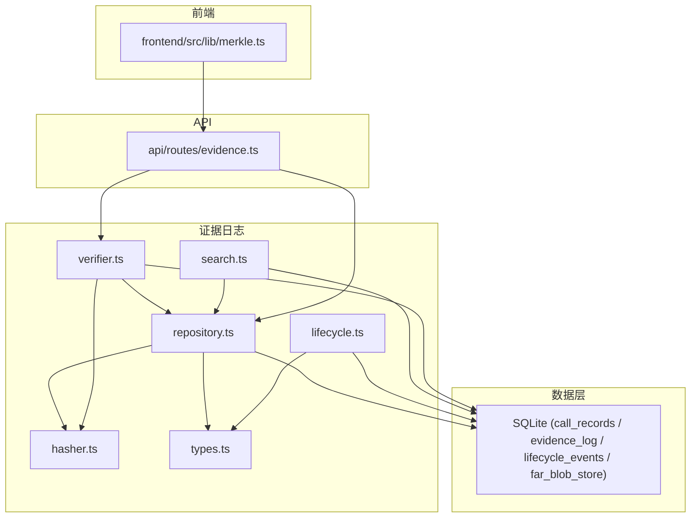
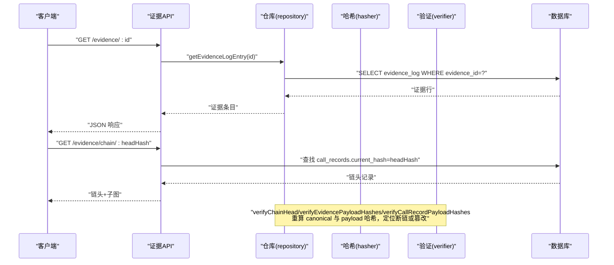
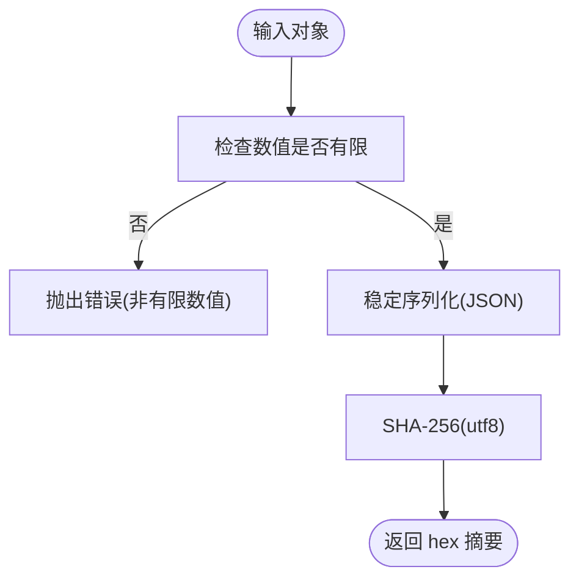
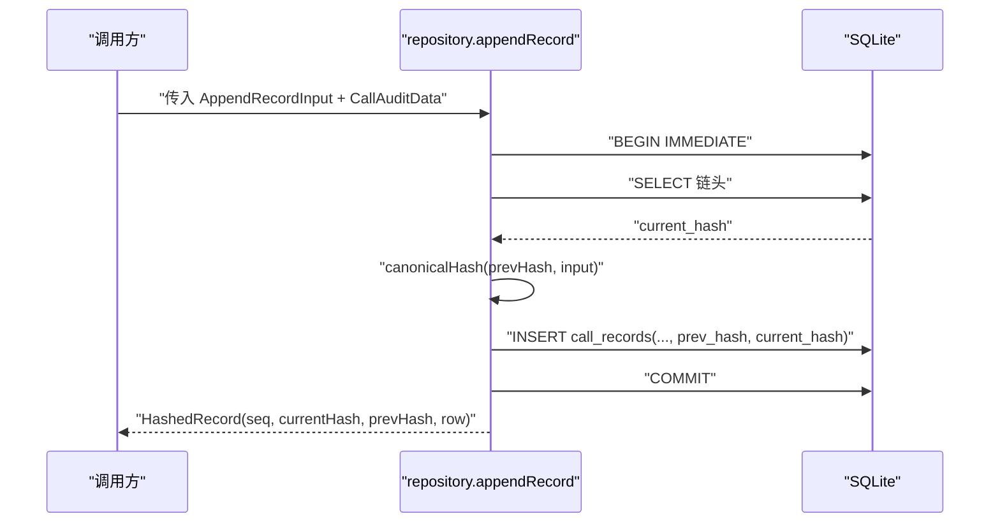
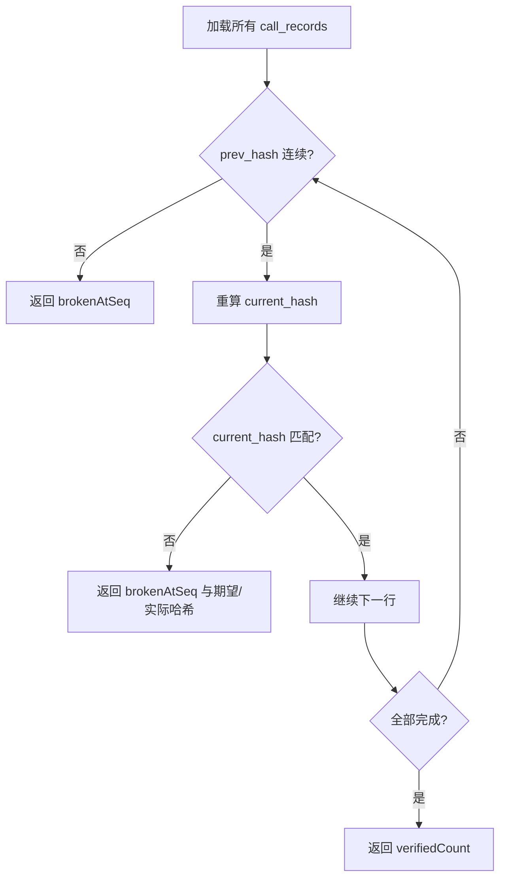
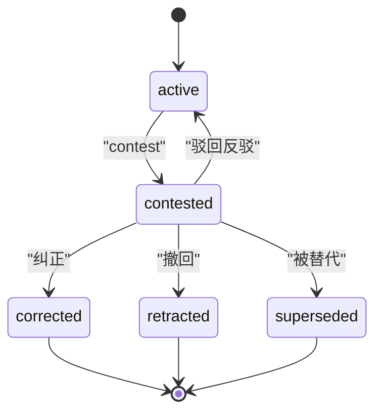
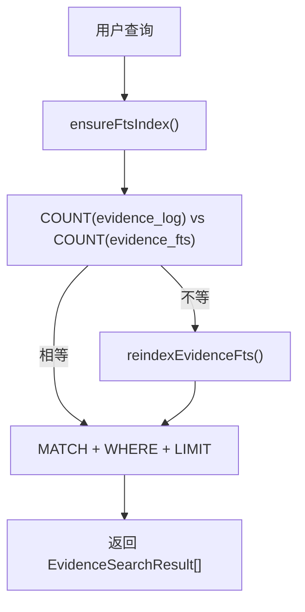
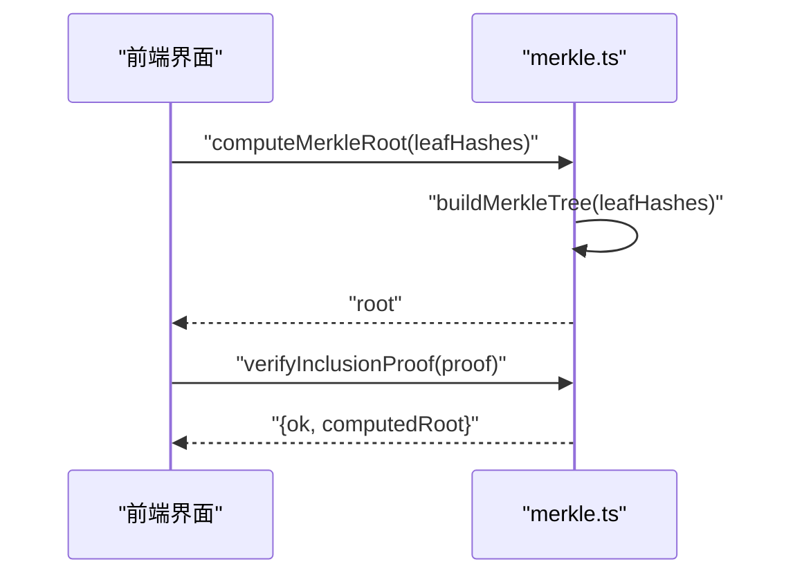
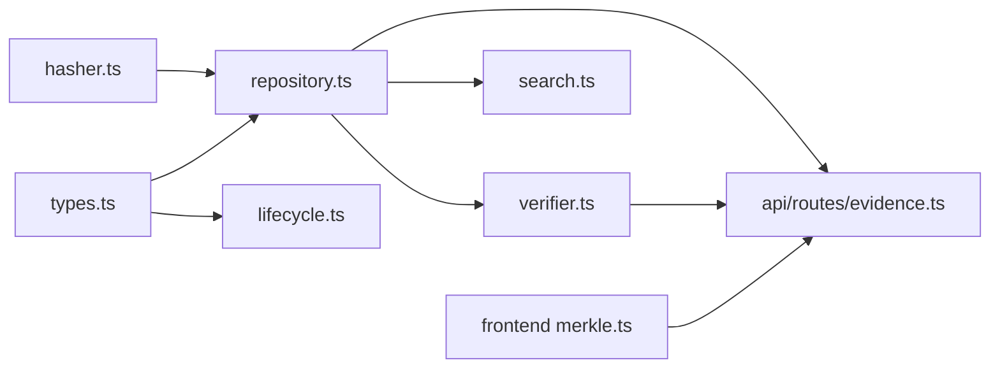

# 证据链系统

<cite>
**本文引用的文件**
- [src/evidence_log/index.ts](file://src/evidence_log/index.ts)
- [src/evidence_log/types.ts](file://src/evidence_log/types.ts)
- [src/evidence_log/repository.ts](file://src/evidence_log/repository.ts)
- [src/evidence_log/hasher.ts](file://src/evidence_log/hasher.ts)
- [src/evidence_log/verifier.ts](file://src/evidence_log/verifier.ts)
- [src/evidence_log/lifecycle.ts](file://src/evidence_log/lifecycle.ts)
- [src/evidence_log/search.ts](file://src/evidence_log/search.ts)
- [src/api/routes/evidence.ts](file://src/api/routes/evidence.ts)
- [frontend/src/lib/merkle.ts](file://frontend/src/lib/merkle.ts)
- [golden_vectors/generate_golden_vectors.ts](file://golden_vectors/generate_golden_vectors.ts)
- [golden_vectors/integrity-golden.ts](file://golden_vectors/integrity-golden.ts)
- [schema/migrations/0015_far_blob_store.sql](file://schema/migrations/0015_far_blob_store.sql)
- [schema/migrations/0021_lifecycle_events.sql](file://schema/migrations/0021_lifecycle_events.sql)
</cite>

## 目录
1. [简介](#简介)
2. [项目结构](#项目结构)
3. [核心组件](#核心组件)
4. [架构总览](#架构总览)
5. [详细组件分析](#详细组件分析)
6. [依赖关系分析](#依赖关系分析)
7. [性能考量](#性能考量)
8. [故障排除指南](#故障排除指南)
9. [结论](#结论)
10. [附录](#附录)

## 简介
本系统提供不可变证据记录与审计链的存储、管理与验证能力。通过“调用记录链 + 证据日志 + 生命周期事件”三层结构，结合内容寻址（CAS）与 Merkle 树根，实现跨语言一致的哈希计算、完整性校验、版本控制与可检索性。系统同时提供 API 接口用于查询证据与证据链，以及前端侧的独立重算能力，支持离线审计与篡改检测演示。

## 项目结构
证据链相关代码主要位于 src/evidence_log 模块，API 路由在 src/api/routes，Merkle 树实现在前端库中，数据库迁移定义在 schema/migrations，跨语言一致性由 golden vectors 与测试保障。

图表来源
- [src/evidence_log/repository.ts:94-165](file://src/evidence_log/repository.ts#L94-L165)
- [src/evidence_log/hasher.ts:8-31](file://src/evidence_log/hasher.ts#L8-L31)
- [src/evidence_log/verifier.ts:17-65](file://src/evidence_log/verifier.ts#L17-L65)
- [src/evidence_log/lifecycle.ts:188-266](file://src/evidence_log/lifecycle.ts#L188-L266)
- [src/evidence_log/search.ts:43-89](file://src/evidence_log/search.ts#L43-L89)
- [src/api/routes/evidence.ts:74-161](file://src/api/routes/evidence.ts#L74-L161)
- [frontend/src/lib/merkle.ts:84-132](file://frontend/src/lib/merkle.ts#L84-L132)

章节来源
- [src/evidence_log/index.ts:1-92](file://src/evidence_log/index.ts#L1-L92)

## 核心组件
- 哈希与规范化：canonicalHash/canonicalJson/hashCanonicalJson，确保跨平台一致序列化与 SHA-256 摘要。
- 写入与链式追加：appendRecord 将调用记录以 prev_hash/current_hash 链接成链；appendEvidenceLog 将证据与来源锚定并可选内容寻址绑定。
- 完整性验证：verifyChainHead 校验链头与每行 current_hash；verifyEvidencePayloadHashes/verifyCallRecordPayloadHashes 进行内容寻址重算比对；verifyCallRecordExportAnchor 对比导出锚点。
- 生命周期管理：applyLifecycleTransition 执行状态机迁移，verifyLifecycleChain 重放校验事件链。
- 搜索索引：ensureFtsIndex/reindexEvidenceFts/searchEvidence 基于 FTS5 提供全文检索，懒同步保证一致性。
- Merkle 树：前端 computeMerkleRoot/buildMerkleTree/verifyInclusionProof 实现浏览器端独立重算与包含证明验证。
- 内容寻址 CAS：far_blob_store 表按 hash PK 去重存储 blob，禁止更新删除，保障内容不变性。

章节来源
- [src/evidence_log/hasher.ts:8-51](file://src/evidence_log/hasher.ts#L8-L51)
- [src/evidence_log/repository.ts:94-258](file://src/evidence_log/repository.ts#L94-L258)
- [src/evidence_log/verifier.ts:17-280](file://src/evidence_log/verifier.ts#L17-L280)
- [src/evidence_log/lifecycle.ts:188-329](file://src/evidence_log/lifecycle.ts#L188-L329)
- [src/evidence_log/search.ts:43-181](file://src/evidence_log/search.ts#L43-L181)
- [frontend/src/lib/merkle.ts:84-170](file://frontend/src/lib/merkle.ts#L84-L170)
- [schema/migrations/0015_far_blob_store.sql:22-44](file://schema/migrations/0015_far_blob_store.sql#L22-L44)

## 架构总览
系统采用“链式调用记录 + 证据日志 + 生命周期事件”的三段式不可变设计，辅以内容寻址与 Merkle 根，形成端到端的可验证审计体系。

图表来源
- [src/api/routes/evidence.ts:78-161](file://src/api/routes/evidence.ts#L78-L161)
- [src/evidence_log/repository.ts:170-188](file://src/evidence_log/repository.ts#L170-L188)
- [src/evidence_log/verifier.ts:17-188](file://src/evidence_log/verifier.ts#L17-L188)

## 详细组件分析

### 哈希与规范化（hasher.ts）
- 确定性 JSON 序列化：使用稳定字符串化，拒绝非有限数值（NaN/Infinity），避免跨平台差异。
- 链输入哈希：对 CanonicalInput 做稳定序列化后 SHA-256，生成 current_hash。
- 内容哈希：对任意 JSON 值做 canonical 化后哈希，用于证据与调用的内容寻址列。

图表来源
- [src/evidence_log/hasher.ts:8-51](file://src/evidence_log/hasher.ts#L8-L51)
- [src/evidence_log/hasher.ts:69-89](file://src/evidence_log/hasher.ts#L69-L89)

章节来源
- [src/evidence_log/hasher.ts:1-90](file://src/evidence_log/hasher.ts#L1-L90)

### 写入与链式追加（repository.ts）
- appendRecord：读取链头，校验 prev_hash 与链头一致，计算 current_hash，插入 call_records，事务 IMMEDIATE 获取写锁防并发分叉。
- appendEvidenceLog：规范化证据与来源锚，derivable=1 时落证据内容哈希；provenanceClass=llm_generated 强制 systemClaimHash 非空且 dashscopeRequestId=null，防止伪造来源。
- rowTo*：安全解析枚举与 JSON 字段，非法值抛错。

图表来源
- [src/evidence_log/repository.ts:94-165](file://src/evidence_log/repository.ts#L94-L165)

章节来源
- [src/evidence_log/repository.ts:1-417](file://src/evidence_log/repository.ts#L1-L417)

### 完整性验证（verifier.ts）
- verifyChainHead：从 genesis 开始逐行校验 prev_hash=current_hash 的连续性，并重算 current_hash 比对。
- verifyEvidencePayloadHashes：对 derivable=1 的证据重算 sha256(canonical JSON)，失配标记 tampered。
- verifyCallRecordPayloadHashes：对 call_records 的请求/响应负载重算内容哈希，老行 NULL 计 legacy-not-covered。
- verifyCallRecordExportAnchor：将导出中的 payload hash 与当前 DB 值逐 seq 比对，检测一致伪造与锚漂移。

图表来源
- [src/evidence_log/verifier.ts:17-65](file://src/evidence_log/verifier.ts#L17-L65)

章节来源
- [src/evidence_log/verifier.ts:1-280](file://src/evidence_log/verifier.ts#L1-L280)

### 生命周期管理（lifecycle.ts）
- 状态机：active → contested → {active, corrected, retracted, superseded}；终态不可逆。
- applyLifecycleTransition：在 IMMEDIATE 事务内读取 fromState、校验允许迁移、计算事件哈希并插入 lifecycle_events。
- verifyLifecycleChain：重放事件链，校验 prev_hash 链、事件哈希与状态连续性。

图表来源
- [src/evidence_log/lifecycle.ts:41-47](file://src/evidence_log/lifecycle.ts#L41-L47)
- [schema/migrations/0021_lifecycle_events.sql:21-36](file://schema/migrations/0021_lifecycle_events.sql#L21-L36)

章节来源
- [src/evidence_log/lifecycle.ts:1-329](file://src/evidence_log/lifecycle.ts#L1-L329)

### 搜索与索引（search.ts）
- ensureFtsIndex：幂等创建 evidence_fts 虚拟表（FTS5）。
- reindexEvidenceFts：全量重建索引（DELETE + INSERT SELECT），事务批量插入。
- searchEvidence：懒同步策略——比较 evidence_log 与 evidence_fts 行数，不等则重建；支持 stageId/payloadKind/provenanceClass 过滤；结果按 bm25 排序。

图表来源
- [src/evidence_log/search.ts:43-181](file://src/evidence_log/search.ts#L43-L181)

章节来源
- [src/evidence_log/search.ts:1-216](file://src/evidence_log/search.ts#L1-L216)

### Merkle 树与包含证明（前端 merkle.ts）
- combineHashes：sha256(utf8(left ++ right))，left/right 为 64-hex。
- buildMerkleTree：自底向上构建层级，奇数末叶自复制。
- verifyInclusionProof：用 leaf 与 siblings 自底向上重算根，与 expectedRoot 比对。
- Golden 向量：golden_vectors 与 integrity-golden 提供跨语言对齐锚，确保浏览器/Node/Python 字节相等。

图表来源
- [frontend/src/lib/merkle.ts:84-170](file://frontend/src/lib/merkle.ts#L84-L170)
- [golden_vectors/integrity-golden.ts:38-58](file://golden_vectors/integrity-golden.ts#L38-L58)

章节来源
- [frontend/src/lib/merkle.ts:1-193](file://frontend/src/lib/merkle.ts#L1-L193)
- [golden_vectors/generate_golden_vectors.ts:1-198](file://golden_vectors/generate_golden_vectors.ts#L1-L198)

### 内容寻址存储（far_blob_store）
- 以 hash 为主键，content 为规范化的 JSON 文本，size_bytes 记录字节数。
- 触发器禁止 UPDATE/DELETE，确保内容不可变；同内容多次写入去重。

章节来源
- [schema/migrations/0015_far_blob_store.sql:1-44](file://schema/migrations/0015_far_blob_store.sql#L1-L44)

## 依赖关系分析
- repository.ts 依赖 hasher.ts 与 types.ts，负责写入与转换。
- verifier.ts 依赖 hasher.ts 与 repository.ts，负责链与内容的完整性验证。
- lifecycle.ts 依赖 types.ts，维护事件链与状态机。
- search.ts 依赖 repository.ts 的类型，维护 FTS5 索引。
- api/routes/evidence.ts 依赖 repository.ts 与内部图/裁决查询，暴露 REST 接口。
- frontend merkle.ts 与后端 golden vectors 共同保证跨语言一致性。

图表来源
- [src/evidence_log/repository.ts:1-33](file://src/evidence_log/repository.ts#L1-L33)
- [src/evidence_log/verifier.ts:1-12](file://src/evidence_log/verifier.ts#L1-L12)
- [src/evidence_log/lifecycle.ts:22-38](file://src/evidence_log/lifecycle.ts#L22-L38)
- [src/evidence_log/search.ts:14-15](file://src/evidence_log/search.ts#L14-L15)
- [src/api/routes/evidence.ts:13-23](file://src/api/routes/evidence.ts#L13-L23)

章节来源
- [src/evidence_log/index.ts:1-92](file://src/evidence_log/index.ts#L1-L92)

## 性能考量
- 写入原子性与并发：appendRecord 使用 BEGIN IMMEDIATE 事务，跨进程并发下获取 RESERVED 写锁，避免 TOCTOU 分叉。
- 搜索索引重建：FTS5 索引懒同步，仅在证据数量不一致时全量重建；适用于中等规模数据（10^4 级），超过 10^5 需评估增量策略。
- Merkle 计算：前端使用 Web Crypto 本地计算，零依赖、可离线验证；单叶树直接返回叶作为根，减少开销。
- 内容寻址：far_blob_store 以 hash 去重，避免重复存储大对象，降低 I/O。

[本节为通用指导，不直接分析具体文件]

## 故障排除指南
- 链头校验失败：verifyChainHead 返回 brokenAtSeq 与期望/实际哈希，检查对应记录的 prev_hash 与 current_hash 是否一致。
- 证据内容篡改：verifyEvidencePayloadHashes 列出 tamperedEvidenceIds，检查 derivable=1 的行是否存在 evidence_payload_hash 缺失或 JSON 非法。
- 调用负载篡改：verifyCallRecordPayloadHashes 列出 tamperedSeqs，老行 NULL 计 legacy-not-covered；确认迁移 0020 已落地。
- 导出锚漂移：verifyCallRecordExportAnchor 返回 anchorDrift 与 tamperedSeqs，检查导出与 DB 的 seq 集合是否一致。
- 生命周期非法迁移：applyLifecycleTransition 抛错提示非法迁移；verifyLifecycleChain 返回 violation 原因（prev_hash_link_broken/event_hash_mismatch/state_continuity_broken/illegal_transition）。
- 搜索异常：searchEvidence 要求 query 非空且 limit 在 [1,200]；若 FTS5 不存在会先 ensureFtsIndex。

章节来源
- [src/evidence_log/verifier.ts:17-280](file://src/evidence_log/verifier.ts#L17-L280)
- [src/evidence_log/lifecycle.ts:188-329](file://src/evidence_log/lifecycle.ts#L188-L329)
- [src/evidence_log/search.ts:106-181](file://src/evidence_log/search.ts#L106-L181)

## 结论
本证据链系统通过严格的规范化哈希、链式追加、内容寻址与 Merkle 根，实现了跨语言一致的不可变审计能力。配合生命周期事件的状态机约束与 FTS5 检索辅助，既保证了安全性与可验证性，又提供了实用的查询与审计体验。前端侧的独立重算进一步增强了外部审计的可信度与可操作性。

[本节为总结，不直接分析具体文件]

## 附录

### 数据结构定义（节选）
- 调用记录行（CallRecordRow）：seq、stage_id、payload_kind、purpose_tag、model_id、dashscope_request_id、repro_hash、git_commit_sha、iso_timestamp、request_payload、response_payload、request_payload_hash、response_payload_hash、degraded_from、finish_reason、usage_tokens_total、prev_hash、current_hash、created_at。
- 证据日志行（EvidenceLogRow）：evidence_id、call_record_seq、stage_id、payload_kind、evidence_payload、source_anchor、source_anchor_git、source_anchor_req、source_anchor_ts、source_anchor_path、source_anchor_lineno、derivable、evidence_payload_hash、provenance_class、system_claim_hash、created_at。
- 生命周期事件（LifecycleEvent）：event_id、target_kind、target_id、from_state、to_state、actor、reason、audit_ref、prev_hash、current_hash、created_at。

章节来源
- [src/evidence_log/types.ts:96-153](file://src/evidence_log/types.ts#L96-L153)
- [src/evidence_log/lifecycle.ts:49-62](file://src/evidence_log/lifecycle.ts#L49-L62)

### 存储格式规范
- 规范化 JSON：使用稳定字符串化，禁止非有限数值，确保跨平台一致。
- 哈希算法：SHA-256，输出 64 小写十六进制。
- 链式字段：prev_hash/current_hash 均为 64 位十六进制；genesis prev_hash 为全零。
- 内容寻址：evidence_payload_hash/request_payload_hash/response_payload_hash 为 sha256(canonical JSON)。

章节来源
- [src/evidence_log/hasher.ts:8-51](file://src/evidence_log/hasher.ts#L8-L51)
- [src/evidence_log/types.ts:4-5](file://src/evidence_log/types.ts#L4-L5)

### API 接口说明
- GET /evidence/:id：按 evidenceId 查询证据日志条目，返回证据与关联判定节点。
- GET /evidence/chain/:headHash：按链头哈希查询证据链头与子图。

章节来源
- [src/api/routes/evidence.ts:74-161](file://src/api/routes/evidence.ts#L74-L161)

### 导入导出工具与故障排除
- 导入：通过 appendRecord/appendEvidenceLog 写入调用与证据，确保 provenanceClass 与 derivable 正确设置。
- 导出：利用 call_records.redacted.jsonl 中的 payload hash 列作为锚点，与 DB 值比对验证一致性。
- 常见错误：
  - prev_hash 不匹配：检查链头与写入顺序。
  - provenanceClass=llm_generated 未提供 systemClaimHash：补充系统计算的 claim hash。
  - FTS5 索引不同步：调用 reindexEvidenceFts 重建。
  - Merkle 验证失败：检查 leaf/siblings 是否为 64-hex，expectedRoot 是否正确。

章节来源
- [src/evidence_log/repository.ts:193-258](file://src/evidence_log/repository.ts#L193-L258)
- [src/evidence_log/search.ts:65-89](file://src/evidence_log/search.ts#L65-L89)
- [frontend/src/lib/merkle.ts:155-170](file://frontend/src/lib/merkle.ts#L155-L170)