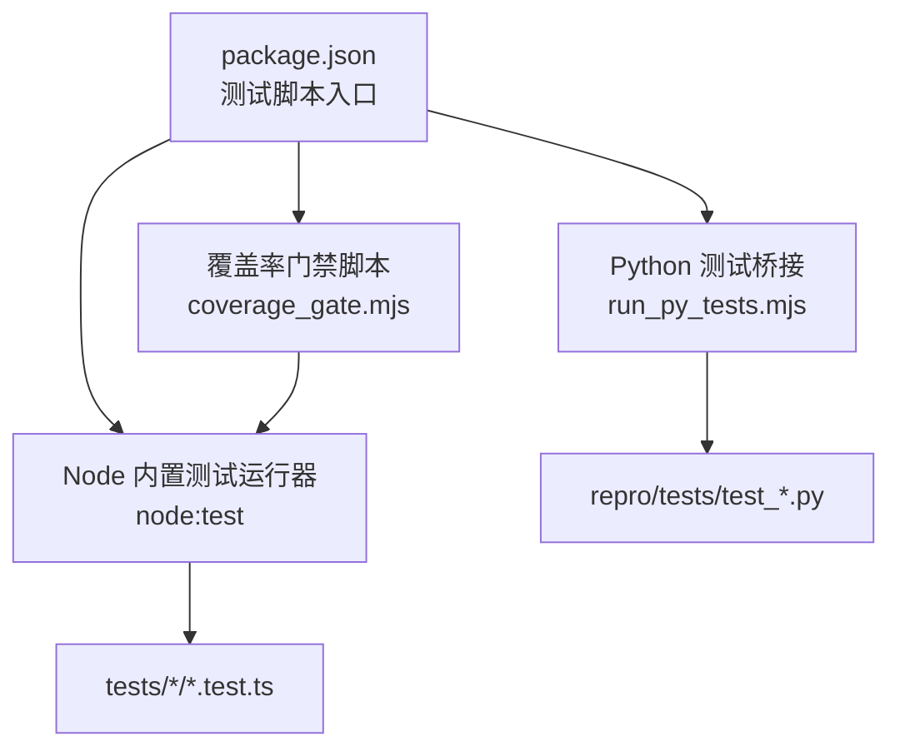
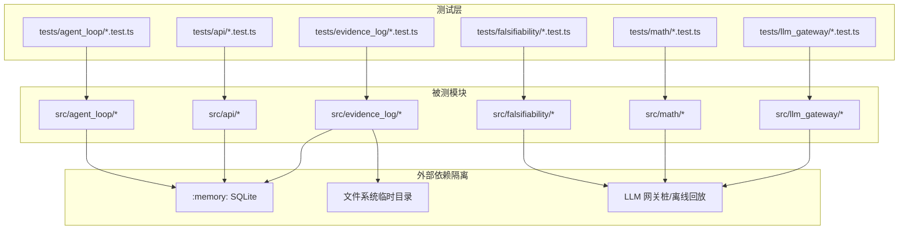
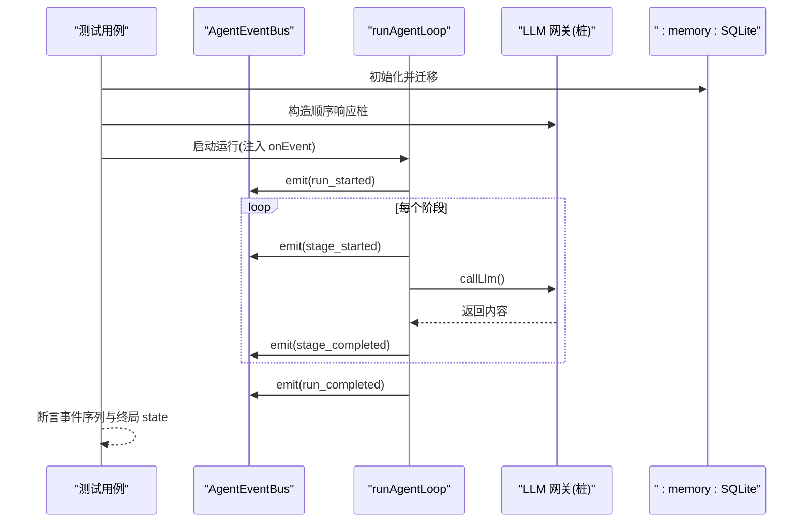
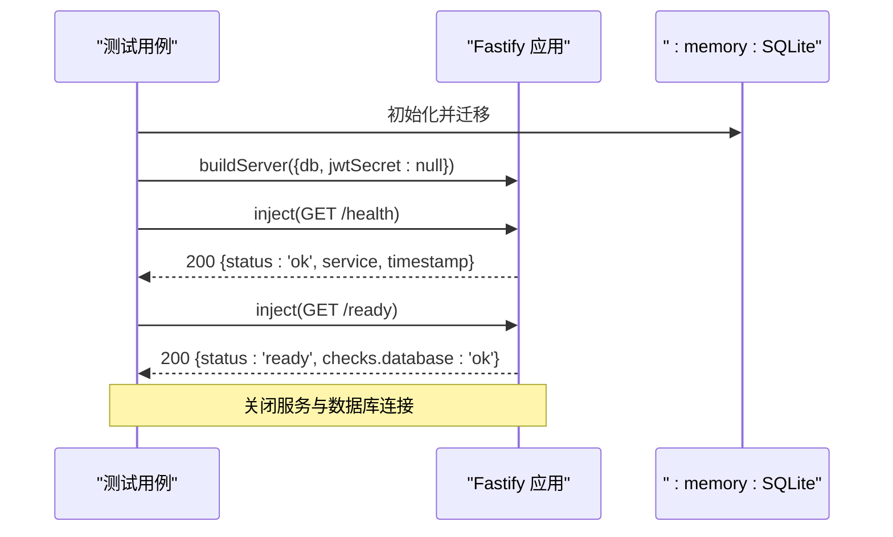
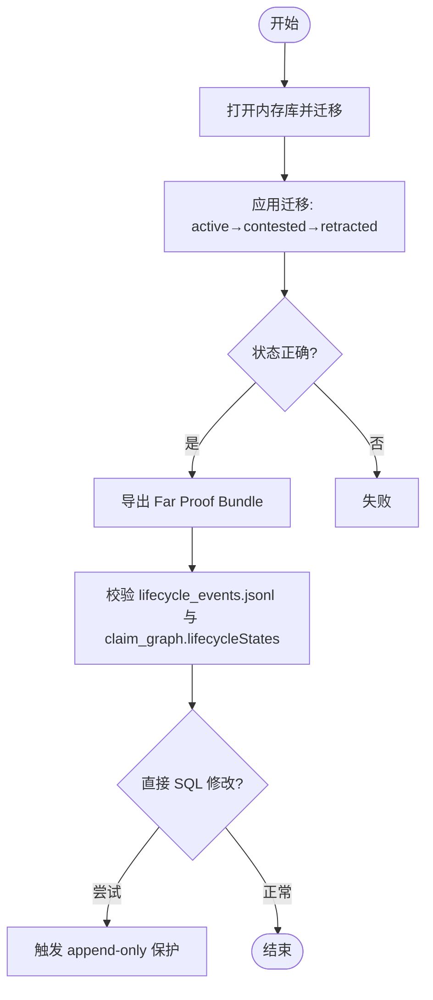
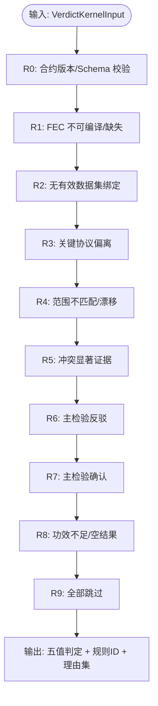
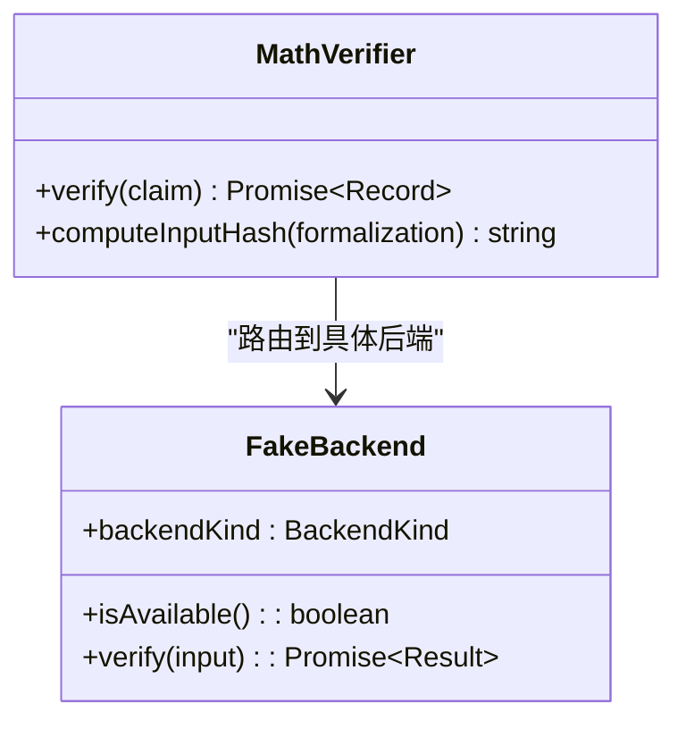
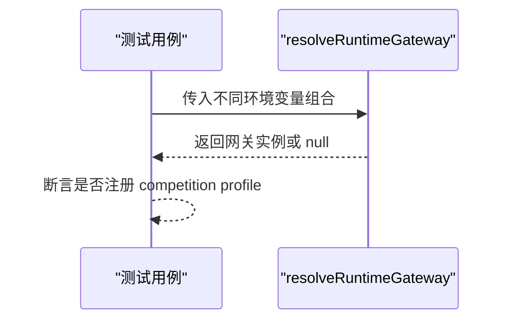
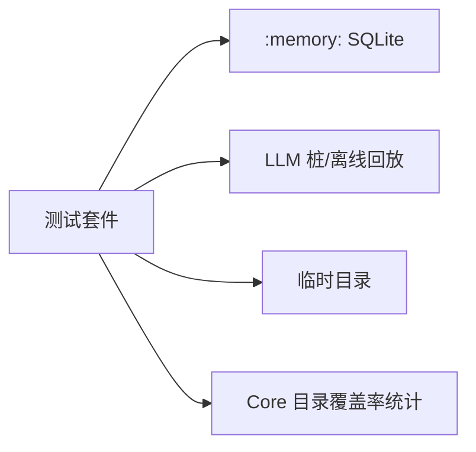

# 单元测试

<cite>
**本文引用的文件**
- [package.json](file://package.json)
- [scripts/coverage_gate.mjs](file://scripts/coverage_gate.mjs)
- [scripts/run_py_tests.mjs](file://scripts/run_py_tests.mjs)
- [eslint.config.mjs](file://eslint.config.mjs)
- [tests/agent_loop/events.test.ts](file://tests/agent_loop/events.test.ts)
- [tests/api/health.test.ts](file://tests/api/health.test.ts)
- [tests/evidence_log/lifecycle.test.ts](file://tests/evidence_log/lifecycle.test.ts)
- [tests/falsifiability/verdict_kernel_v2.test.ts](file://tests/falsifiability/verdict_kernel_v2.test.ts)
- [tests/math/math_verifier.test.ts](file://tests/math/math_verifier.test.ts)
- [tests/llm_gateway/runtime_gateway.test.ts](file://tests/llm_gateway/runtime_gateway.test.ts)
</cite>

## 目录
1. [简介](#简介)
2. [项目结构](#项目结构)
3. [核心组件](#核心组件)
4. [架构总览](#架构总览)
5. [详细组件分析](#详细组件分析)
6. [依赖关系分析](#依赖关系分析)
7. [性能考虑](#性能考虑)
8. [故障排查指南](#故障排查指南)
9. [结论](#结论)
10. [附录](#附录)

## 简介
本文件面向 FAR-Lab 的单元测试体系，系统性说明测试框架选择与配置、各模块测试组织结构与策略、测试用例设计原则（边界条件、异常处理、性能）、模拟对象与桩的使用模式、外部依赖隔离方法、覆盖率要求与代码质量门禁，以及编写最佳实践与调试技巧。目标是帮助读者快速理解并高质量地维护该项目的测试套件。

## 项目结构
- 测试运行器：基于 Node.js 内置 test runner（node:test），通过 package.json scripts 统一编排执行。
- 测试组织：按 src 模块镜像在 tests 下建立对应目录，便于定位与维护。
- 覆盖率门禁：使用 Node 24 原生 --experimental-test-coverage，配合脚本阈值断言。
- Python 侧测试：通过跨平台脚本统一设置 PYTHONPATH 并调用 unittest discover。
- 代码质量：ESLint 零容忍规则约束源码质量；测试目录默认忽略 lint。

**图表来源**
- [package.json:45-82](file://package.json#L45-L82)
- [scripts/coverage_gate.mjs:19-86](file://scripts/coverage_gate.mjs#L19-L86)
- [scripts/run_py_tests.mjs:104-126](file://scripts/run_py_tests.mjs#L104-L126)

**章节来源**
- [package.json:45-82](file://package.json#L45-L82)
- [scripts/coverage_gate.mjs:19-86](file://scripts/coverage_gate.mjs#L19-L86)
- [scripts/run_py_tests.mjs:104-126](file://scripts/run_py_tests.mjs#L104-L126)

## 核心组件
- 测试框架与执行
  - 使用 Node.js 内置 node:test 作为测试框架，无需额外依赖。
  - 通过 package.json 的 scripts 提供全量与分模块测试命令，支持超时控制与并行执行。
- 覆盖率门禁
  - 使用 Node 24 原生覆盖率能力，仅统计 Core 目录，设定行覆盖≥85%、分支覆盖≥75% 的硬性门槛。
- Python 测试桥接
  - 跨平台设置 PYTHONPATH，探测 Python 环境可用性，并在 CI PR 模式下对触及 Python-axis 符号的变更进行阻断。
- 代码质量
  - ESLint 零容忍规则禁止 any、@ts-ignore、空 catch、eval 等高风险用法，保障源码健壮性。

**章节来源**
- [package.json:45-82](file://package.json#L45-L82)
- [scripts/coverage_gate.mjs:19-86](file://scripts/coverage_gate.mjs#L19-L86)
- [scripts/run_py_tests.mjs:28-93](file://scripts/run_py_tests.mjs#L28-L93)
- [eslint.config.mjs:1-54](file://eslint.config.mjs#L1-L54)

## 架构总览
下图展示测试层如何围绕核心模块组织，并通过内存数据库、桩函数和固定输入实现对外部依赖的隔离。

**图表来源**
- [tests/agent_loop/events.test.ts:16-27](file://tests/agent_loop/events.test.ts#L16-L27)
- [tests/api/health.test.ts:14-19](file://tests/api/health.test.ts#L14-L19)
- [tests/evidence_log/lifecycle.test.ts:17-25](file://tests/evidence_log/lifecycle.test.ts#L17-L25)
- [tests/falsifiability/verdict_kernel_v2.test.ts:19-25](file://tests/falsifiability/verdict_kernel_v2.test.ts#L19-L25)
- [tests/math/math_verifier.test.ts:13-30](file://tests/math/math_verifier.test.ts#L13-L30)
- [tests/llm_gateway/runtime_gateway.test.ts:12-15](file://tests/llm_gateway/runtime_gateway.test.ts#L12-L15)

## 详细组件分析

### Agent Loop 测试策略
- 目标：验证事件总线、阶段执行顺序、生命周期事件完整性与零成本开关行为。
- 关键要点：
  - 使用内存数据库 + 迁移确保状态一致且可重复。
  - 构造顺序响应的 LLM 网关桩，驱动完整阶段序列。
  - 断言事件数量、字段一致性、终止原因与终局状态一致。
  - 零回归：不传 onEvent 时行为字节等同基线。

**图表来源**
- [tests/agent_loop/events.test.ts:141-173](file://tests/agent_loop/events.test.ts#L141-L173)
- [tests/agent_loop/events.test.ts:267-334](file://tests/agent_loop/events.test.ts#L267-L334)

**章节来源**
- [tests/agent_loop/events.test.ts:16-27](file://tests/agent_loop/events.test.ts#L16-L27)
- [tests/agent_loop/events.test.ts:141-173](file://tests/agent_loop/events.test.ts#L141-L173)
- [tests/agent_loop/events.test.ts:267-334](file://tests/agent_loop/events.test.ts#L267-L334)

### API 服务测试策略
- 目标：验证健康检查路由、就绪探针、保护模式下的匿名访问豁免。
- 关键要点：
  - 使用内存数据库 + 迁移构建最小可用服务。
  - 通过 app.inject 发起 HTTP 请求，断言状态码与响应体字段。
  - 保护模式下确认 /health 与 /ready 始终匿名可达。

**图表来源**
- [tests/api/health.test.ts:21-26](file://tests/api/health.test.ts#L21-L26)
- [tests/api/health.test.ts:30-47](file://tests/api/health.test.ts#L30-L47)
- [tests/api/health.test.ts:86-107](file://tests/api/health.test.ts#L86-L107)
- [tests/api/health.test.ts:132-166](file://tests/api/health.test.ts#L132-L166)

**章节来源**
- [tests/api/health.test.ts:14-19](file://tests/api/health.test.ts#L14-L19)
- [tests/api/health.test.ts:30-47](file://tests/api/health.test.ts#L30-L47)
- [tests/api/health.test.ts:86-107](file://tests/api/health.test.ts#L86-L107)
- [tests/api/health.test.ts:132-166](file://tests/api/health.test.ts#L132-L166)

### 证据日志测试策略
- 目标：验证声明生命周期迁移、非法迁移拒绝、墓碑化导出与链校验。
- 关键要点：
  - 使用内存数据库 + 迁移，调用 applyLifecycleTransition 推进状态。
  - 断言合法迁移链、非法迁移抛错、重复操作幂等。
  - 导出 Far Proof Bundle 后校验 lifecycle_events.jsonl 与 claim_graph.lifecycleStates。
  - 直接 SQL 修改触发 append-only 保护。

**图表来源**
- [tests/evidence_log/lifecycle.test.ts:27-31](file://tests/evidence_log/lifecycle.test.ts#L27-L31)
- [tests/evidence_log/lifecycle.test.ts:35-46](file://tests/evidence_log/lifecycle.test.ts#L35-L46)
- [tests/evidence_log/lifecycle.test.ts:93-103](file://tests/evidence_log/lifecycle.test.ts#L93-L103)
- [tests/evidence_log/lifecycle.test.ts:105-126](file://tests/evidence_log/lifecycle.test.ts#L105-L126)

**章节来源**
- [tests/evidence_log/lifecycle.test.ts:17-25](file://tests/evidence_log/lifecycle.test.ts#L17-L25)
- [tests/evidence_log/lifecycle.test.ts:35-46](file://tests/evidence_log/lifecycle.test.ts#L35-L46)
- [tests/evidence_log/lifecycle.test.ts:93-103](file://tests/evidence_log/lifecycle.test.ts#L93-L103)
- [tests/evidence_log/lifecycle.test.ts:105-126](file://tests/evidence_log/lifecycle.test.ts#L105-L126)

### 可证伪性引擎测试策略
- 目标：覆盖 R0-R9 判定规则与多个黄金向量（GV-01..GV-12）及扩展场景。
- 关键要点：
  - 构造合法的 VerdictKernelInput，断言五值判定结果、决定性规则 ID 与理由集合。
  - 覆盖缺失 FEC、缺失数据集、范围缩小、数据漂移、功效不足、冲突指标、事后阈值、篡改证明、指标替换、种子挑选等场景。
  - 验证浮点容差、效应量边界、因果混杂门降级逻辑与不变性。

**图表来源**
- [tests/falsifiability/verdict_kernel_v2.test.ts:98-104](file://tests/falsifiability/verdict_kernel_v2.test.ts#L98-L104)
- [tests/falsifiability/verdict_kernel_v2.test.ts:106-126](file://tests/falsifiability/verdict_kernel_v2.test.ts#L106-L126)
- [tests/falsifiability/verdict_kernel_v2.test.ts:128-155](file://tests/falsifiability/verdict_kernel_v2.test.ts#L128-L155)
- [tests/falsifiability/verdict_kernel_v2.test.ts:157-197](file://tests/falsifiability/verdict_kernel_v2.test.ts#L157-L197)
- [tests/falsifiability/verdict_kernel_v2.test.ts:220-273](file://tests/falsifiability/verdict_kernel_v2.test.ts#L220-L273)
- [tests/falsifiability/verdict_kernel_v2.test.ts:338-396](file://tests/falsifiability/verdict_kernel_v2.test.ts#L338-L396)
- [tests/falsifiability/verdict_kernel_v2.test.ts:400-420](file://tests/falsifiability/verdict_kernel_v2.test.ts#L400-L420)
- [tests/falsifiability/verdict_kernel_v2.test.ts:443-518](file://tests/falsifiability/verdict_kernel_v2.test.ts#L443-L518)
- [tests/falsifiability/verdict_kernel_v2.test.ts:537-649](file://tests/falsifiability/verdict_kernel_v2.test.ts#L537-L649)

**章节来源**
- [tests/falsifiability/verdict_kernel_v2.test.ts:19-25](file://tests/falsifiability/verdict_kernel_v2.test.ts#L19-L25)
- [tests/falsifiability/verdict_kernel_v2.test.ts:98-104](file://tests/falsifiability/verdict_kernel_v2.test.ts#L98-L104)
- [tests/falsifiability/verdict_kernel_v2.test.ts:106-126](file://tests/falsifiability/verdict_kernel_v2.test.ts#L106-L126)
- [tests/falsifiability/verdict_kernel_v2.test.ts:128-155](file://tests/falsifiability/verdict_kernel_v2.test.ts#L128-L155)
- [tests/falsifiability/verdict_kernel_v2.test.ts:157-197](file://tests/falsifiability/verdict_kernel_v2.test.ts#L157-L197)
- [tests/falsifiability/verdict_kernel_v2.test.ts:220-273](file://tests/falsifiability/verdict_kernel_v2.test.ts#L220-L273)
- [tests/falsifiability/verdict_kernel_v2.test.ts:338-396](file://tests/falsifiability/verdict_kernel_v2.test.ts#L338-L396)
- [tests/falsifiability/verdict_kernel_v2.test.ts:400-420](file://tests/falsifiability/verdict_kernel_v2.test.ts#L400-L420)
- [tests/falsifiability/verdict_kernel_v2.test.ts:443-518](file://tests/falsifiability/verdict_kernel_v2.test.ts#L443-L518)
- [tests/falsifiability/verdict_kernel_v2.test.ts:537-649](file://tests/falsifiability/verdict_kernel_v2.test.ts#L537-L649)

### 数学验证测试策略
- 目标：验证按 claimKind 与 requiredLevel 的路由、后端可用性降级、输入哈希确定性与跨语言对齐。
- 关键要点：
  - 使用 FakeBackend 模拟 CAS/SMT/Lean/Numerical 后端，避免真实求解器依赖。
  - 断言路由决策、记录字段完整性、mode=expand 传递、fresh-clone 降级为 unknown。
  - 验证 computeInputHash 确定性、雪崩性与 canonicalConfidence 归一化。

**图表来源**
- [tests/math/math_verifier.test.ts:36-77](file://tests/math/math_verifier.test.ts#L36-L77)
- [tests/math/math_verifier.test.ts:110-145](file://tests/math/math_verifier.test.ts#L110-L145)
- [tests/math/math_verifier.test.ts:151-177](file://tests/math/math_verifier.test.ts#L151-L177)
- [tests/math/math_verifier.test.ts:179-183](file://tests/math/math_verifier.test.ts#L179-L183)
- [tests/math/math_verifier.test.ts:189-226](file://tests/math/math_verifier.test.ts#L189-L226)
- [tests/math/math_verifier.test.ts:232-250](file://tests/math/math_verifier.test.ts#L232-L250)
- [tests/math/math_verifier.test.ts:259-301](file://tests/math/math_verifier.test.ts#L259-L301)

**章节来源**
- [tests/math/math_verifier.test.ts:13-30](file://tests/math/math_verifier.test.ts#L13-L30)
- [tests/math/math_verifier.test.ts:110-145](file://tests/math/math_verifier.test.ts#L110-L145)
- [tests/math/math_verifier.test.ts:151-177](file://tests/math/math_verifier.test.ts#L151-L177)
- [tests/math/math_verifier.test.ts:179-183](file://tests/math/math_verifier.test.ts#L179-L183)
- [tests/math/math_verifier.test.ts:189-226](file://tests/math/math_verifier.test.ts#L189-L226)
- [tests/math/math_verifier.test.ts:232-250](file://tests/math/math_verifier.test.ts#L232-L250)
- [tests/math/math_verifier.test.ts:259-301](file://tests/math/math_verifier.test.ts#L259-L301)

### LLM 网关测试策略
- 目标：验证运行时网关解析与环境变量优先级，确保离线回放诚实降级。
- 关键要点：
  - 存在 key 时返回非 null 网关并注册 competition profile。
  - 无 key 或空串时返回 null，绝不假装 live。
  - FAR_DASHSCOPE_API_KEY 优先于 DASHSCOPE_API_KEY。

**图表来源**
- [tests/llm_gateway/runtime_gateway.test.ts:17-24](file://tests/llm_gateway/runtime_gateway.test.ts#L17-L24)
- [tests/llm_gateway/runtime_gateway.test.ts:26-39](file://tests/llm_gateway/runtime_gateway.test.ts#L26-L39)
- [tests/llm_gateway/runtime_gateway.test.ts:41-49](file://tests/llm_gateway/runtime_gateway.test.ts#L41-L49)

**章节来源**
- [tests/llm_gateway/runtime_gateway.test.ts:12-15](file://tests/llm_gateway/runtime_gateway.test.ts#L12-L15)
- [tests/llm_gateway/runtime_gateway.test.ts:17-24](file://tests/llm_gateway/runtime_gateway.test.ts#L17-L24)
- [tests/llm_gateway/runtime_gateway.test.ts:26-39](file://tests/llm_gateway/runtime_gateway.test.ts#L26-L39)
- [tests/llm_gateway/runtime_gateway.test.ts:41-49](file://tests/llm_gateway/runtime_gateway.test.ts#L41-L49)

## 依赖关系分析
- 测试与源码耦合：tests 目录严格映射 src 模块，便于定位影响面。
- 外部依赖隔离：
  - 数据库：统一使用 :memory: SQLite + 迁移，保证每次测试独立、可重复。
  - LLM：通过桩或离线回放模式，避免真实网络调用。
  - 文件系统：使用系统临时目录进行导出与读取。
- 覆盖率门禁：仅统计 Core 目录，排除需外部求解器的后端与竞争适配器命名空间，确保门禁稳定。

**图表来源**
- [tests/agent_loop/events.test.ts:34-39](file://tests/agent_loop/events.test.ts#L34-L39)
- [tests/api/health.test.ts:21-26](file://tests/api/health.test.ts#L21-L26)
- [tests/evidence_log/lifecycle.test.ts:27-31](file://tests/evidence_log/lifecycle.test.ts#L27-L31)
- [scripts/coverage_gate.mjs:23-41](file://scripts/coverage_gate.mjs#L23-L41)

**章节来源**
- [scripts/coverage_gate.mjs:23-41](file://scripts/coverage_gate.mjs#L23-L41)
- [scripts/coverage_gate.mjs:45-86](file://scripts/coverage_gate.mjs#L45-L86)

## 性能考虑
- 测试超时：通过 --test-timeout 控制长耗时测试，避免 CI 挂起。
- 覆盖率插桩稳定性：脚本区分“测试失败”与“阈值不达标”，避免误判。
- 内存与 I/O：使用内存数据库与临时目录，减少磁盘压力与竞态。
- 外部依赖：尽量使用桩与离线回放，降低网络抖动与第三方服务不稳定带来的 flake。

[本节为通用指导，不直接分析具体文件]

## 故障排查指南
- 覆盖率门禁失败
  - 若脚本输出包含 fail N>0，表示覆盖率运行内测试失败，可能受插桩影响（如性能/内存测试），应先修复测试再评估覆盖率。
  - 若脚本输出为非零退出但无失败计数，则确认为覆盖率阈值未达标。
- Python 轴不可用
  - 在 CI PR 模式下，若 diff 触及 Python-axis 符号且 Python 环境不可用，将阻断合并。
  - 本地可通过 run_py_tests.mjs 的探针输出判断原因（python3 不在 PATH、sympy/z3 导入失败等）。
- 健康检查异常
  - 若 /ready 返回 503，检查数据库连接与迁移是否成功。
  - 保护模式下确认 /health 与 /ready 仍匿名可达。

**章节来源**
- [scripts/coverage_gate.mjs:94-126](file://scripts/coverage_gate.mjs#L94-L126)
- [scripts/run_py_tests.mjs:28-93](file://scripts/run_py_tests.mjs#L28-L93)
- [tests/api/health.test.ts:86-107](file://tests/api/health.test.ts#L86-L107)
- [tests/api/health.test.ts:132-166](file://tests/api/health.test.ts#L132-L166)

## 结论
本项目采用 Node 内置测试运行器与原生覆盖率能力，结合严格的覆盖率门禁与 ESLint 零容忍规则，构建了高可靠、可重复、易维护的测试体系。各模块测试通过内存数据库、桩函数与固定输入有效隔离外部依赖，覆盖边界条件、异常路径与性能相关场景。遵循本文的最佳实践与调试技巧，可显著提升测试质量与开发效率。

[本节为总结性内容，不直接分析具体文件]

## 附录
- 测试编写最佳实践
  - 使用内存数据库 + 迁移，确保每次测试独立、可重复。
  - 对外部依赖一律使用桩或离线回放，避免真实网络调用。
  - 断言聚焦单一职责，避免多重断言掩盖问题。
  - 对浮点比较使用容差，对字符串比较使用正则或结构化断言。
  - 保持测试幂等，避免共享状态污染。
- 调试技巧
  - 使用分模块测试命令快速定位问题。
  - 在覆盖率门禁中区分“测试失败”与“阈值不达标”。
  - 对异步流程增加超时与重试策略，减少 flake。
  - 对网络/IO 错误捕获并打印上下文信息，便于排障。

[本节为通用指导，不直接分析具体文件]