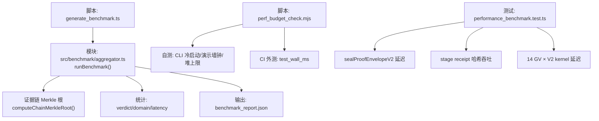
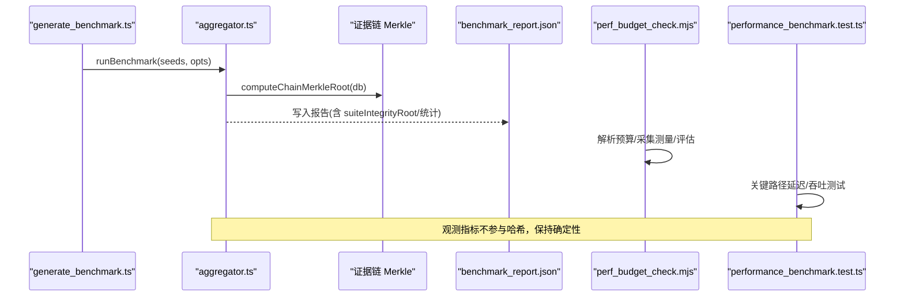
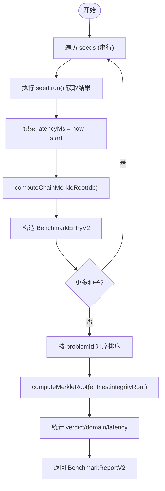
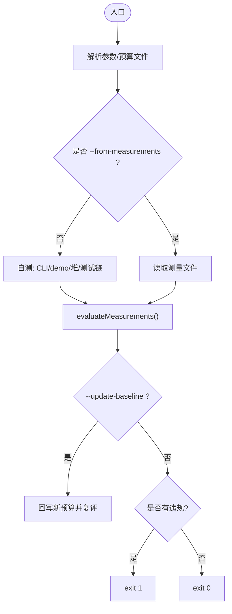
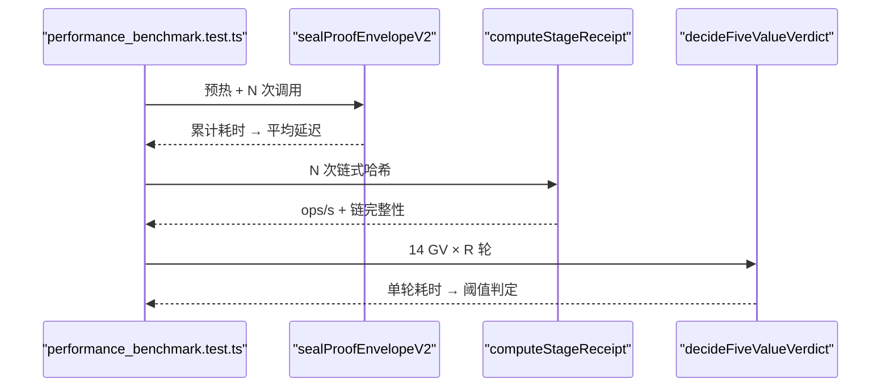
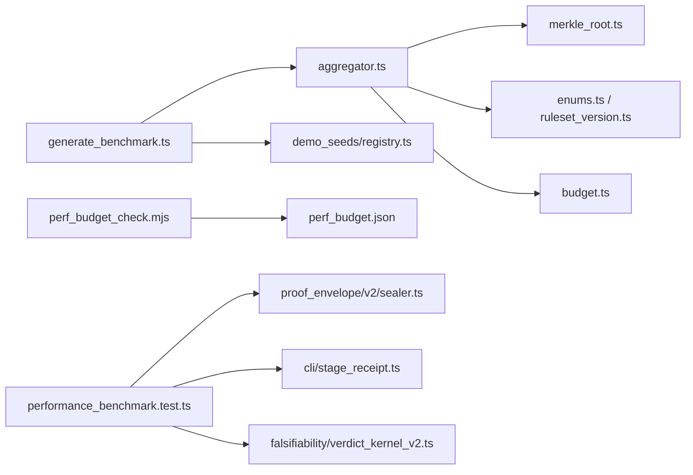

# 性能基准测试

<cite>
**本文引用的文件**
- [src/benchmark/index.ts](file://src/benchmark/index.ts)
- [src/benchmark/aggregator.ts](file://src/benchmark/aggregator.ts)
- [src/benchmark/types.ts](file://src/benchmark/types.ts)
- [scripts/generate_benchmark.ts](file://scripts/generate_benchmark.ts)
- [scripts/perf_budget_check.mjs](file://scripts/perf_budget_check.mjs)
- [scripts/perf_budget.json](file://scripts/perf_budget.json)
- [tests/comparison/performance_benchmark.test.ts](file://tests/comparison/performance_benchmark.test.ts)
- [tests/benchmark/aggregator.test.ts](file://tests/benchmark/aggregator.test.ts)
- [scripts/benchmark_report_check.mts](file://scripts/benchmark_report_check.mts)
</cite>

## 目录
1. [简介](#简介)
2. [项目结构](#项目结构)
3. [核心组件](#核心组件)
4. [架构总览](#架构总览)
5. [详细组件分析](#详细组件分析)
6. [依赖关系分析](#依赖关系分析)
7. [性能考量](#性能考量)
8. [故障排查指南](#故障排查指南)
9. [结论](#结论)
10. [附录](#附录)

## 简介
本文件面向 FAR-Lab 的性能基准测试体系，系统性说明框架设计、用例设计原则（负载/压力/容量）、关键指标测量方法（响应时间、吞吐量、资源利用率）、性能回归检测与基准数据管理、优化建议与瓶颈分析方法，以及 CI/CD 自动化集成方案。内容严格基于仓库内现有实现与测试，确保可复现、可审计、可演进。

## 项目结构
FAR-Lab 在“基准测试”方向由三层构成：
- 报告聚合层：以确定性种子运行多领域问题，产出带密码学完整性根的报告与统计。
- 性能预算门：对 CLI 冷启动、演示流程、堆上限与 CI 测试链墙钟进行阈值门禁。
- 关键路径微基准：针对 seal、阶段收据哈希吞吐、裁决内核延迟等关键路径做门槛测试。

图表来源
- [scripts/generate_benchmark.ts:1-54](file://scripts/generate_benchmark.ts#L1-L54)
- [src/benchmark/aggregator.ts:159-249](file://src/benchmark/aggregator.ts#L159-L249)
- [scripts/perf_budget_check.mjs:1-410](file://scripts/perf_budget_check.mjs#L1-L410)
- [tests/comparison/performance_benchmark.test.ts:1-140](file://tests/comparison/performance_benchmark.test.ts#L1-L140)

章节来源
- [scripts/generate_benchmark.ts:1-54](file://scripts/generate_benchmark.ts#L1-L54)
- [src/benchmark/aggregator.ts:1-250](file://src/benchmark/aggregator.ts#L1-L250)
- [scripts/perf_budget_check.mjs:1-410](file://scripts/perf_budget_check.mjs#L1-L410)
- [tests/comparison/performance_benchmark.test.ts:1-140](file://tests/comparison/performance_benchmark.test.ts#L1-L140)

## 核心组件
- 基准报告聚合器：串行执行种子，计算每条证据链的 Merkle 根，汇总套件级完整性根、裁决分布、领域分布与延迟统计；所有观测指标不参与任何哈希，保证确定性。
- 性能预算门：读取 JSON 预算，自动或注入测量值，按维度评估是否超阈；支持基线更新并回写，fail-closed 策略。
- 关键路径微基准：对 seal、阶段收据哈希链、跨语言一致性延迟设置明确门槛，保障关键路径不退化。
- 报告协议校验：对生成的报告进行 v2 协议机检，确保披露字段齐备与合规。

章节来源
- [src/benchmark/aggregator.ts:159-249](file://src/benchmark/aggregator.ts#L159-L249)
- [scripts/perf_budget_check.mjs:103-194](file://scripts/perf_budget_check.mjs#L103-L194)
- [tests/comparison/performance_benchmark.test.ts:46-139](file://tests/comparison/performance_benchmark.test.ts#L46-L139)
- [scripts/benchmark_report_check.mts:1-44](file://scripts/benchmark_report_check.mts#L1-L44)

## 架构总览
下图展示从种子到报告、从预算到门禁、从微基准到门槛的全链路交互。

图表来源
- [scripts/generate_benchmark.ts:33-51](file://scripts/generate_benchmark.ts#L33-L51)
- [src/benchmark/aggregator.ts:159-249](file://src/benchmark/aggregator.ts#L159-L249)
- [scripts/perf_budget_check.mjs:335-409](file://scripts/perf_budget_check.mjs#L335-L409)
- [tests/comparison/performance_benchmark.test.ts:46-139](file://tests/comparison/performance_benchmark.test.ts#L46-L139)

## 详细组件分析

### 基准报告聚合器（runBenchmark）
- 职责：串行执行种子，收集裁决、链验证、成本、延迟等指标；计算条目级与套件级 Merkle 根；生成确定性报告。
- 关键特性：
  - 确定性：entries 按 problemId 排序，suiteIntegrityRoot 跨 fresh-clone 一致。
  - 诚实标注：verdict 来自离线 fixture，非科学排名；latencyMs 仅观测不参与哈希。
  - 统计：verdict 分布（全 5 键恒在）、领域分布、延迟统计（p50/p95/max）。
- 复杂度：O(N) 遍历种子与条目；排序 O(N log N)；Merkle 折叠 O(N)。

图表来源
- [src/benchmark/aggregator.ts:159-249](file://src/benchmark/aggregator.ts#L159-L249)

章节来源
- [src/benchmark/aggregator.ts:1-250](file://src/benchmark/aggregator.ts#L1-L250)
- [src/benchmark/types.ts:1-106](file://src/benchmark/types.ts#L1-L106)
- [tests/benchmark/aggregator.test.ts:37-206](file://tests/benchmark/aggregator.test.ts#L37-L206)

### 性能预算门（perf_budget_check）
- 维度：
  - cli_cold_start_ms：CLI 冷启动墙钟。
  - demo_wall_ms：演示流程墙钟。
  - demo_heap_cap：在指定堆上限下演示必须成功退出。
  - test_wall_ms：CI 测试链墙钟（外部注入）。
- 机制：
  - 自测：spawnSync 多次测量取 max，乘以余量倍率后向上取整得到阈值。
  - 评估：逐项比对，违规即 fail-closed。
  - 基线更新：--update-baseline 回写新预算并立即复评。
- 复杂度：O(K) 维度遍历；每次测量为 spawn 开销。

图表来源
- [scripts/perf_budget_check.mjs:63-96](file://scripts/perf_budget_check.mjs#L63-L96)
- [scripts/perf_budget_check.mjs:103-194](file://scripts/perf_budget_check.mjs#L103-L194)
- [scripts/perf_budget_check.mjs:225-259](file://scripts/perf_budget_check.mjs#L225-L259)
- [scripts/perf_budget_check.mjs:335-409](file://scripts/perf_budget_check.mjs#L335-L409)

章节来源
- [scripts/perf_budget_check.mjs:1-410](file://scripts/perf_budget_check.mjs#L1-L410)
- [scripts/perf_budget.json:1-64](file://scripts/perf_budget.json#L1-L64)

### 关键路径微基准
- seal 延迟：批量调用 sealProofEnvelopeV2，计算平均延迟并对比阈值。
- 阶段收据哈希吞吐：循环 computeStageReceipt，计算 ops/s，并验证链完整性。
- 跨语言一致性延迟：加载全部黄金向量，重复多轮 decideFiveValueVerdict，评估单轮耗时。

图表来源
- [tests/comparison/performance_benchmark.test.ts:46-139](file://tests/comparison/performance_benchmark.test.ts#L46-L139)

章节来源
- [tests/comparison/performance_benchmark.test.ts:1-140](file://tests/comparison/performance_benchmark.test.ts#L1-L140)

### 报告协议校验
- 规则：schemaVersion=2；顶层与 entry 披露字段齐全；bestOfK=false；oracleReviewStatus 合法。
- 用法：node scripts/benchmark_report_check.mjs [reportPath]，通过 exit 0，否则 exit 1。

章节来源
- [scripts/benchmark_report_check.mts:1-44](file://scripts/benchmark_report_check.mts#L1-L44)

## 依赖关系分析
- aggregator.ts 依赖证据链 Merkle 工具、枚举、规则集版本、LLM 成本汇总、报告 schema 类型。
- generate_benchmark.ts 依赖 aggregator 与种子注册表，负责序列化报告。
- perf_budget_check.mjs 独立于业务逻辑，仅依赖 Node 标准库与预算文件。
- 微基准直接依赖具体实现模块（sealer、stage_receipt、verdict_kernel_v2）。

图表来源
- [src/benchmark/aggregator.ts:26-35](file://src/benchmark/aggregator.ts#L26-L35)
- [scripts/generate_benchmark.ts:21-23](file://scripts/generate_benchmark.ts#L21-L23)
- [scripts/perf_budget_check.mjs:40-57](file://scripts/perf_budget_check.mjs#L40-L57)
- [tests/comparison/performance_benchmark.test.ts:21-25](file://tests/comparison/performance_benchmark.test.ts#L21-L25)

章节来源
- [src/benchmark/aggregator.ts:1-250](file://src/benchmark/aggregator.ts#L1-L250)
- [scripts/generate_benchmark.ts:1-54](file://scripts/generate_benchmark.ts#L1-L54)
- [scripts/perf_budget_check.mjs:1-410](file://scripts/perf_budget_check.mjs#L1-L410)
- [tests/comparison/performance_benchmark.test.ts:1-140](file://tests/comparison/performance_benchmark.test.ts#L1-L140)

## 性能考量
- 指标定义与采集
  - 响应时间：wall-clock 毫秒（performance.now），用于每个种子与关键路径；不参与哈希，保证确定性。
  - 吞吐量：ops/s（如阶段收据哈希链），通过固定迭代次数与计时估算。
  - 资源利用率：通过堆上限 cap 验证内存膨胀风险（demo_heap_cap）。
- 回归检测
  - 报告完整性：suiteIntegrityRoot 作为套件级指纹，变更即告警。
  - 预算门：cli_cold_start_ms/demo_wall_ms/test_wall_ms/demo_heap_cap 超阈即失败。
  - 微基准门槛：seal 延迟、哈希吞吐、跨语言一致性延迟均有明确阈值。
- 数据管理
  - 报告生成：generate_benchmark.ts 输出 deterministic report；测试中 ensure 与 load 对齐 golden。
  - 预算基线：--update-baseline 显式重置并回写，附带 last_measured 与 rationale。
- 优化建议与瓶颈定位
  - 若 CLI 冷启动超时：检查模块加载面与依赖图变化。
  - 若演示墙钟上升：聚焦内核路径与 IO 热点。
  - 若堆上限失败：定位对象增长与泄漏点，必要时调整 cap 并记录理由。
  - 若关键路径延迟升高：聚焦 seal、哈希、裁决内核的实现路径与输入规模。

[本节为通用指导，无需特定文件引用]

## 故障排查指南
- 报告校验失败
  - 现象：benchmark_report_check 报错缺字段或协议违反。
  - 处理：根据错误列表补齐披露字段；必要时升级报告至 v2。
- 预算门失败
  - 现象：perf_budget_check 输出 violations 并 exit 1。
  - 处理：查看 measured vs threshold；若确属平台差异，使用 --update-baseline 显式重置并保留证据。
- 微基准失败
  - 现象：seal/吞吐/延迟超过阈值。
  - 处理：复现实验环境，确认 warmup 充分；定位热点函数；必要时收紧/放宽阈值并记录依据。

章节来源
- [scripts/benchmark_report_check.mts:19-43](file://scripts/benchmark_report_check.mts#L19-L43)
- [scripts/perf_budget_check.mjs:335-409](file://scripts/perf_budget_check.mjs#L335-L409)
- [tests/comparison/performance_benchmark.test.ts:46-139](file://tests/comparison/performance_benchmark.test.ts#L46-L139)

## 结论
本项目的性能基准体系以“确定性报告 + 预算门禁 + 关键路径微基准”三位一体构建：
- 报告提供跨问题可审计的套件级完整性根与诚实声明。
- 预算门将冷启动、演示、堆与 CI 测试链纳入持续门禁，防止量级退化。
- 微基准锁定关键路径门槛，快速发现回归。
三者协同，形成可复现、可演进、可审计的性能治理闭环。

[本节为总结性内容，无需特定文件引用]

## 附录

### 负载/压力/容量测试设计原则（基于仓库能力）
- 负载测试
  - 目标：验证系统在典型并发下的稳定性与延迟分布。
  - 实践：利用微基准中的批量调用（如 seal 循环、哈希链循环）模拟稳定负载，观察 p50/p95/max。
- 压力测试
  - 目标：逼近系统极限，识别崩溃点与降级行为。
  - 实践：提高迭代次数或缩短间隔，结合堆上限 cap 观察是否越界；关注 demo_heap_cap 门禁。
- 容量测试
  - 目标：确定最大可承载规模（如 GV 数量、证据链长度）。
  - 实践：逐步扩大输入规模（如增加 GV 轮数或条目数），监控 wall-clock 与资源占用，评估线性/非线性拐点。

[本节为概念性指导，无需特定文件引用]

### CI/CD 自动化集成方案
- 生成与校验报告
  - 步骤：运行 generate_benchmark.ts 生成报告；执行 benchmark_report_check.mts 进行协议校验。
- 性能预算门禁
  - 步骤：在 CI 中执行 perf_budget_check.mjs；对于 test_wall_ms，由 CI 传入实测值；必要时支持 --update-baseline 显式更新。
- 关键路径微基准
  - 步骤：运行 performance_benchmark.test.ts 中的微基准用例，确保 seal、吞吐、延迟均通过门槛。
- 回归保护
  - 通过 suiteIntegrityRoot 与预算阈值双重保护，任何漂移都会触发失败并附实测值，便于回溯。

章节来源
- [scripts/generate_benchmark.ts:33-51](file://scripts/generate_benchmark.ts#L33-L51)
- [scripts/benchmark_report_check.mts:19-43](file://scripts/benchmark_report_check.mts#L19-L43)
- [scripts/perf_budget_check.mjs:335-409](file://scripts/perf_budget_check.mjs#L335-L409)
- [tests/comparison/performance_benchmark.test.ts:46-139](file://tests/comparison/performance_benchmark.test.ts#L46-L139)