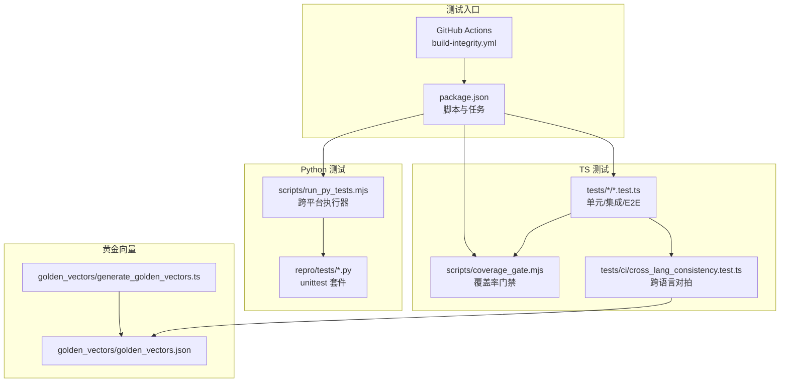
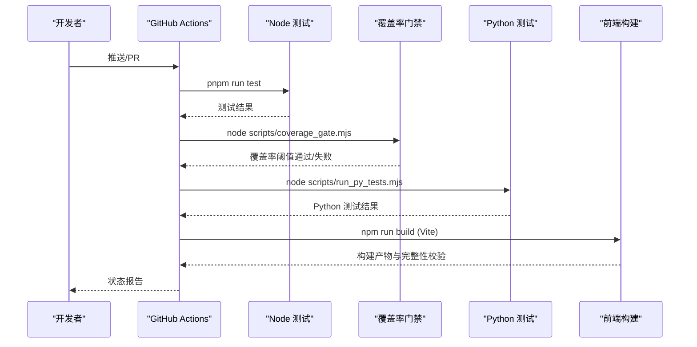
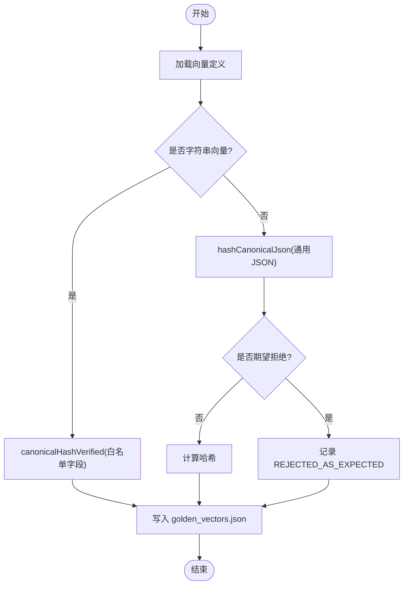
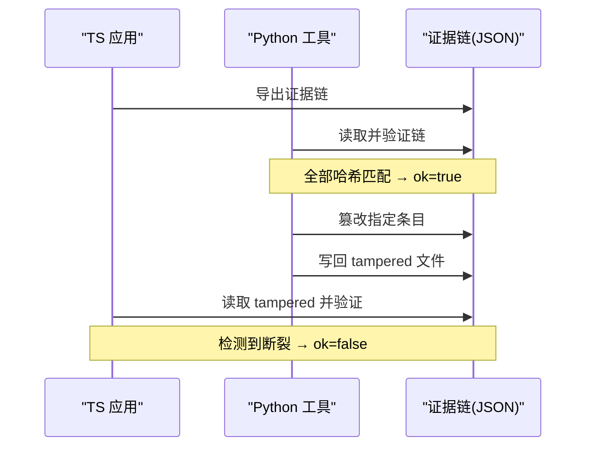
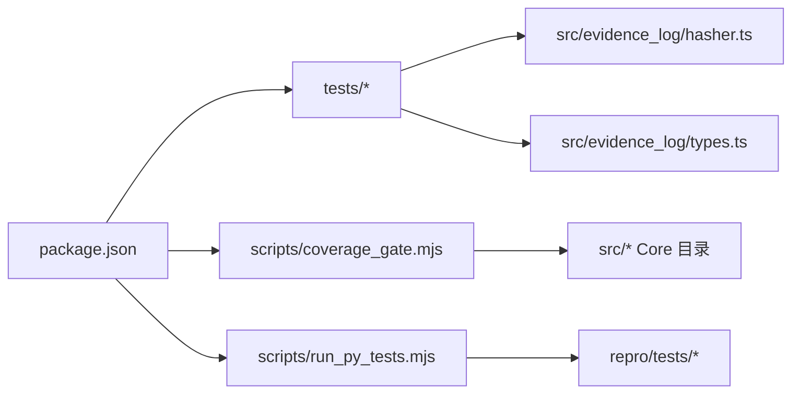

# 测试策略

<cite>
**本文引用的文件**
- [package.json](file://package.json)
- [scripts/coverage_gate.mjs](file://scripts/coverage_gate.mjs)
- [scripts/run_py_tests.mjs](file://scripts/run_py_tests.mjs)
- [.github/workflows/build-integrity.yml](file://.github/workflows/build-integrity.yml)
- [golden_vectors/generate_golden_vectors.ts](file://golden_vectors/generate_golden_vectors.ts)
- [golden_vectors/golden_vectors.json](file://golden_vectors/golden_vectors.json)
- [tests/ci/cross_lang_consistency.test.ts](file://tests/ci/cross_lang_consistency.test.ts)
- [repro/tests/test_cross_lang_consistency.py](file://repro/tests/test_cross_lang_consistency.py)
- [repro/far_chain_repro/cross_lang_roundtrip.py](file://repro/far_chain_repro/cross_lang_roundtrip.py)
- [tests/golden_vectors/verdict_oracle_cases.test.ts](file://tests/golden_vectors/verdict_oracle_cases.test.ts)
- [frontend/src/test-setup.ts](file://frontend/src/test-setup.ts)
- [src/evidence_log/hasher.ts](file://src/evidence_log/hasher.ts)
- [src/evidence_log/types.ts](file://src/evidence_log/types.ts)
- [src/falsifiability/verdict_kernel_v2.ts](file://src/falsifiability/verdict_kernel_v2.ts)
</cite>

## 目录
1. [简介](#简介)
2. [项目结构](#项目结构)
3. [核心组件](#核心组件)
4. [架构总览](#架构总览)
5. [详细组件分析](#详细组件分析)
6. [依赖关系分析](#依赖关系分析)
7. [性能考量](#性能考量)
8. [故障排查指南](#故障排查指南)
9. [结论](#结论)
10. [附录](#附录)

## 简介
本测试策略面向 FAR-Lab 的多层次测试体系，覆盖单元测试、集成测试、端到端测试、跨语言一致性验证、黄金向量用例、性能基准与回归、模拟与桩函数、覆盖率门禁、自动化 CI/CD 流程、测试数据与环境配置、调试与排障、以及最佳实践。目标是确保代码质量、可复现性与跨语言确定性，并在持续集成中形成强质量门禁。

## 项目结构
仓库采用多语言混合工程：TypeScript/Node.js 为主，Python 用于跨语言对拍与科学计算；前端使用 React + Vite。测试组织遵循“按领域分目录”的原则，测试文件与源码模块一一对应，便于定位与维护。



**图表来源**
- [package.json:45-82](file://package.json#L45-L82)
- [.github/workflows/build-integrity.yml:117-125](file://.github/workflows/build-integrity.yml#L117-L125)
- [scripts/coverage_gate.mjs:74-86](file://scripts/coverage_gate.mjs#L74-L86)
- [scripts/run_py_tests.mjs:104-126](file://scripts/run_py_tests.mjs#L104-L126)
- [golden_vectors/generate_golden_vectors.ts:153-198](file://golden_vectors/generate_golden_vectors.ts#L153-L198)
- [golden_vectors/golden_vectors.json:1-49](file://golden_vectors/golden_vectors.json#L1-L49)

**章节来源**
- [package.json:45-82](file://package.json#L45-L82)
- [.github/workflows/build-integrity.yml:117-125](file://.github/workflows/build-integrity.yml#L117-L125)

## 核心组件
- 统一测试入口与任务编排：通过 package.json 的 scripts 聚合全量测试、子域测试、覆盖率门禁、Python 测试、构建检查等。
- 覆盖率门禁：基于 Node 24 原生测试覆盖率能力，限定 Core 目录并设置阈值（行≥85%，分支≥75%），失败即阻断合并。
- Python 轴桥接：跨平台运行 Python unittest，自动注入 PYTHONPATH，支持 PR 场景下“触及 Python-axis 符号但环境不可用”的 fail-closed 保护。
- 跨语言一致性：TS 与 Python 在 canonicalHash/hashCanonicalJson 上逐向量对拍，保证字节级一致。
- 黄金向量：生成与校验哈希期望值，覆盖字符串与数值边界（含 NaN/Infinity 拒绝路径）。
- 裁决内核黄金用例：以 JSON 文件驱动五值裁决内核，断言输出与预期完全一致。
- 前端测试基线：Vitest 全局初始化，补齐 WebCrypto、fetch、matchMedia 等缺失能力，确保 UI 行为稳定可测。

**章节来源**
- [package.json:45-82](file://package.json#L45-L82)
- [scripts/coverage_gate.mjs:1-126](file://scripts/coverage_gate.mjs#L1-L126)
- [scripts/run_py_tests.mjs:1-127](file://scripts/run_py_tests.mjs#L1-L127)
- [tests/ci/cross_lang_consistency.test.ts:1-135](file://tests/ci/cross_lang_consistency.test.ts#L1-L135)
- [golden_vectors/generate_golden_vectors.ts:1-198](file://golden_vectors/generate_golden_vectors.ts#L1-L198)
- [golden_vectors/golden_vectors.json:1-49](file://golden_vectors/golden_vectors.json#L1-L49)
- [tests/golden_vectors/verdict_oracle_cases.test.ts:1-122](file://tests/golden_vectors/verdict_oracle_cases.test.ts#L1-L122)
- [frontend/src/test-setup.ts:1-55](file://frontend/src/test-setup.ts#L1-L55)

## 架构总览
下图展示从提交到 CI 的全链路：类型检查、ESLint、全量 TS 测试、覆盖率门禁、Python 测试、跨语言一致性、前端构建与完整性校验。



**图表来源**
- [.github/workflows/build-integrity.yml:117-125](file://.github/workflows/build-integrity.yml#L117-L125)
- [package.json:45-82](file://package.json#L45-L82)
- [scripts/coverage_gate.mjs:74-86](file://scripts/coverage_gate.mjs#L74-L86)
- [scripts/run_py_tests.mjs:104-126](file://scripts/run_py_tests.mjs#L104-L126)

## 详细组件分析

### 黄金向量测试用例
- 设计原则
  - 字符串向量走白名单字段规范化哈希；数值向量走通用 canonical JSON 哈希，覆盖 IEEE754 浮点、大整数、NaN/Infinity 拒绝路径。
  - 生成脚本固定时间戳与种子，禁用随机源，确保可重复。
  - 产出 golden_vectors.json 作为期望哈希的权威来源。
- 使用方法
  - 重新生成：运行生成脚本更新 golden_vectors.json。
  - 校验：CI 中的跨语言一致性测试将 TS 与 Python 计算的哈希与期望进行比对。
- 复杂度与稳定性
  - 向量数量固定（当前为 9+1 meta），哈希计算为 O(n) 序列化与一次散列，整体开销极低。
  - 通过真 NaN 输入触发拒绝路径，避免“假绿”。



**图表来源**
- [golden_vectors/generate_golden_vectors.ts:153-198](file://golden_vectors/generate_golden_vectors.ts#L153-L198)
- [golden_vectors/golden_vectors.json:1-49](file://golden_vectors/golden_vectors.json#L1-L49)

**章节来源**
- [golden_vectors/generate_golden_vectors.ts:1-198](file://golden_vectors/generate_golden_vectors.ts#L1-L198)
- [golden_vectors/golden_vectors.json:1-49](file://golden_vectors/golden_vectors.json#L1-L49)

### 跨语言一致性测试（TS ↔ Python）
- 目标：同一输入在 TS 与 Python 产生相同 hex 哈希；嵌套对象、camelCase 字段名、purposeTag 白名单等关键语义保持一致。
- 机制：TS 侧通过 spawnSync 调用 Python 解释器，设置 PYTHONPATH=repro，执行 Python 脚本计算哈希并与 TS 结果比较。
- 回归防护：新增或修改 canonicalHash/hashCanonicalJson 时，必须通过该测试；否则 CI 失败。

```mermaid
sequenceDiagram
participant TS as "TS 测试"
participant SP as "spawnSync"
participant PY as "Python 进程"
participant MOD as "far_chain_repro.canonical_json"
TS->>SP : 执行 python -c "import ...; print(canonical_hash(...))"
SP->>PY : 启动进程并传入参数
PY->>MOD : 导入模块并计算哈希
MOD-->>PY : 返回 hex
PY-->>SP : stdout 输出 hex
SP-->>TS : 读取输出
TS->>TS : 与 TS 计算结果断言相等
```

**图表来源**
- [tests/ci/cross_lang_consistency.test.ts:22-68](file://tests/ci/cross_lang_consistency.test.ts#L22-L68)
- [tests/ci/cross_lang_consistency.test.ts:70-135](file://tests/ci/cross_lang_consistency.test.ts#L70-L135)

**章节来源**
- [tests/ci/cross_lang_consistency.test.ts:1-135](file://tests/ci/cross_lang_consistency.test.ts#L1-L135)
- [repro/tests/test_cross_lang_consistency.py:1-104](file://repro/tests/test_cross_lang_consistency.py#L1-L104)

### 证据链往返篡改检测（端到端闭环）
- 目标：TS 导出证据链 → Python 重算并验证 → 篡改单条记录 → 再次验证应失败，证明链完整性有效且跨语言哈希一致。
- 关键点：篡改方式包括 currentHash、payload_data、prev_hash、cred.modelId；检测需给出断裂位置与期望/实际哈希。



**图表来源**
- [repro/far_chain_repro/cross_lang_roundtrip.py:66-208](file://repro/far_chain_repro/cross_lang_roundtrip.py#L66-L208)
- [repro/far_chain_repro/cross_lang_roundtrip.py:214-249](file://repro/far_chain_repro/cross_lang_roundtrip.py#L214-L249)

**章节来源**
- [repro/far_chain_repro/cross_lang_roundtrip.py:1-310](file://repro/far_chain_repro/cross_lang_roundtrip.py#L1-L310)

### 裁决内核黄金用例
- 目标：以磁盘上的 GV-01..GV-14 输入驱动五值裁决内核，断言输出（verdict、decisiveRuleId、reasonCodes、untestedReason）与预期一致。
- 价值：锁定裁决逻辑契约，防止规则漂移导致误判。

**章节来源**
- [tests/golden_vectors/verdict_oracle_cases.test.ts:1-122](file://tests/golden_vectors/verdict_oracle_cases.test.ts#L1-L122)
- [src/falsifiability/verdict_kernel_v2.ts:114-139](file://src/falsifiability/verdict_kernel_v2.ts#L114-L139)

### 前端测试基线与模拟桩
- Vitest 全局初始化注入 webcrypto.subtle、mock fetch、matchMedia，清理 DOM 与 mock 调用，确保 UI 测试稳定。
- 典型模式：vi.mocked(fetch) 拦截 API 响应；vi.stubGlobal 替换全局对象；afterEach 清理。

**章节来源**
- [frontend/src/test-setup.ts:1-55](file://frontend/src/test-setup.ts#L1-L55)

## 依赖关系分析
- 测试编排依赖
  - package.json 脚本串联 ensure_native_deps、ensure_py_deps、python_axis_probe、node --test、coverage_gate、run_py_tests。
  - GitHub Actions 在 push/PR 触发 tsc、lint、全量测试、覆盖率门禁、Python 测试、前端构建与完整性校验。
- 模块耦合
  - 跨语言一致性测试同时依赖 src/evidence_log 的哈希实现与 repro 的 Python 实现。
  - 覆盖率门禁仅统计 Core 目录，排除外部求解器与离线回放相关目录，降低噪声。
  - Python 测试执行器维护 PYTHONPATH 包含 repro 与 .python-deps，确保 import 成功。



**图表来源**
- [package.json:45-82](file://package.json#L45-L82)
- [scripts/coverage_gate.mjs:21-41](file://scripts/coverage_gate.mjs#L21-L41)
- [scripts/run_py_tests.mjs:13-26](file://scripts/run_py_tests.mjs#L13-L26)
- [src/evidence_log/hasher.ts](file://src/evidence_log/hasher.ts)
- [src/evidence_log/types.ts](file://src/evidence_log/types.ts)

**章节来源**
- [package.json:45-82](file://package.json#L45-L82)
- [scripts/coverage_gate.mjs:21-41](file://scripts/coverage_gate.mjs#L21-L41)
- [scripts/run_py_tests.mjs:13-26](file://scripts/run_py_tests.mjs#L13-L26)

## 性能考量
- 测试规模与耗时
  - 全量测试通过单一脚本并行执行多个子集，超时设置为 180s，适合复杂 E2E 场景。
  - 覆盖率门禁仅统计 Core 目录，减少插桩开销与 flake 风险。
- 建议
  - 对慢测试拆分独立任务，按需启用（如 real_backends、science_harness 适配器）。
  - 使用 fixtures 与离线 replay 替代真实网络/模型调用，提升稳定性。
  - 对内存敏感测试（如 memory_bounded）在覆盖率模式下单独观察，避免插桩导致的抖动。

[本节提供一般性指导，不直接分析具体文件]

## 故障排查指南
- 覆盖率门禁失败
  - 若覆盖率运行内存在测试失败，先修复测试本身；再确认是否为阈值未达标。
  - 关注日志中“fail N”与退出码区分：测试失败 vs 阈值不达标。
- Python 轴不可用
  - Windows 下使用 'python'，Unix 使用 'python3'；确保 PATH 正确且 sympy/z3 可导入。
  - PR 场景下若触及 Python-axis 符号但环境不可用，会 fail-closed 阻断。
- 跨语言哈希不一致
  - 检查 canonicalHash/hashCanonicalJson 是否引入非确定性（如随机、时间戳）。
  - 确认 camelCase 字段未被转换，purposeTag 白名单语义一致。
- 前端测试环境问题
  - 确保 vitest 全局初始化已注入 webcrypto.subtle、fetch、matchMedia。
  - 清理 afterEach 中的 DOM 与 mock，避免跨用例污染。

**章节来源**
- [scripts/coverage_gate.mjs:94-126](file://scripts/coverage_gate.mjs#L94-L126)
- [scripts/run_py_tests.mjs:28-93](file://scripts/run_py_tests.mjs#L28-L93)
- [tests/ci/cross_lang_consistency.test.ts:18-33](file://tests/ci/cross_lang_consistency.test.ts#L18-L33)
- [frontend/src/test-setup.ts:1-55](file://frontend/src/test-setup.ts#L1-L55)

## 结论
本测试策略通过分层测试、黄金向量、跨语言一致性、覆盖率门禁与 CI 集成，构建了高可信的质量保障体系。建议在后续迭代中持续完善：
- 扩展黄金向量覆盖更多边界条件与领域用例。
- 细化性能基准与回归阈值，纳入资源消耗监控。
- 强化模拟与桩函数的标准化，提高测试隔离度与可维护性。
- 保持 CI 流程与本地开发体验一致，减少环境差异带来的不稳定。

[本节总结性内容，不直接分析具体文件]

## 附录

### 自动化测试流程与 CI/CD 集成
- 本地命令
  - 全量测试：pnpm run test
  - Python 测试：pnpm run test:py
  - 覆盖率门禁：pnpm run coverage
- CI 流水线
  - 类型检查与 ESLint 零容忍。
  - 全量 TS 测试与覆盖率门禁。
  - Python 测试与跨语言一致性。
  - 前端构建与产物完整性校验。

**章节来源**
- [package.json:45-82](file://package.json#L45-L82)
- [.github/workflows/build-integrity.yml:117-125](file://.github/workflows/build-integrity.yml#L117-L125)

### 测试数据管理与环境配置
- 黄金向量数据位于 golden_vectors/golden_vectors.json，由 generate_golden_vectors.ts 生成，禁止手动编辑。
- Python 环境通过 scripts/run_py_tests.mjs 设置 PYTHONPATH=repro:.python-deps，确保依赖解析一致。
- 前端测试环境通过 frontend/src/test-setup.ts 补齐浏览器缺失能力，确保 UI 测试稳定。

**章节来源**
- [golden_vectors/generate_golden_vectors.ts:153-198](file://golden_vectors/generate_golden_vectors.ts#L153-L198)
- [golden_vectors/golden_vectors.json:1-49](file://golden_vectors/golden_vectors.json#L1-L49)
- [scripts/run_py_tests.mjs:13-26](file://scripts/run_py_tests.mjs#L13-L26)
- [frontend/src/test-setup.ts:1-55](file://frontend/src/test-setup.ts#L1-L55)

### 模拟与桩函数使用模式
- 网络请求：vi.mocked(fetch) 拦截 API，返回固定响应，避免真实网络依赖。
- 全局能力：vi.stubGlobal('URL', ...) 替换 URL 静态方法，控制下载等行为。
- 生命周期：afterEach 清理 DOM 与 mock，避免跨用例污染。

**章节来源**
- [frontend/src/test-setup.ts:1-55](file://frontend/src/test-setup.ts#L1-L55)

### 覆盖率要求与质量门禁
- 覆盖率范围：Core 13 目录（evidence_log、confounding_gate、falsifiability、anti_theater、proof_envelope、far_proof、agent_loop、fec、report、db、schema、api、statistics）。
- 阈值：行覆盖率 ≥85%，分支覆盖率 ≥75%。
- 门禁行为：低于阈值或非零退出（测试失败）均阻断合并。

**章节来源**
- [scripts/coverage_gate.mjs:21-41](file://scripts/coverage_gate.mjs#L21-L41)
- [scripts/coverage_gate.mjs:74-86](file://scripts/coverage_gate.mjs#L74-L86)
- [scripts/coverage_gate.mjs:94-126](file://scripts/coverage_gate.mjs#L94-L126)

### 调试技巧与故障诊断
- 逐步缩小范围：先运行子域测试（如 test:evidence_log、test:falsifiability）。
- 捕获输出：覆盖率门禁区分“测试失败”与“阈值不达标”，优先修复测试失败。
- 跨语言问题：打印 TS 与 Python 两端中间值，对比序列化与哈希输入。
- 前端问题：检查 vitest 全局初始化是否生效，确认 mock 是否正确清理。

**章节来源**
- [scripts/coverage_gate.mjs:94-126](file://scripts/coverage_gate.mjs#L94-L126)
- [tests/ci/cross_lang_consistency.test.ts:18-33](file://tests/ci/cross_lang_consistency.test.ts#L18-L33)
- [frontend/src/test-setup.ts:1-55](file://frontend/src/test-setup.ts#L1-L55)

### 最佳实践与代码质量保证
- 零容忍合规：禁止 any、@ts-ignore、空 catch、双重断言、桩代码返回。
- 确定性优先：禁用 Math.random()/Date.now() 进入确定性路径；固定时间戳与种子。
- 契约驱动：以黄金向量与裁决内核用例锁定接口与行为契约。
- 隔离与可复现：使用 fixtures、离线 replay、沙箱限制资源，确保测试稳定。

[本节提供一般性指导，不直接分析具体文件]