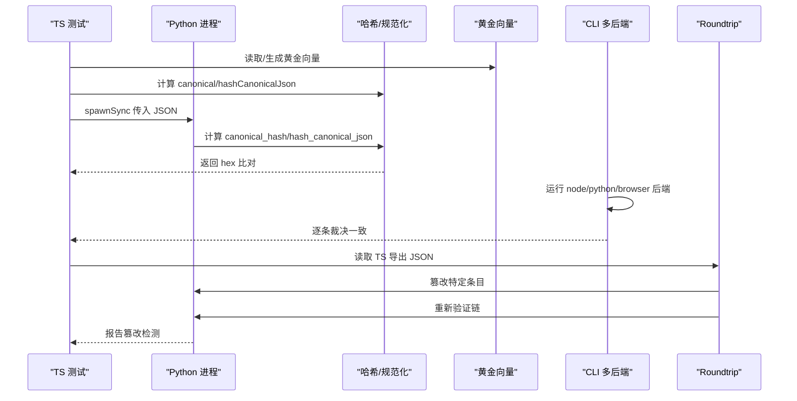
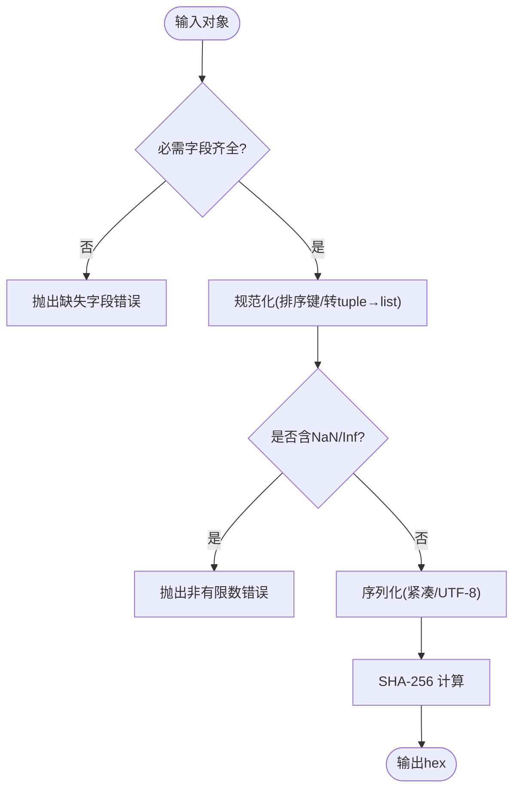
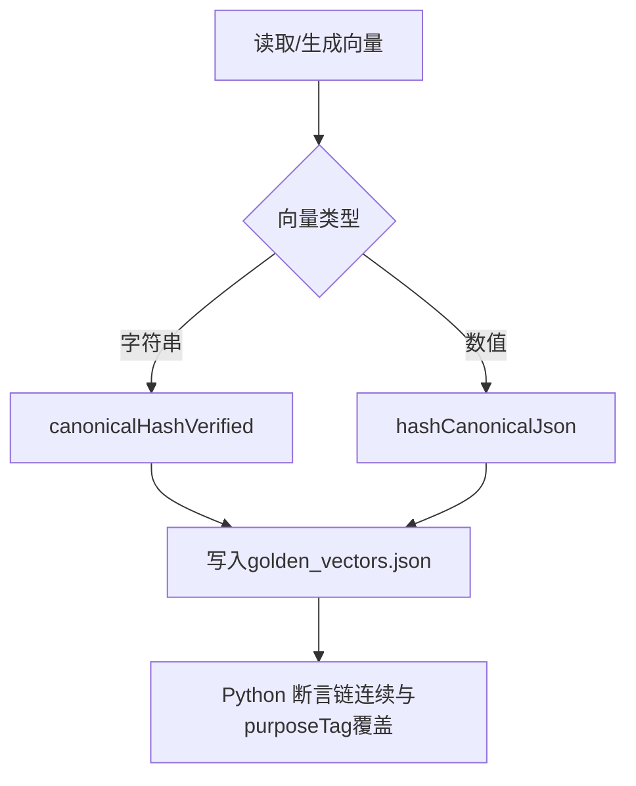
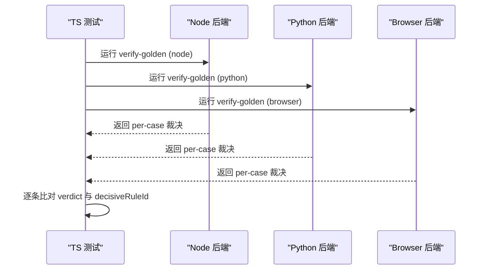
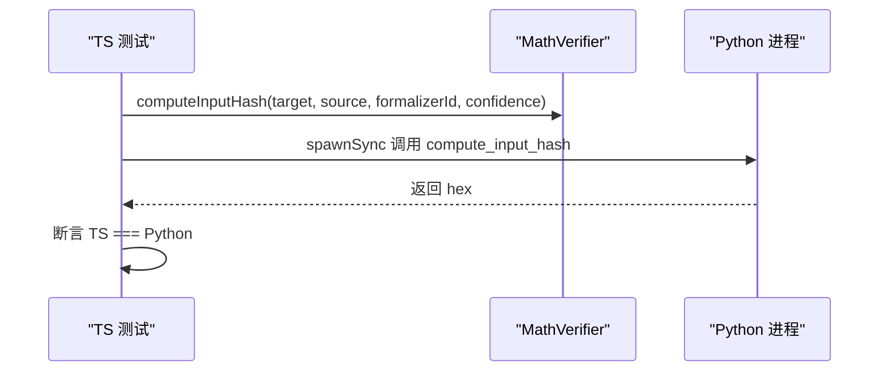
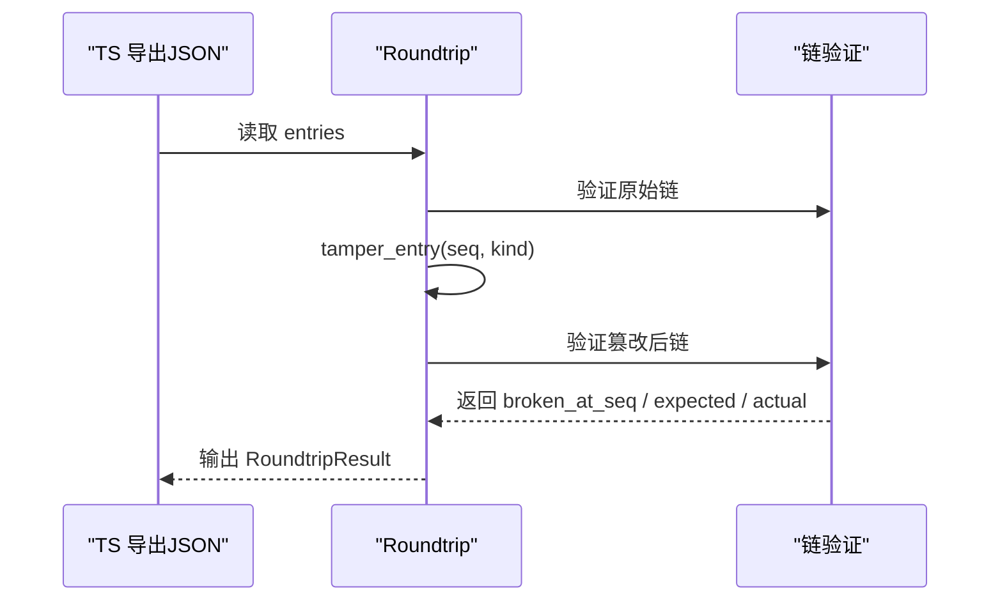
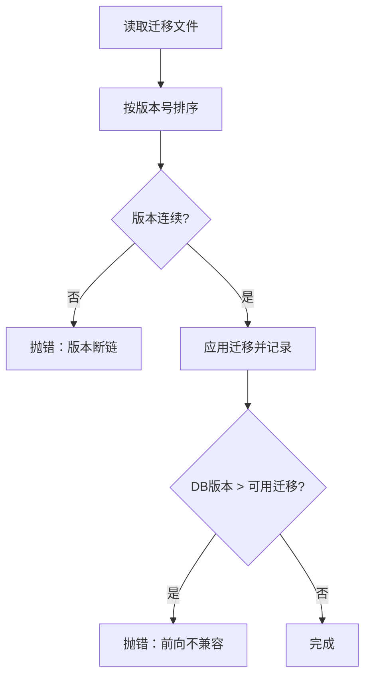
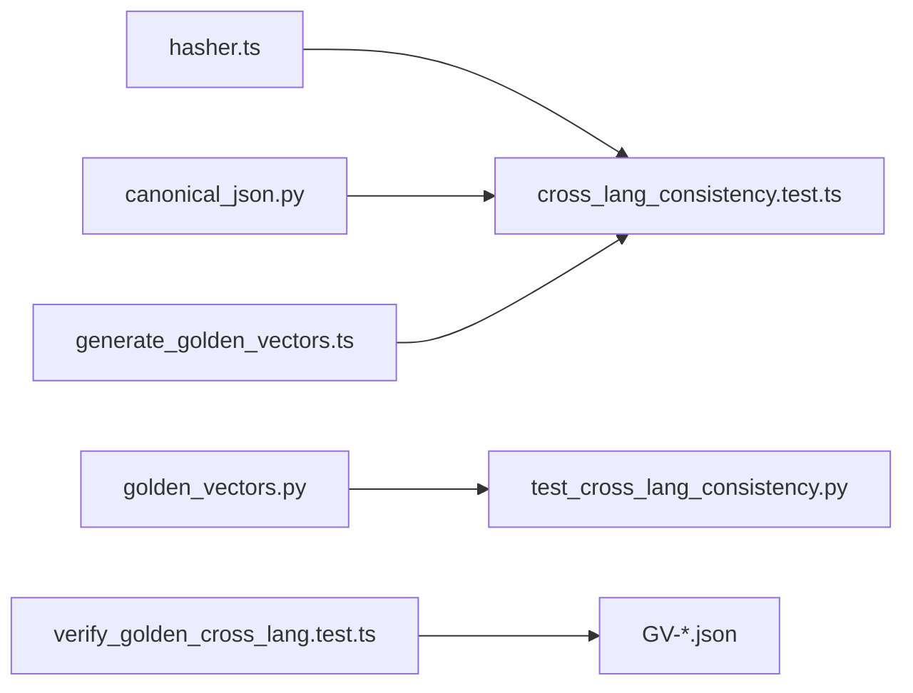

# 跨语言一致性测试

<cite>
**本文引用的文件**
- [repro/tests/test_cross_lang_consistency.py](file://repro/tests/test_cross_lang_consistency.py)
- [repro/far_chain_repro/cross_lang_roundtrip.py](file://repro/far_chain_repro/cross_lang_roundtrip.py)
- [golden_vectors/generate_golden_vectors.ts](file://golden_vectors/generate_golden_vectors.ts)
- [tests/cli/verify_golden_cross_lang.test.ts](file://tests/cli/verify_golden_cross_lang.test.ts)
- [tests/evidence_log/cross_lang_consistency.test.ts](file://tests/evidence_log/cross_lang_consistency.test.ts)
- [repro/far_chain_repro/golden_vectors.py](file://repro/far_chain_repro/golden_vectors.py)
- [src/evidence_log/hasher.ts](file://src/evidence_log/hasher.ts)
- [golden_vectors/cases/GV-01.json](file://golden_vectors/cases/GV-01.json)
- [tests/math/math_input_hash_cross_lang.test.ts](file://tests/math/math_input_hash_cross_lang.test.ts)
- [repro/far_chain_repro/canonical_json.py](file://repro/far_chain_repro/canonical_json.py)
- [src/evidence_log/golden_vectors.ts](file://src/evidence_log/golden_vectors.ts)
- [tests/db/migrator_safety.test.ts](file://tests/db/migrator_safety.test.ts)
- [src/db/migrator.ts](file://src/db/migrator.ts)
</cite>

## 目录
1. [简介](#简介)
2. [项目结构](#项目结构)
3. [核心组件](#核心组件)
4. [架构总览](#架构总览)
5. [详细组件分析](#详细组件分析)
6. [依赖关系分析](#依赖关系分析)
7. [性能考量](#性能考量)
8. [故障诊断指南](#故障诊断指南)
9. [结论](#结论)
10. [附录](#附录)

## 简介
本文件面向 TypeScript 与 Python 双实现的一致性保障，系统化说明以下目标：
- 跨语言数据序列化、算法一致性与数值精度的验证方法
- 确保不同语言实现行为一致的机制与流程
- 测试数据的共享机制与比较框架
- 版本兼容性与迁移验证策略
- 跨语言调试工具与故障诊断方法

该仓库通过“黄金向量（Golden Vectors）”、“跨语言对拍（spawnSync 进程间比对）”、“闭环篡改检测（Roundtrip）”和“多后端裁决一致性（Node/Python/Browser）”等机制，形成端到端的跨语言一致性门禁。

## 项目结构
围绕跨语言一致性，关键目录与职责如下：
- repro/far_chain_repro：Python 参考实现与跨语言工具链（canonical JSON、哈希、链校验、roundtrip）
- golden_vectors：TS 侧黄金向量生成器与落盘用例
- src/evidence_log：TS 侧证据日志的哈希、规范化与类型定义
- tests：覆盖跨语言对拍、CLI 端到端、数学输入哈希、数据库迁移安全等
- golden_vectors/cases：已落盘的黄金用例（如 GV-01..GV-14），用于多后端裁决一致性验证

```mermaid
graph TB
subgraph "TypeScript"
TS_H["证据日志哈希<br/>src/evidence_log/hasher.ts"]
TS_GV["黄金向量生成<br/>golden_vectors/generate_golden_vectors.ts"]
TS_TEST["跨语言测试<br/>tests/evidence_log/cross_lang_consistency.test.ts"]
CLI_TEST["CLI 多后端一致性<br/>tests/cli/verify_golden_cross_lang.test.ts"]
end
subgraph "Python"
PY_CJ["规范JSON/哈希<br/>repro/far_chain_repro/canonical_json.py"]
PY_GV["黄金向量/链<br/>repro/far_chain_repro/golden_vectors.py"]
PY_RT["Roundtrip/篡改检测<br/>repro/far_chain_repro/cross_lang_roundtrip.py"]
PY_TEST["Python 侧一致性<br/>repro/tests/test_cross_lang_consistency.py"]
end
subgraph "共享数据"
CASES["黄金用例<br/>golden_vectors/cases/GV-*.json"]
end
TS_TEST --> |spawnSync 调用| PY_CJ
TS_TEST --> |读取| TS_GV
CLI_TEST --> |运行内核| CASES
PY_RT --> |读写JSON| CASES
PY_TEST --> |断言| PY_GV
TS_H <- --> PY_CJ
```

图表来源
- [src/evidence_log/hasher.ts:1-90](file://src/evidence_log/hasher.ts#L1-L90)
- [repro/far_chain_repro/canonical_json.py:1-82](file://repro/far_chain_repro/canonical_json.py#L1-L82)
- [golden_vectors/generate_golden_vectors.ts:1-198](file://golden_vectors/generate_golden_vectors.ts#L1-L198)
- [repro/far_chain_repro/golden_vectors.py:1-232](file://repro/far_chain_repro/golden_vectors.py#L1-L232)
- [tests/evidence_log/cross_lang_consistency.test.ts:1-157](file://tests/evidence_log/cross_lang_consistency.test.ts#L1-L157)
- [tests/cli/verify_golden_cross_lang.test.ts:1-93](file://tests/cli/verify_golden_cross_lang.test.ts#L1-L93)
- [golden_vectors/cases/GV-01.json:1-158](file://golden_vectors/cases/GV-01.json#L1-L158)

章节来源
- [golden_vectors/generate_golden_vectors.ts:1-198](file://golden_vectors/generate_golden_vectors.ts#L1-L198)
- [repro/far_chain_repro/golden_vectors.py:1-232](file://repro/far_chain_repro/golden_vectors.py#L1-L232)
- [tests/evidence_log/cross_lang_consistency.test.ts:1-157](file://tests/evidence_log/cross_lang_consistency.test.ts#L1-L157)
- [tests/cli/verify_golden_cross_lang.test.ts:1-93](file://tests/cli/verify_golden_cross_lang.test.ts#L1-L93)

## 核心组件
- 跨语言规范 JSON 与哈希
  - TS：使用稳定字符串化与 SHA-256 计算；拒绝非有限数；提供白名单字段路径的 canonicalHashVerified
  - Python：等价实现，严格排序键、禁止 NaN/Inf、显式 tuple→list 转换以对齐字节序
- 黄金向量与链完整性
  - TS：生成器产出黄金向量并落盘；包含数值边界样本（GREEN/RED 分类）
  - Python：维护与 TS 镜像的向量集与 9 项 mini-chain，断言 prevHash 连续与 purposeTag 全覆盖
- 多后端裁决一致性
  - CLI 测试驱动 Node/Python/Browser 三种后端执行同一组 GV 用例，逐条对比裁决结果
- 数学输入哈希跨语言一致性
  - 针对 formalization 输入哈希，覆盖整数浮点、极小值、target 变化等场景，确保两侧 byte-equal
- 版本与迁移安全
  - 数据库迁移版本连续性检查与前向不兼容 fail-closed 保护

章节来源
- [src/evidence_log/hasher.ts:1-90](file://src/evidence_log/hasher.ts#L1-L90)
- [repro/far_chain_repro/canonical_json.py:1-82](file://repro/far_chain_repro/canonical_json.py#L1-L82)
- [golden_vectors/generate_golden_vectors.ts:1-198](file://golden_vectors/generate_golden_vectors.ts#L1-L198)
- [repro/far_chain_repro/golden_vectors.py:1-232](file://repro/far_chain_repro/golden_vectors.py#L1-L232)
- [tests/math/math_input_hash_cross_lang.test.ts:1-167](file://tests/math/math_input_hash_cross_lang.test.ts#L1-L167)
- [tests/db/migrator_safety.test.ts:1-73](file://tests/db/migrator_safety.test.ts#L1-L73)
- [src/db/migrator.ts:90-135](file://src/db/migrator.ts#L90-L135)

## 架构总览
下图展示跨语言一致性测试的整体流程：TS 与 Python 分别实现相同算法，通过黄金向量与 spawnSync 进行进程级对拍；同时用 CLI 驱动多后端对同一份用例进行裁决一致性验证；最后通过 roundtrip 完成“导出—篡改—再验证”的闭环检测。



图表来源
- [tests/evidence_log/cross_lang_consistency.test.ts:1-157](file://tests/evidence_log/cross_lang_consistency.test.ts#L1-L157)
- [tests/cli/verify_golden_cross_lang.test.ts:1-93](file://tests/cli/verify_golden_cross_lang.test.ts#L1-L93)
- [repro/far_chain_repro/cross_lang_roundtrip.py:1-310](file://repro/far_chain_repro/cross_lang_roundtrip.py#L1-L310)
- [golden_vectors/generate_golden_vectors.ts:1-198](file://golden_vectors/generate_golden_vectors.ts#L1-L198)

## 详细组件分析

### 组件A：跨语言规范 JSON 与哈希（TS vs Python）
- 设计要点
  - TS 侧 canonicalHashVerified 仅对白名单字段进行规范化与哈希，避免无关字段影响
  - Python 侧 _hashable 强制要求 stageId/cred/payloadKind/prevHash 四字段存在，保证契约一致
  - 两者均拒绝 NaN/Infinity，防止非有限数破坏确定性
  - Python 显式将 tuple 转为 list，消除隐式序列化差异
- 复杂度
  - 时间复杂度 O(n)（遍历对象/数组）
  - 空间复杂度 O(n)（构建规范化字符串）
- 优化建议
  - 在大规模 payload 下可考虑流式哈希（当前为内存内字符串）
  - 保持键排序与分隔符一致，避免 locale 或库版本漂移



图表来源
- [src/evidence_log/hasher.ts:1-90](file://src/evidence_log/hasher.ts#L1-L90)
- [repro/far_chain_repro/canonical_json.py:1-82](file://repro/far_chain_repro/canonical_json.py#L1-L82)

章节来源
- [src/evidence_log/hasher.ts:1-90](file://src/evidence_log/hasher.ts#L1-L90)
- [repro/far_chain_repro/canonical_json.py:1-82](file://repro/far_chain_repro/canonical_json.py#L1-L82)

### 组件B：黄金向量与链完整性（TS 生成 + Python 断言）
- 设计要点
  - TS 生成器按两类向量处理：字符串走 canonicalHashVerified；数值边界走 hashCanonicalJson，并对期望拒绝的用例记录占位标记
  - Python 维护 10 个黄金向量与 9 项 mini-chain，断言每个 prevHash 链接正确且 purposeTag 全覆盖
- 复杂度
  - 生成与断言均为线性扫描
- 优化建议
  - 新增向量时同步更新两端集合，保持 SSOT（单一事实源）



图表来源
- [golden_vectors/generate_golden_vectors.ts:1-198](file://golden_vectors/generate_golden_vectors.ts#L1-L198)
- [repro/far_chain_repro/golden_vectors.py:1-232](file://repro/far_chain_repro/golden_vectors.py#L1-L232)

章节来源
- [golden_vectors/generate_golden_vectors.ts:1-198](file://golden_vectors/generate_golden_vectors.ts#L1-L198)
- [repro/far_chain_repro/golden_vectors.py:1-232](file://repro/far_chain_repro/golden_vectors.py#L1-L232)

### 组件C：多后端裁决一致性（Node/Python/Browser）
- 设计要点
  - 通过 CLI 命令收集各后端对同一组 GV 用例的裁决结果，逐条比对 verdict 与 decisiveRuleId
  - 环境不可用时显式 skip，避免误报
- 复杂度
  - 取决于后端实现；测试层为 O(k) 逐条比对
- 优化建议
  - 增加并行执行与超时控制，缩短 CI 时长



图表来源
- [tests/cli/verify_golden_cross_lang.test.ts:1-93](file://tests/cli/verify_golden_cross_lang.test.ts#L1-L93)
- [golden_vectors/cases/GV-01.json:1-158](file://golden_vectors/cases/GV-01.json#L1-L158)

章节来源
- [tests/cli/verify_golden_cross_lang.test.ts:1-93](file://tests/cli/verify_golden_cross_lang.test.ts#L1-L93)
- [golden_vectors/cases/GV-01.json:1-158](file://golden_vectors/cases/GV-01.json#L1-L158)

### 组件D：数学输入哈希跨语言一致性
- 设计要点
  - 针对 computeInputHash 的 confidence 参数，覆盖整数浮点、极小值、IEEE-754 和 target 变化等场景
  - 通过 spawnSync 调用 Python 的 compute_input_hash，与 TS 结果逐字节比对
- 复杂度
  - 每次对拍为常数开销；整体随用例数量线性增长
- 优化建议
  - 批量用例合并 stdin 传输以减少进程启动开销



图表来源
- [tests/math/math_input_hash_cross_lang.test.ts:1-167](file://tests/math/math_input_hash_cross_lang.test.ts#L1-L167)

章节来源
- [tests/math/math_input_hash_cross_lang.test.ts:1-167](file://tests/math/math_input_hash_cross_lang.test.ts#L1-L167)

### 组件E：Roundtrip 闭环篡改检测
- 设计要点
  - 阶段1：验证原始证据链
  - 阶段2：篡改指定条目（currentHash/payload_data/prev_hash/cred_model_id）
  - 阶段3：重新验证链，确认检测到篡改
- 复杂度
  - 线性扫描链；篡改操作为常量时间
- 优化建议
  - 支持并发对不同 seq 的篡改探测



图表来源
- [repro/far_chain_repro/cross_lang_roundtrip.py:1-310](file://repro/far_chain_repro/cross_lang_roundtrip.py#L1-L310)

章节来源
- [repro/far_chain_repro/cross_lang_roundtrip.py:1-310](file://repro/far_chain_repro/cross_lang_roundtrip.py#L1-L310)

### 组件F：版本兼容性与迁移验证
- 设计要点
  - 迁移版本必须连续，否则 fail-closed
  - DB schema 版本高于代码迁移集时，阻止旧代码读新 schema，避免崩溃
- 复杂度
  - 读取与校验为线性扫描
- 优化建议
  - 在 CI 中引入迁移回归用例，覆盖常见升级路径



图表来源
- [src/db/migrator.ts:90-135](file://src/db/migrator.ts#L90-L135)
- [tests/db/migrator_safety.test.ts:1-73](file://tests/db/migrator_safety.test.ts#L1-L73)

章节来源
- [src/db/migrator.ts:90-135](file://src/db/migrator.ts#L90-L135)
- [tests/db/migrator_safety.test.ts:1-73](file://tests/db/migrator_safety.test.ts#L1-L73)

## 依赖关系分析
- 模块耦合
  - evidence_log 哈希模块被跨语言测试直接引用，作为一致性基准
  - golden_vectors 生成器与 Python 黄金向量集互为镜像，需保持同步
  - CLI 测试依赖各后端实现，但通过统一用例解耦
- 外部依赖
  - spawnSync 用于进程间通信，需考虑平台差异（Windows 使用 python，Unix 使用 python3）
  - fast-json-stable-stringify 与 Python json.dumps 的行为差异已在测试中明确标注（指数零填充）



图表来源
- [src/evidence_log/hasher.ts:1-90](file://src/evidence_log/hasher.ts#L1-L90)
- [repro/far_chain_repro/canonical_json.py:1-82](file://repro/far_chain_repro/canonical_json.py#L1-L82)
- [golden_vectors/generate_golden_vectors.ts:1-198](file://golden_vectors/generate_golden_vectors.ts#L1-L198)
- [repro/far_chain_repro/golden_vectors.py:1-232](file://repro/far_chain_repro/golden_vectors.py#L1-L232)
- [tests/evidence_log/cross_lang_consistency.test.ts:1-157](file://tests/evidence_log/cross_lang_consistency.test.ts#L1-L157)
- [repro/tests/test_cross_lang_consistency.py:1-104](file://repro/tests/test_cross_lang_consistency.py#L1-L104)
- [tests/cli/verify_golden_cross_lang.test.ts:1-93](file://tests/cli/verify_golden_cross_lang.test.ts#L1-L93)
- [golden_vectors/cases/GV-01.json:1-158](file://golden_vectors/cases/GV-01.json#L1-L158)

章节来源
- [tests/evidence_log/cross_lang_consistency.test.ts:1-157](file://tests/evidence_log/cross_lang_consistency.test.ts#L1-L157)
- [repro/tests/test_cross_lang_consistency.py:1-104](file://repro/tests/test_cross_lang_consistency.py#L1-L104)
- [tests/cli/verify_golden_cross_lang.test.ts:1-93](file://tests/cli/verify_golden_cross_lang.test.ts#L1-L93)

## 性能考量
- 进程启动开销：spawnSync 调用频繁时可能成为瓶颈，建议批量化或缓存
- 序列化成本：大对象规范化与哈希占用内存，可考虑分块处理
- 并发执行：多后端裁决可并行化，但需注意资源隔离与超时控制
- I/O 优化：黄金向量与用例文件应只读，减少磁盘抖动

[本节为通用指导，无需具体文件分析]

## 故障诊断指南
- 常见问题
  - Python 环境缺失或依赖不全：CI 中显式 skip 并记录原因
  - WindowsApps python3 stub：使用 'python' 替代以避免挂起
  - 数值序列化差异：关注指数零填充（TS "1e-7" vs Py "1e-07"），属于已知差异
- 定位步骤
  - 使用 roundtrip 工具定位篡改位置（broken_at_seq、expected/actual）
  - 通过 CLI 多后端测试缩小问题范围（Node/Python/Browser 哪一侧不一致）
  - 检查迁移版本连续性，避免前向不兼容导致运行时异常
- 恢复措施
  - 更新黄金向量与 Python 镜像集，保持 SSOT
  - 修复规范化逻辑，确保键排序与分隔符一致
  - 在 CI 中增加更细粒度的失败捕获与产物归档

章节来源
- [repro/far_chain_repro/cross_lang_roundtrip.py:1-310](file://repro/far_chain_repro/cross_lang_roundtrip.py#L1-L310)
- [tests/cli/verify_golden_cross_lang.test.ts:1-93](file://tests/cli/verify_golden_cross_lang.test.ts#L1-L93)
- [tests/db/migrator_safety.test.ts:1-73](file://tests/db/migrator_safety.test.ts#L1-L73)

## 结论
本项目通过黄金向量、跨语言对拍、多后端裁决一致性和 roundtrip 闭环检测，构建了坚实的跨语言一致性保障体系。数值域存在已知序列化格式差异，已通过明确标注与回归基线管理。版本迁移采用 fail-closed 策略，有效防止前向不兼容风险。建议在后续迭代中继续强化批量化与并行化，提升 CI 效率与可观测性。

[本节为总结，无需具体文件分析]

## 附录
- 术语
  - 黄金向量：固定输入与期望输出的对照集，用于回归与跨语言对拍
  - Roundtrip：导出—篡改—再验证的闭环测试
  - 多后端：Node/Python/Browser 三种执行环境
- 最佳实践
  - 新增向量时同步更新 TS 与 Python 侧
  - 所有跨语言比较基于 spawnSync 进程级比对，避免共享内存干扰
  - 对数值域差异如实记录，避免伪造绿色

[本节为补充信息，无需具体文件分析]