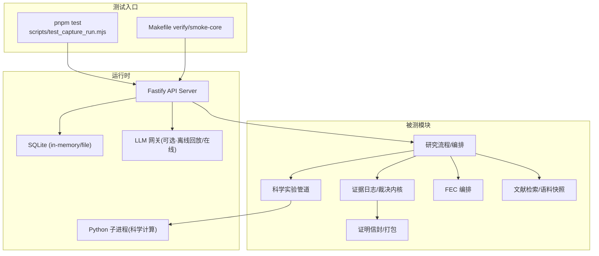
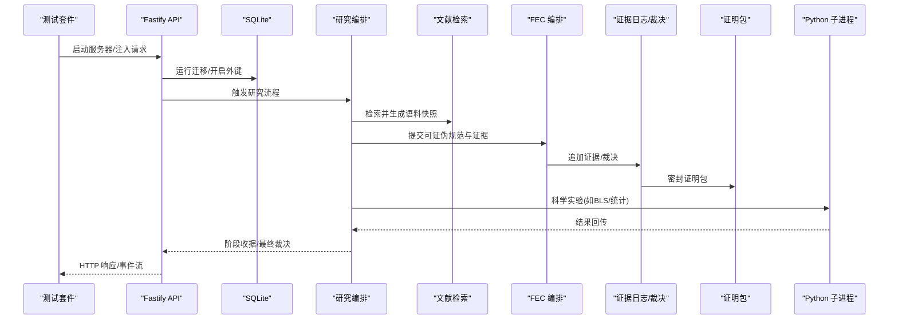
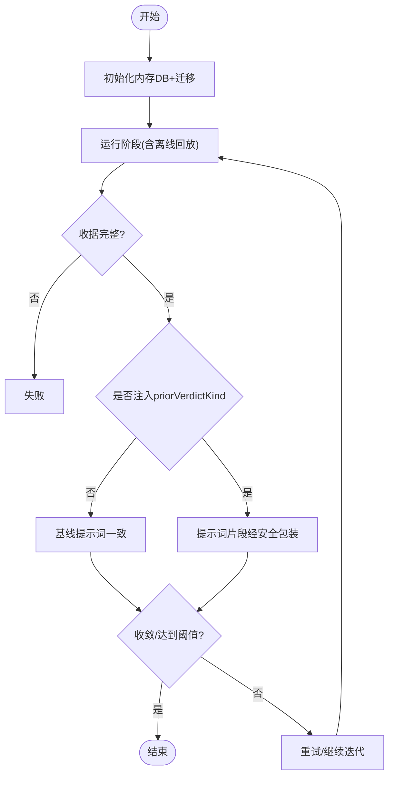
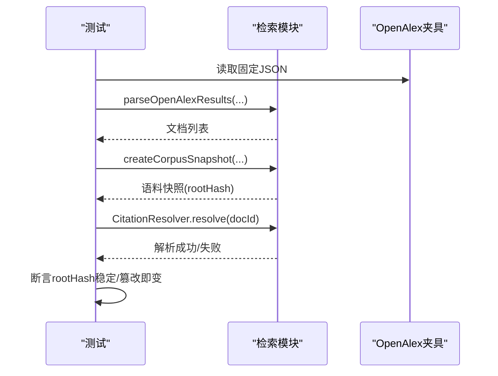
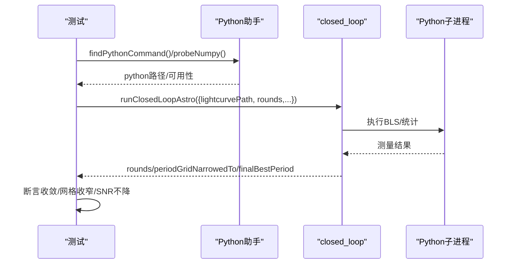
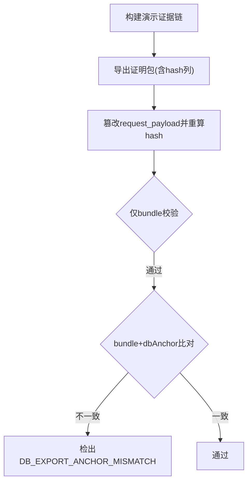
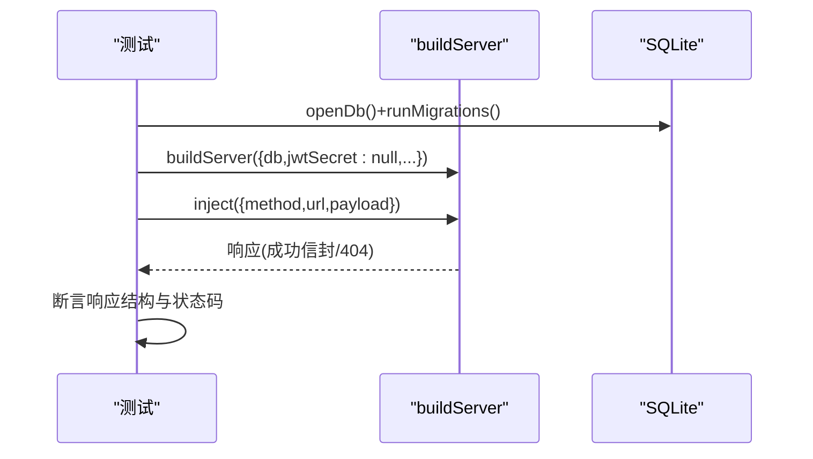
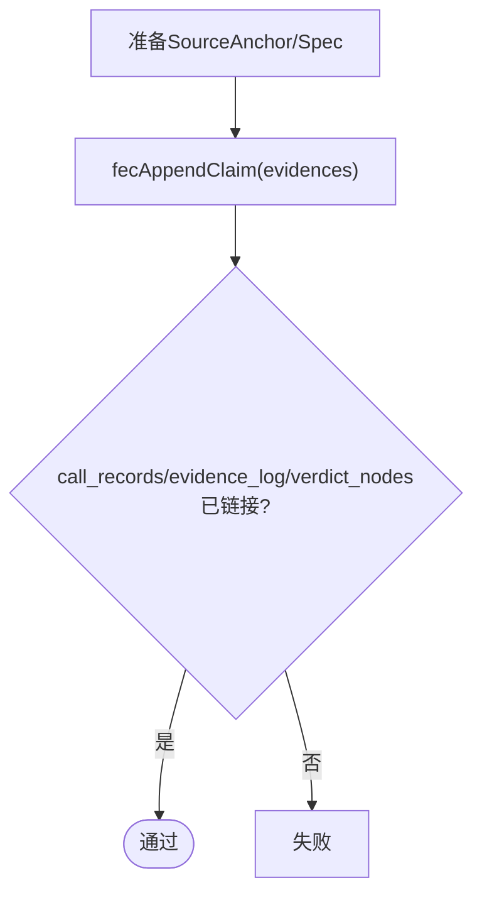
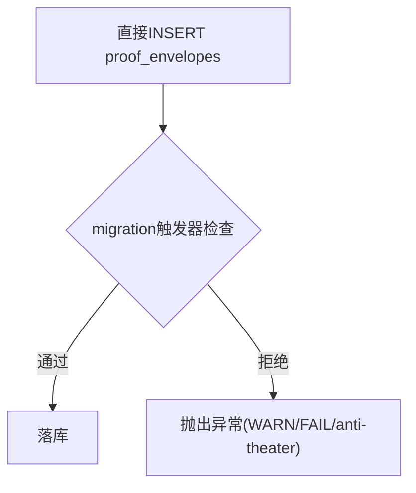
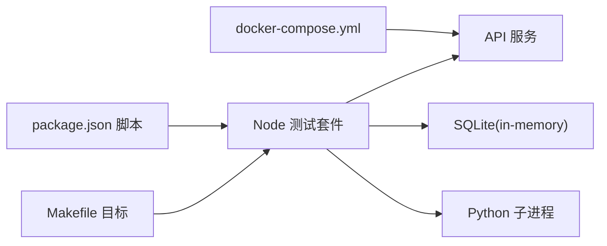

# 集成测试

<cite>
**本文引用的文件**
- [package.json](file://package.json)
- [Makefile](file://Makefile)
- [docker-compose.yml](file://docker-compose.yml)
- [tests/_helpers/python.ts](file://tests/_helpers/python.ts)
- [tests/_helpers/benchmark_report.ts](file://tests/_helpers/benchmark_report.ts)
- [src/api/server.ts](file://src/api/server.ts)
- [src/cli/commands/api.ts](file://src/cli/commands/api.ts)
- [src/db/index.ts](file://src/db/index.ts)
- [src/db/migrator.ts](file://src/db/migrator.ts)
- [src/db/open.ts](file://src/db/open.ts)
- [src/fec/index.ts](file://src/fec/index.ts)
- [src/evidence_log/index.ts](file://src/evidence_log/index.ts)
- [src/retrieval/index.ts](file://src/retrieval/index.ts)
- [src/science_harness/closed_loop.ts](file://src/science_harness/closed_loop.ts)
- [src/science_harness/hero_b_pipeline.ts](file://src/science_harness/hero_b_pipeline.ts)
- [src/proof_envelope/sealer.ts](file://src/proof_envelope/sealer.ts)
- [src/proof_envelope/validator.ts](file://src/proof_envelope/validator.ts)
- [src/proof_envelope/proof_hash.ts](file://src/proof_envelope/proof_hash.ts)
- [tests/api/v1_success_envelope.test.ts](file://tests/api/v1_success_envelope.test.ts)
- [tests/api/verdict_authority_boundary.test.ts](file://tests/api/verdict_authority_boundary.test.ts)
- [tests/api/server_fail_closed.test.ts](file://tests/api/server_fail_closed.test.ts)
- [tests/fec/fec_orchestrator.test.ts](file://tests/fec/fec_orchestrator.test.ts)
- [tests/retrieval/corpus_citation.test.ts](file://tests/retrieval/corpus_citation.test.ts)
- [tests/science_harness/closed_loop.test.ts](file://tests/science_harness/closed_loop.test.ts)
- [tests/proof_envelope/proof_envelope.test.ts](file://tests/proof_envelope/proof_envelope.test.ts)
- [tests/far_proof/bundle_export_anchor.test.ts](file://tests/far_proof/bundle_export_anchor.test.ts)
- [tests/agent_loop/stage6_verdict_inject.test.ts](file://tests/agent_loop/stage6_verdict_inject.test.ts)
</cite>

## 目录
1. [简介](#简介)
2. [项目结构](#项目结构)
3. [核心组件](#核心组件)
4. [架构总览](#架构总览)
5. [详细组件分析](#详细组件分析)
6. [依赖关系分析](#依赖关系分析)
7. [性能考量](#性能考量)
8. [故障排查指南](#故障排查指南)
9. [结论](#结论)
10. [附录](#附录)

## 简介
本文件面向 FAR-Lab 的集成测试，聚焦多组件交互与端到端场景。围绕工作流编排、研究流程、科学实验管道、证明包生成与文献检索等模块，说明如何设计并实现跨进程、跨语言、跨存储的集成测试；解释组件间通信协议与数据流转验证方法；覆盖数据库集成、外部 API 调用与异步操作；给出测试环境配置、数据准备与清理策略；并提供端到端场景与故障注入的最佳实践。

## 项目结构
仓库采用“源码 + 测试”分层组织：
- src：业务与平台能力（API、CLI、证据链、FEC、证明信封、检索、科学实验、数学后端等）
- tests：按模块划分的单元测试与集成测试，包含跨语言 Python 调用、真实后端回归、端到端闭环实验
- scripts：构建、质量门禁、脚本工具
- schema：数据库迁移与 JSON Schema
- golden_vectors：确定性向量与回归基线
- ci：CI 流水线与冒烟用例
- frontend：前端应用（与 API 集成测试配合）

**图表来源**
- [package.json:45-82](file://package.json#L45-L82)
- [Makefile:12-40](file://Makefile#L12-L40)
- [docker-compose.yml:12-28](file://docker-compose.yml#L12-L28)

**章节来源**
- [package.json:45-82](file://package.json#L45-L82)
- [Makefile:12-40](file://Makefile#L12-L40)
- [docker-compose.yml:12-28](file://docker-compose.yml#L12-L28)

## 核心组件
- 工作流编排与 Agent Loop：通过阶段化 FSM 驱动研究生命周期，记录每阶段收据，支持断点恢复与可重放。
- 研究流程：从问题落地到真实文献检索、假设生成、独立批判、评分与计划输出，全程可审计。
- 科学实验管道：封装 BLS、统计检验、网格缩放与闭环迭代，支持真实 Python 后端执行。
- 证明包生成：将证据链、裁决节点、元数据密封为可验证包，支持离线校验与一致性锚定。
- 文献检索：基于 OpenAlex/arXiv/Crossref 的语料快照与引用解析，确保引用不可伪造且语料不可变。

**章节来源**
- [src/science_harness/hero_b_pipeline.ts:23-60](file://src/science_harness/hero_b_pipeline.ts#L23-L60)
- [src/retrieval/index.ts](file://src/retrieval/index.ts)
- [src/proof_envelope/sealer.ts](file://src/proof_envelope/sealer.ts)
- [src/proof_envelope/validator.ts](file://src/proof_envelope/validator.ts)
- [src/proof_envelope/proof_hash.ts](file://src/proof_envelope/proof_hash.ts)

## 架构总览
下图展示集成测试中关键组件的交互：API 层作为统一入口，协调研究编排、检索、FEC、证据日志与证明包；科学实验通过 Python 子进程执行；数据库提供持久化与迁移；可选 LLM 网关用于在线模式或离线回放。

**图表来源**
- [tests/api/v1_success_envelope.test.ts:23-39](file://tests/api/v1_success_envelope.test.ts#L23-L39)
- [src/db/index.ts](file://src/db/index.ts)
- [src/retrieval/index.ts](file://src/retrieval/index.ts)
- [src/fec/index.ts](file://src/fec/index.ts)
- [src/evidence_log/index.ts](file://src/evidence_log/index.ts)
- [src/proof_envelope/sealer.ts](file://src/proof_envelope/sealer.ts)
- [src/science_harness/closed_loop.ts](file://src/science_harness/closed_loop.ts)

## 详细组件分析

### 工作流编排与 Agent Loop 集成测试
- 目标：验证阶段顺序、状态机转移、阶段收据写入、软建议注入与收敛行为。
- 关键点：
  - 使用内存数据库+迁移，保证隔离与幂等。
  - 注入离线回放网关，避免外部依赖。
  - 断言 stage6 提示词在有无 priorVerdictKind 时的一致性，以及最小信息原则下的 hint 包装。
- 典型断言：阶段数量、终止条件、token 消耗上限、收据完整性。

**图表来源**
- [tests/agent_loop/stage6_verdict_inject.test.ts:82-123](file://tests/agent_loop/stage6_verdict_inject.test.ts#L82-L123)
- [src/db/migrator.ts](file://src/db/migrator.ts)

**章节来源**
- [tests/agent_loop/stage6_verdict_inject.test.ts:1-123](file://tests/agent_loop/stage6_verdict_inject.test.ts#L1-L123)

### 研究流程与文献检索集成测试
- 目标：验证语料快照不可变、引用必须可解析、根哈希随内容变化而变化。
- 关键点：
  - 使用真实 OpenAlex 固定夹具，构造 RetrievedDocument。
  - 通过 CitationResolver 校验引用绑定到语料。
  - 断言 normalizedDocumentHash 与 rootHash 对篡改敏感。
- 数据准备：fixtures/retrieval 下预存查询结果，避免网络抖动。

**图表来源**
- [tests/retrieval/corpus_citation.test.ts:1-30](file://tests/retrieval/corpus_citation.test.ts#L1-L30)
- [src/retrieval/index.ts](file://src/retrieval/index.ts)

**章节来源**
- [tests/retrieval/corpus_citation.test.ts:1-30](file://tests/retrieval/corpus_citation.test.ts#L1-L30)

### 科学实验管道与 Python 子进程集成测试
- 目标：验证闭环迭代（规划→BLS→验证→网格缩放→实测提升），参数守卫与环境健壮性。
- 关键点：
  - 通过 _helpers/python.ts 定位 python/python3 并探测 numpy。
  - 设置 PYTHONUTF8/PYTHONIOENCODING 解决跨平台编码问题。
  - 使用临时工作目录，测试后清理。
  - 断言轮数、周期收敛、SNR 轨迹不降级、网格收窄与分辨率提升。
- 异步/超时：对 Python spawn 设置超时，避免 CI 挂起。

**图表来源**
- [tests/science_harness/closed_loop.test.ts:21-77](file://tests/science_harness/closed_loop.test.ts#L21-L77)
- [tests/_helpers/python.ts:19-63](file://tests/_helpers/python.ts#L19-L63)
- [src/science_harness/closed_loop.ts](file://src/science_harness/closed_loop.ts)

**章节来源**
- [tests/science_harness/closed_loop.test.ts:1-98](file://tests/science_harness/closed_loop.test.ts#L1-L98)
- [tests/_helpers/python.ts:1-76](file://tests/_helpers/python.ts#L1-L76)

### 证明包生成与一致性锚定集成测试
- 目标：验证导出包与数据库锚的一致性，检测一致伪造（payload 修改但 hash 重算）。
- 关键点：
  - 先导出再篡改，对比 bundle-only 与 dbAnchor 校验差异。
  - 断言错误码包含 DB_EXPORT_ANCHOR_MISMATCH。
  - 结合 sealer/validator/proof_hash 形成物理兜底。
- 数据准备：demo chain 构建与 backfill payload hashes。

**图表来源**
- [tests/far_proof/bundle_export_anchor.test.ts:86-115](file://tests/far_proof/bundle_export_anchor.test.ts#L86-L115)
- [src/proof_envelope/sealer.ts](file://src/proof_envelope/sealer.ts)
- [src/proof_envelope/validator.ts](file://src/proof_envelope/validator.ts)
- [src/proof_envelope/proof_hash.ts](file://src/proof_envelope/proof_hash.ts)

**章节来源**
- [tests/far_proof/bundle_export_anchor.test.ts:86-115](file://tests/far_proof/bundle_export_anchor.test.ts#L86-L115)

### API 集成与权限边界测试
- 目标：验证 V1 成功信封序列化、无写入口的安全边界、匿名/受保护模式启动策略。
- 关键点：
  - 使用内存数据库+迁移，注入 buildServer，发送 HTTP 请求。
  - 断言 PUT/PATCH/DELETE 到裁决相关路径返回 404。
  - 默认 host 为 loopback；非 loopback 需启用 JWT 保护，否则拒绝启动。
- 数据准备：openDb 函数封装迁移与外键开关。

**图表来源**
- [tests/api/v1_success_envelope.test.ts:23-39](file://tests/api/v1_success_envelope.test.ts#L23-L39)
- [tests/api/verdict_authority_boundary.test.ts:26-60](file://tests/api/verdict_authority_boundary.test.ts#L26-L60)
- [tests/api/server_fail_closed.test.ts:19-52](file://tests/api/server_fail_closed.test.ts#L19-L52)

**章节来源**
- [tests/api/v1_success_envelope.test.ts:1-57](file://tests/api/v1_success_envelope.test.ts#L1-L57)
- [tests/api/verdict_authority_boundary.test.ts:26-60](file://tests/api/verdict_authority_boundary.test.ts#L26-L60)
- [tests/api/server_fail_closed.test.ts:1-110](file://tests/api/server_fail_closed.test.ts#L1-L110)

### FEC 编排与证据链集成测试
- 目标：验证 fecAppendClaim 正确链接 call_records、evidence_log、verdict_nodes。
- 关键点：
  - 构造 SourceAnchor/FalsificationSpec/ThresholdSpec。
  - 使用内存数据库+迁移，插入证据并断言关联表计数。
- 数据准备：fixtures 提供有效 FEC 对象。

**图表来源**
- [tests/fec/fec_orchestrator.test.ts:1-57](file://tests/fec/fec_orchestrator.test.ts#L1-L57)
- [src/fec/index.ts](file://src/fec/index.ts)
- [src/evidence_log/index.ts](file://src/evidence_log/index.ts)

**章节来源**
- [tests/fec/fec_orchestrator.test.ts:1-57](file://tests/fec/fec_orchestrator.test.ts#L1-L57)

### 证明信封校验与物理兜底测试
- 目标：验证 sealer 规则、validator 检查、migration trigger 拦截非法直接 INSERT。
- 关键点：
  - 构造含 FAIL+CONFIRMED 的 envelope，尝试绕过 sealer 直接 INSERT。
  - 断言触发器抛出包含 WARN/FAIL 或 anti-theater 的错误。
- 数据准备：valid spec/anchor/hashes。

**图表来源**
- [tests/proof_envelope/proof_envelope.test.ts:431-458](file://tests/proof_envelope/proof_envelope.test.ts#L431-L458)
- [src/proof_envelope/sealer.ts](file://src/proof_envelope/sealer.ts)
- [src/proof_envelope/validator.ts](file://src/proof_envelope/validator.ts)

**章节来源**
- [tests/proof_envelope/proof_envelope.test.ts:16-62](file://tests/proof_envelope/proof_envelope.test.ts#L16-L62)
- [tests/proof_envelope/proof_envelope.test.ts:431-458](file://tests/proof_envelope/proof_envelope.test.ts#L431-L458)

## 依赖关系分析
- 测试入口与脚本：
  - package.json 定义 test 命令，串联 Node 与 Python 测试，覆盖所有模块。
  - Makefile 提供 verify/smoke-core 等便捷目标。
- 环境与容器：
  - docker-compose.yml 提供 offline demo 与 API 服务，支持可选 .env 注入密钥。
- 跨语言协作：
  - _helpers/python.ts 统一 Python 发现、路径拼接、numpy 探测与超时控制。
- 数据库：
  - 测试普遍使用 :memory: 数据库+runMigrations，确保迁移链与外键约束生效。

**图表来源**
- [package.json:45-82](file://package.json#L45-L82)
- [Makefile:12-40](file://Makefile#L12-L40)
- [docker-compose.yml:12-28](file://docker-compose.yml#L12-L28)

**章节来源**
- [package.json:45-82](file://package.json#L45-L82)
- [Makefile:12-40](file://Makefile#L12-L40)
- [docker-compose.yml:12-28](file://docker-compose.yml#L12-L28)

## 性能考量
- 超时与阻塞防护：对 Python spawn 设置 30s 超时，避免 CI 主线程冻结导致静默挂起。
- 资源隔离：每个测试使用内存数据库与临时工作目录，避免共享状态污染。
- 确定性：使用离线回放与固定夹具，减少外部依赖波动；基准报告按需生成，避免重复开销。
- 并发与吞吐：API 测试通过 app.inject 快速注入请求，避免真实网络开销。

[本节为通用指导，无需具体文件引用]

## 故障排查指南
- API 启动失败：
  - 非 loopback 主机未启用 JWT 保护会拒绝启动；默认 host 为 127.0.0.1。
  - 空 secret 会被拒绝，防止伪造 admin。
- Python 子进程卡死：
  - 检查 PYTHONPATH 与 numpy 可用；确认 PYTHONUTF8/PYTHONIOENCODING 已设置。
  - 捕获 spawn 错误并打印 stderr/stdout。
- 数据库迁移/外键：
  - 确保 runMigrations 已执行且 pragma foreign_keys=ON。
- 证明包不一致：
  - 若 bundle-only 通过但 dbAnchor 校验失败，通常为一致伪造；检查导出时机与触发器。

**章节来源**
- [tests/api/server_fail_closed.test.ts:54-110](file://tests/api/server_fail_closed.test.ts#L54-L110)
- [tests/_helpers/python.ts:57-76](file://tests/_helpers/python.ts#L57-L76)
- [tests/far_proof/bundle_export_anchor.test.ts:86-115](file://tests/far_proof/bundle_export_anchor.test.ts#L86-L115)

## 结论
本集成测试体系以“内存数据库+迁移”“离线回放+固定夹具”“Python 子进程超时防护”为核心，覆盖了工作流编排、研究流程、科学实验、证明包与文献检索的关键交互路径。通过明确的权限边界、物理兜底与一致性锚定，确保系统在真实与对抗环境下仍具备可验证性与鲁棒性。建议在新增功能时遵循相同范式：隔离环境、确定性输入、显式超时与严格断言。

[本节为总结，无需具体文件引用]

## 附录
- 测试环境配置要点
  - Node：使用 pnpm 安装依赖，执行 test 命令。
  - Python：确保 PATH 中存在 python/python3，并安装 numpy；必要时设置环境变量。
  - Docker：使用 docker-compose up far-api 启动离线 API；如需在线模型，传入 .env 文件。
- 数据准备与清理
  - 使用 fixtures 目录存放固定数据；测试前后创建/删除临时目录。
  - 基准报告按需生成，存在则跳过。
- 端到端场景示例
  - 研究闭环：问题→检索→假设→批判→评分→计划。
  - 科学实验闭环：BLS→统计→网格缩放→收敛验证。
  - 证明包：导出→篡改→一致性锚定校验。
- 故障注入最佳实践
  - 直接 SQL 绕过 sealer，验证触发器拦截。
  - 篡改 payload 并重算 hash，验证 dbAnchor 比对。
  - 注入 priorVerdictKind，验证提示词最小信息与安全性。

[本节为补充信息，无需具体文件引用]