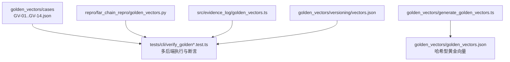
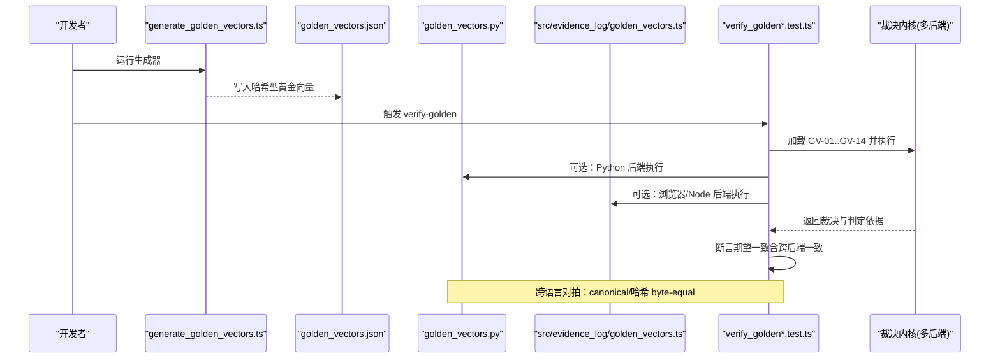
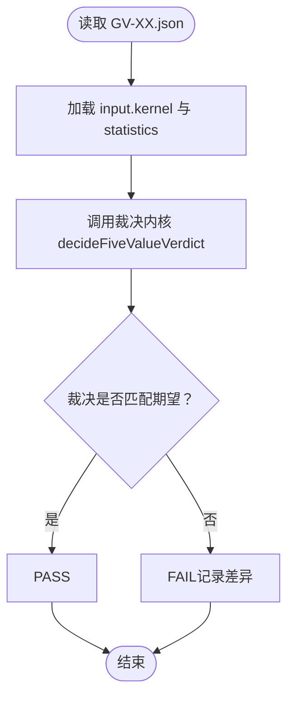
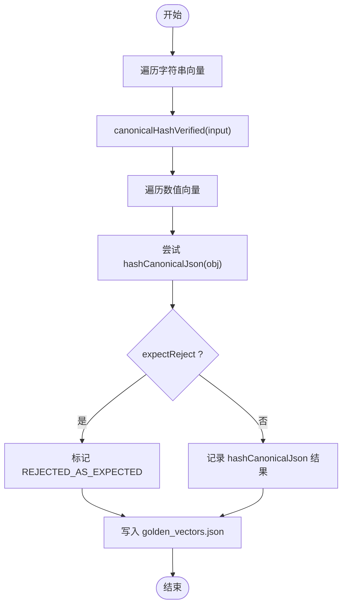
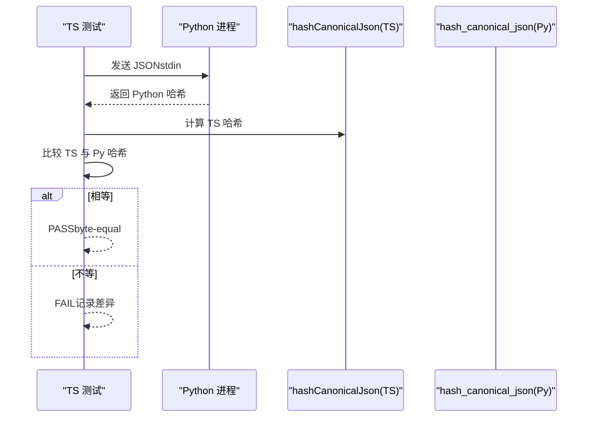
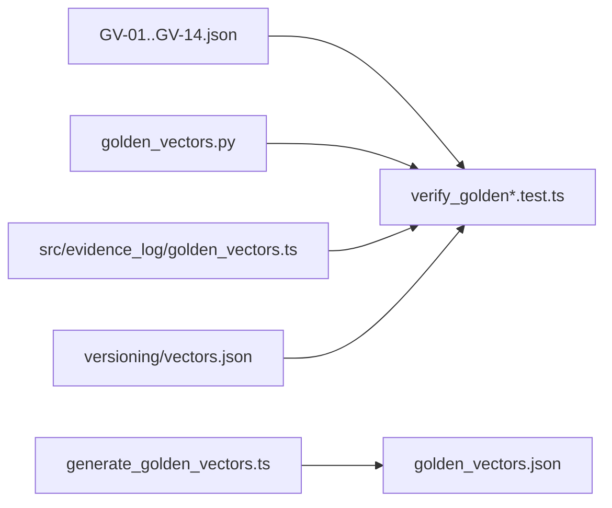

# 黄金向量测试

<cite>
**本文引用的文件**
- [golden_vectors/generate_golden_vectors.ts](file://golden_vectors/generate_golden_vectors.ts)
- [golden_vectors/golden_vectors.json](file://golden_vectors/golden_vectors.json)
- [golden_vectors/versioning/vectors.json](file://golden_vectors/versioning/vectors.json)
- [golden_vectors/versioning/README.md](file://golden_vectors/versioning/README.md)
- [repro/far_chain_repro/golden_vectors.py](file://repro/far_chain_repro/golden_vectors.py)
- [src/evidence_log/golden_vectors.ts](file://src/evidence_log/golden_vectors.ts)
- [tests/cli/verify_golden.test.ts](file://tests/cli/verify_golden.test.ts)
- [tests/cli/verify_golden_cross_lang.test.ts](file://tests/cli/verify_golden_cross_lang.test.ts)
- [golden_vectors/cases/GV-01.json](file://golden_vectors/cases/GV-01.json)
- [golden_vectors/cases/GV-02.json](file://golden_vectors/cases/GV-02.json)
- [golden_vectors/cases/GV-14.json](file://golden_vectors/cases/GV-14.json)
</cite>

## 目录
1. [简介](#简介)
2. [项目结构](#项目结构)
3. [核心组件](#核心组件)
4. [架构总览](#架构总览)
5. [详细组件分析](#详细组件分析)
6. [依赖关系分析](#依赖关系分析)
7. [性能与可维护性](#性能与可维护性)
8. [故障排查指南](#故障排查指南)
9. [结论](#结论)
10. [附录](#附录)

## 简介
本文件系统性说明“黄金向量测试”的设计原理、实现机制与维护方法，覆盖以下内容：
- 确定性测试用例的设计原则与生成流程
- 黄金向量的版本管理与跨语言一致性验证
- 如何使用黄金向量进行回归测试与基准测试
- 测试数据的存储格式、校验方法与更新策略
- 黄金向量的维护指南与扩展方法
- 与 Python 复现工具的一致性保证机制

黄金向量在本仓库中承担两类职责：
- 裁决内核（verdict kernel）的确定性回归基线：通过固定输入与期望输出，确保规则引擎在不同后端（Node、Python、浏览器）行为一致。
- 哈希与序列化边界：通过数值与字符串边界用例，确保 canonical 化与哈希在多语言间稳定一致。

## 项目结构
黄金向量相关资产分布在以下位置：
- golden_vectors/cases：存放裁决内核的 14 个用例（GV-01..GV-14），每个 JSON 包含输入、期望裁决与判定依据。
- golden_vectors/generate_golden_vectors.ts 与 golden_vectors/golden_vectors.json：用于生成并固化一组“哈希型”黄金向量（字符串与数值边界）。
- golden_vectors/versioning：针对信封版本派发的场景化期望集合（VV-01..VV-05），与内核金向量正交。
- repro/far_chain_repro/golden_vectors.py：Python 参考实现中的黄金向量与链式用例，用于跨语言对拍。
- src/evidence_log/golden_vectors.ts：TS 侧的常量定义与跨语言对拍用集（GREEN/RED 分类）。
- tests/cli/verify_golden*.test.ts：端到端验证脚本，驱动 Node/Python/Browser 多后端执行并断言一致性。

图表来源
- [golden_vectors/cases/GV-01.json:1-158](file://golden_vectors/cases/GV-01.json#L1-L158)
- [tests/cli/verify_golden.test.ts:69-111](file://tests/cli/verify_golden.test.ts#L69-L111)
- [golden_vectors/generate_golden_vectors.ts:153-197](file://golden_vectors/generate_golden_vectors.ts#L153-L197)
- [repro/far_chain_repro/golden_vectors.py:35-197](file://repro/far_chain_repro/golden_vectors.py#L35-L197)
- [src/evidence_log/golden_vectors.ts:210-256](file://src/evidence_log/golden_vectors.ts#L210-L256)
- [golden_vectors/versioning/vectors.json:1-39](file://golden_vectors/versioning/vectors.json#L1-L39)

章节来源
- [golden_vectors/cases/GV-01.json:1-158](file://golden_vectors/cases/GV-01.json#L1-L158)
- [golden_vectors/cases/GV-02.json:1-158](file://golden_vectors/cases/GV-02.json#L1-L158)
- [golden_vectors/cases/GV-14.json:1-168](file://golden_vectors/cases/GV-14.json#L1-L168)
- [golden_vectors/generate_golden_vectors.ts:1-198](file://golden_vectors/generate_golden_vectors.ts#L1-L198)
- [golden_vectors/golden_vectors.json:1-49](file://golden_vectors/golden_vectors.json#L1-L49)
- [golden_vectors/versioning/vectors.json:1-39](file://golden_vectors/versioning/vectors.json#L1-L39)
- [golden_vectors/versioning/README.md:1-10](file://golden_vectors/versioning/README.md#L1-L10)
- [repro/far_chain_repro/golden_vectors.py:1-232](file://repro/far_chain_repro/golden_vectors.py#L1-L232)
- [src/evidence_log/golden_vectors.ts:1-257](file://src/evidence_log/golden_vectors.ts#L1-L257)
- [tests/cli/verify_golden.test.ts:1-264](file://tests/cli/verify_golden.test.ts#L1-L264)
- [tests/cli/verify_golden_cross_lang.test.ts:1-93](file://tests/cli/verify_golden_cross_lang.test.ts#L1-L93)

## 核心组件
- 裁决内核用例集（GV-01..GV-14）：以 JSON 描述输入、期望裁决与判定依据，用于回归测试。
- 哈希型黄金向量生成器：生成字符串与数值边界的哈希结果，作为跨语言一致性锚点。
- Python 参考实现：提供与 TS 一致的 canonical 化与哈希计算，支撑跨语言对拍。
- 多后端验证器：在 Node、Python、Browser 三种环境下运行同一组用例，断言裁决一致。
- 版本化套件（VV-01..VV-05）：针对信封 ruleset_uri 的版本派发与兼容性期望。

章节来源
- [golden_vectors/cases/GV-01.json:1-158](file://golden_vectors/cases/GV-01.json#L1-L158)
- [golden_vectors/generate_golden_vectors.ts:31-151](file://golden_vectors/generate_golden_vectors.ts#L31-L151)
- [repro/far_chain_repro/golden_vectors.py:35-197](file://repro/far_chain_repro/golden_vectors.py#L35-L197)
- [tests/cli/verify_golden.test.ts:69-111](file://tests/cli/verify_golden.test.ts#L69-L111)
- [golden_vectors/versioning/vectors.json:1-39](file://golden_vectors/versioning/vectors.json#L1-L39)

## 架构总览
下图展示了黄金向量从“生成/定义”到“多后端执行与断言”的整体流程，以及跨语言一致性验证的关键路径。

图表来源
- [golden_vectors/generate_golden_vectors.ts:153-197](file://golden_vectors/generate_golden_vectors.ts#L153-L197)
- [golden_vectors/golden_vectors.json:1-49](file://golden_vectors/golden_vectors.json#L1-L49)
- [repro/far_chain_repro/golden_vectors.py:35-197](file://repro/far_chain_repro/golden_vectors.py#L35-L197)
- [src/evidence_log/golden_vectors.ts:210-256](file://src/evidence_log/golden_vectors.ts#L210-L256)
- [tests/cli/verify_golden.test.ts:69-111](file://tests/cli/verify_golden.test.ts#L69-L111)
- [tests/cli/verify_golden_cross_lang.test.ts:23-52](file://tests/cli/verify_golden_cross_lang.test.ts#L23-L52)

## 详细组件分析

### 裁决内核黄金向量（GV-01..GV-14）
- 设计目标：为裁决内核提供确定性的输入与期望输出，覆盖支持、拒绝、不可判定、标识伪造等典型场景。
- 数据结构要点：
  - caseId/status/scenario：用例标识与状态。
  - input.kernel.fec：声明证据契约、统计计划、阈值、幂计划、种子策略等。
  - input.statistics：观测到的统计结果（p值、效应量、置信区间等）。
  - expected.verdict/decisiveRuleId/reasonCodes：期望裁决、决定性规则与原因码。
- 示例：
  - GV-01：完整支持，期望 CONFIRMED，规则 R7_PRIMARY_TEST_CONFIRMS。
  - GV-02：完整拒绝，期望 REFUTED，规则 R6_PRIMARY_TEST_REFUTES。
  - GV-14：标识伪造（DOI 无法解析且无 harness 验证源），期望 REFUTED，规则 R_IDENTIFIER_FABRICATION。

图表来源
- [golden_vectors/cases/GV-01.json:1-158](file://golden_vectors/cases/GV-01.json#L1-L158)
- [golden_vectors/cases/GV-02.json:1-158](file://golden_vectors/cases/GV-02.json#L1-L158)
- [golden_vectors/cases/GV-14.json:1-168](file://golden_vectors/cases/GV-14.json#L1-L168)
- [tests/cli/verify_golden.test.ts:69-111](file://tests/cli/verify_golden.test.ts#L69-L111)

章节来源
- [golden_vectors/cases/GV-01.json:1-158](file://golden_vectors/cases/GV-01.json#L1-L158)
- [golden_vectors/cases/GV-02.json:1-158](file://golden_vectors/cases/GV-02.json#L1-L158)
- [golden_vectors/cases/GV-14.json:1-168](file://golden_vectors/cases/GV-14.json#L1-L168)
- [tests/cli/verify_golden.test.ts:69-111](file://tests/cli/verify_golden.test.ts#L69-L111)

### 哈希型黄金向量生成器（字符串与数值边界）
- 设计目标：为 canonical 化与哈希函数提供确定性输入，确保跨语言 byte-equal。
- 关键实现：
  - 字符串向量走 canonicalHashVerified（T3 白名单字段），用于证明 cred 全 string 路径稳定。
  - 数值向量走 hashCanonicalJson（通用 canonical），覆盖 IEEE754 浮点、科学计数法、大整数、NaN 拒绝等边界。
  - 生成器使用固定时间戳与固定 seed，避免非确定性。
- 输出：golden_vectors/golden_vectors.json 包含 label/hash/note，便于回归比对。

图表来源
- [golden_vectors/generate_golden_vectors.ts:31-151](file://golden_vectors/generate_golden_vectors.ts#L31-L151)
- [golden_vectors/generate_golden_vectors.ts:153-197](file://golden_vectors/generate_golden_vectors.ts#L153-L197)
- [golden_vectors/golden_vectors.json:1-49](file://golden_vectors/golden_vectors.json#L1-L49)

章节来源
- [golden_vectors/generate_golden_vectors.ts:1-198](file://golden_vectors/generate_golden_vectors.ts#L1-L198)
- [golden_vectors/golden_vectors.json:1-49](file://golden_vectors/golden_vectors.json#L1-L49)

### 跨语言一致性验证（TS vs Python）
- 设计目标：确保同一 JSON 经双向序列化后，哈希结果 byte-equal；同时覆盖已知序列化格式差异。
- 关键点：
  - Python 参考实现 golden_vectors.py 提供 GOLDEN_VECTORS（链式用例）与 NUMERIC_GREEN_VECTORS/NUMERIC_KNOWN_DIVERGENCE。
  - TS 侧 src/evidence_log/golden_vectors.ts 提供对应常量集，保持 GREEN/RED 分类一致。
  - 测试通过 spawnSync 将 JSON 传入 Python，两侧分别计算哈希并比对。
- 已知差异：指数表示法的零填充（如 1e-7 vs 1e-07），被明确标注为 RED 并作为迁移回归基线。

图表来源
- [repro/far_chain_repro/golden_vectors.py:35-197](file://repro/far_chain_repro/golden_vectors.py#L35-L197)
- [repro/far_chain_repro/golden_vectors.py:215-231](file://repro/far_chain_repro/golden_vectors.py#L215-L231)
- [src/evidence_log/golden_vectors.ts:210-256](file://src/evidence_log/golden_vectors.ts#L210-L256)
- [tests/cli/verify_golden_cross_lang.test.ts:54-76](file://tests/cli/verify_golden_cross_lang.test.ts#L54-L76)

章节来源
- [repro/far_chain_repro/golden_vectors.py:1-232](file://repro/far_chain_repro/golden_vectors.py#L1-L232)
- [src/evidence_log/golden_vectors.ts:1-257](file://src/evidence_log/golden_vectors.ts#L1-L257)
- [tests/cli/verify_golden_cross_lang.test.ts:1-93](file://tests/cli/verify_golden_cross_lang.test.ts#L1-L93)

### 版本化套件（VV-01..VV-05）
- 设计目标：针对 proof envelope 的 ruleset_uri 版本派发与兼容语义，提供期望断言。
- 场景：
  - VV-01：新信封携带 v1 URI，验证通过。
  - VV-02：legacy 信封（无 URI）按 v1 默认派发，复算一致。
  - VV-03/04：伪造或畸形 URI，fail-closed 拒绝。
  - VV-05：未知扩展字段忽略且不翻转裁决（MINOR 兼容）。
- 消费方：tests/proof_envelope/ruleset_versioning.test.ts（由 vectors.json 描述期望）。

章节来源
- [golden_vectors/versioning/vectors.json:1-39](file://golden_vectors/versioning/vectors.json#L1-L39)
- [golden_vectors/versioning/README.md:1-10](file://golden_vectors/versioning/README.md#L1-L10)

## 依赖关系分析
- 用例数据依赖：
  - 裁决内核用例：golden_vectors/cases/GV-*.json → tests/cli/verify_golden*.test.ts
  - 哈希型用例：generate_golden_vectors.ts → golden_vectors/golden_vectors.json
- 跨语言依赖：
  - Python 参考实现：repro/far_chain_repro/golden_vectors.py
  - TS 常量：src/evidence_log/golden_vectors.ts
- 版本化依赖：
  - golden_vectors/versioning/vectors.json → 版本化测试

图表来源
- [tests/cli/verify_golden.test.ts:69-111](file://tests/cli/verify_golden.test.ts#L69-L111)
- [golden_vectors/generate_golden_vectors.ts:153-197](file://golden_vectors/generate_golden_vectors.ts#L153-L197)
- [repro/far_chain_repro/golden_vectors.py:35-197](file://repro/far_chain_repro/golden_vectors.py#L35-L197)
- [src/evidence_log/golden_vectors.ts:210-256](file://src/evidence_log/golden_vectors.ts#L210-L256)
- [golden_vectors/versioning/vectors.json:1-39](file://golden_vectors/versioning/vectors.json#L1-L39)

章节来源
- [tests/cli/verify_golden.test.ts:1-264](file://tests/cli/verify_golden.test.ts#L1-L264)
- [golden_vectors/generate_golden_vectors.ts:1-198](file://golden_vectors/generate_golden_vectors.ts#L1-L198)
- [repro/far_chain_repro/golden_vectors.py:1-232](file://repro/far_chain_repro/golden_vectors.py#L1-L232)
- [src/evidence_log/golden_vectors.ts:1-257](file://src/evidence_log/golden_vectors.ts#L1-L257)
- [golden_vectors/versioning/vectors.json:1-39](file://golden_vectors/versioning/vectors.json#L1-L39)

## 性能与可维护性
- 确定性保障：
  - 生成器使用固定时间戳与固定 seed，避免随机性与时间漂移。
  - 数值边界用例严格区分 GREEN（byte-equal）与 RED（已知序列化差异），防止“假绿”。
- 可扩展性：
  - 新增裁决用例：在 golden_vectors/cases 下添加新的 GV-XX.json，并在测试中确认数量与期望。
  - 新增哈希用例：在 generate_golden_vectors.ts 中添加 string/numeric 向量，重新生成 golden_vectors.json。
  - 新增版本化场景：在 versioning/vectors.json 中追加 VV-xx，并在对应测试中消费。
- 可维护性建议：
  - 任何变更需同步更新 Python 与 TS 侧常量，确保跨语言一致。
  - 对已知差异（如指数零填充）保留 RED 基线，待迁移至 RFC 8785 JCS 后再更新为 GREEN。

[本节为一般性指导，不直接分析具体文件]

## 故障排查指南
- 常见问题与定位：
  - 用例数量不一致：检查 golden_vectors/cases 下的文件数量与测试断言是否匹配（例如 total=14）。
  - 裁决不一致：核对 expected.verdict/decisiveRuleId/reasonCodes 与实际输出是否一致。
  - 跨语言不一致：检查 Python 环境是否可用（sympy 依赖），若不可用则测试会显式 skip；若可用，对比 TS 与 Python 的哈希输出。
  - 版本化失败：检查 ruleset_uri 是否符合 farlab.dev/ruleset/vN 格式，或是否为 legacy 信封。
- 调试步骤：
  - 单独运行某个 GV 用例，观察 decisiveRuleId 与 reasonCodes。
  - 切换 backend 为 node/python/browser，逐步缩小问题范围。
  - 对哈希型用例，检查 generate_golden_vectors.ts 的输入与 hashCanonicalJson 行为。

章节来源
- [tests/cli/verify_golden.test.ts:69-111](file://tests/cli/verify_golden.test.ts#L69-L111)
- [tests/cli/verify_golden_cross_lang.test.ts:23-52](file://tests/cli/verify_golden_cross_lang.test.ts#L23-L52)
- [golden_vectors/versioning/vectors.json:1-39](file://golden_vectors/versioning/vectors.json#L1-L39)

## 结论
黄金向量测试通过“裁决内核用例 + 哈希型边界用例 + 版本化场景”的组合，构建了覆盖广泛、可重复、可跨语言验证的回归与基准体系。其核心价值在于：
- 以确定性输入与期望输出锁定裁决内核行为，防止规则演进引入回归。
- 以跨语言对拍确保 canonical 化与哈希在多语言间稳定一致。
- 以版本化套件保障信封派发与兼容语义的正确性。
维护者应遵循“诚实标注差异、最小化变更、同步双端常量”的原则，持续巩固系统的可信度与可复现性。

[本节为总结性内容，不直接分析具体文件]

## 附录

### 黄金向量存储格式与校验方法
- 裁决内核用例（GV-*.json）：
  - 关键字段：caseId、input.kernel.fec、input.statistics、expected.verdict/decisiveRuleId/reasonCodes。
  - 校验：测试加载后调用裁决内核，断言输出与期望一致。
- 哈希型黄金向量（golden_vectors.json）：
  - 关键字段：label、hash、note。
  - 校验：生成器计算哈希并与文件比对；跨语言测试比对 TS 与 Python 的哈希结果。
- 版本化套件（versioning/vectors.json）：
  - 关键字段：id、kind、desc、expect。
  - 校验：测试根据 kind 构造信封并断言 expect 语义。

章节来源
- [golden_vectors/cases/GV-01.json:1-158](file://golden_vectors/cases/GV-01.json#L1-L158)
- [golden_vectors/golden_vectors.json:1-49](file://golden_vectors/golden_vectors.json#L1-L49)
- [golden_vectors/versioning/vectors.json:1-39](file://golden_vectors/versioning/vectors.json#L1-L39)

### 更新策略与维护指南
- 新增裁决用例：
  - 在 golden_vectors/cases 下新增 GV-XX.json，填写输入与期望。
  - 运行 tests/cli/verify_golden*.test.ts，确保 total 与 passed 正确。
- 新增哈希用例：
  - 在 generate_golden_vectors.ts 中添加 string/numeric 向量。
  - 重新运行生成器，更新 golden_vectors/golden_vectors.json。
  - 同步更新 src/evidence_log/golden_vectors.ts 与 repro/far_chain_repro/golden_vectors.py 的常量集。
- 版本化场景：
  - 在 versioning/vectors.json 中追加 VV-xx，并在对应测试中消费。
- 已知差异管理：
  - 对指数零填充等差异，保留 RED 基线，待迁移至 RFC 8785 JCS 后再更新为 GREEN。

章节来源
- [golden_vectors/generate_golden_vectors.ts:31-151](file://golden_vectors/generate_golden_vectors.ts#L31-L151)
- [golden_vectors/generate_golden_vectors.ts:153-197](file://golden_vectors/generate_golden_vectors.ts#L153-L197)
- [src/evidence_log/golden_vectors.ts:210-256](file://src/evidence_log/golden_vectors.ts#L210-L256)
- [repro/far_chain_repro/golden_vectors.py:215-231](file://repro/far_chain_repro/golden_vectors.py#L215-L231)
- [golden_vectors/versioning/vectors.json:1-39](file://golden_vectors/versioning/vectors.json#L1-L39)

### 与 Python 复现工具的一致性保证机制
- 对拍方法：
  - TS 侧通过 spawnSync 将 JSON 传入 Python，两侧分别计算哈希并比对。
  - 对于裁决内核用例，Node/Python/Browser 三后端 per-case verdict 必须一致。
- 已知差异处理：
  - 指数零填充（1e-7 vs 1e-07）被明确标注为 RED，作为迁移回归基线。
- 环境探针：
  - Python 环境不可用时，测试显式 skip 并记录原因，避免误报。

章节来源
- [tests/cli/verify_golden_cross_lang.test.ts:54-76](file://tests/cli/verify_golden_cross_lang.test.ts#L54-L76)
- [repro/far_chain_repro/golden_vectors.py:215-231](file://repro/far_chain_repro/golden_vectors.py#L215-L231)
- [src/evidence_log/golden_vectors.ts:210-256](file://src/evidence_log/golden_vectors.ts#L210-L256)