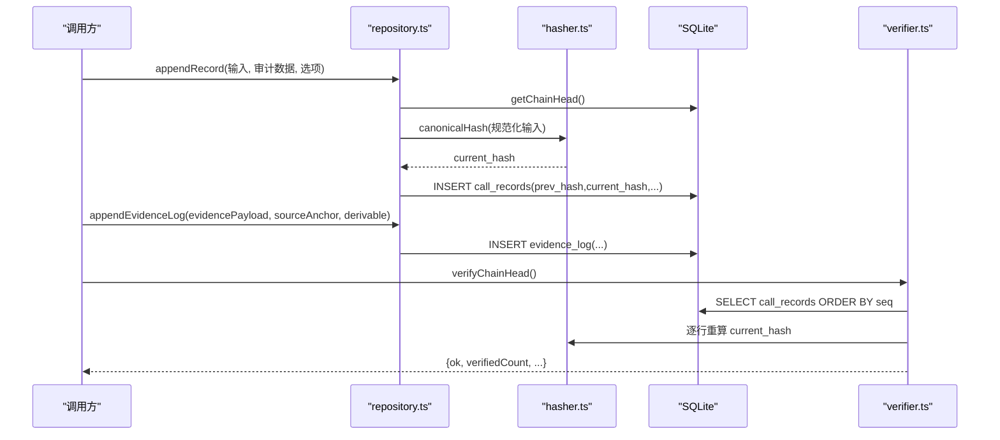
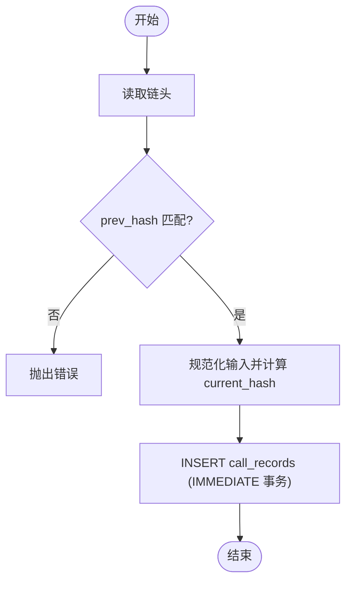
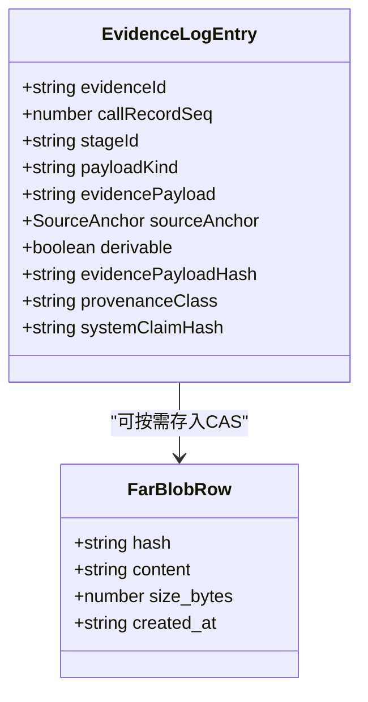
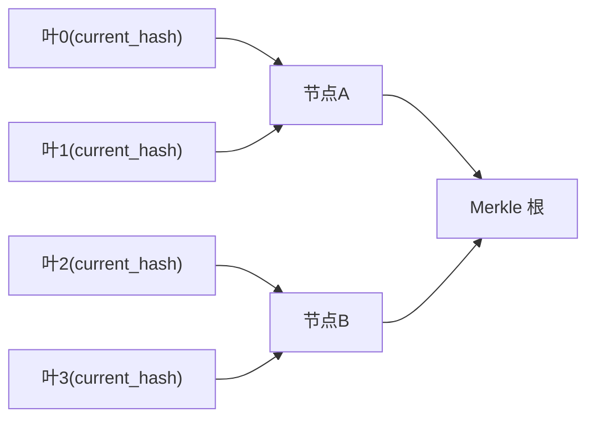
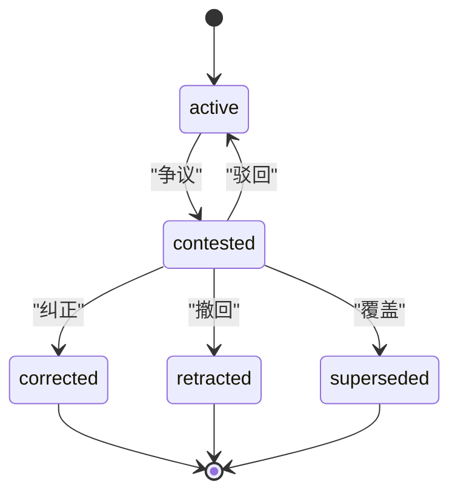
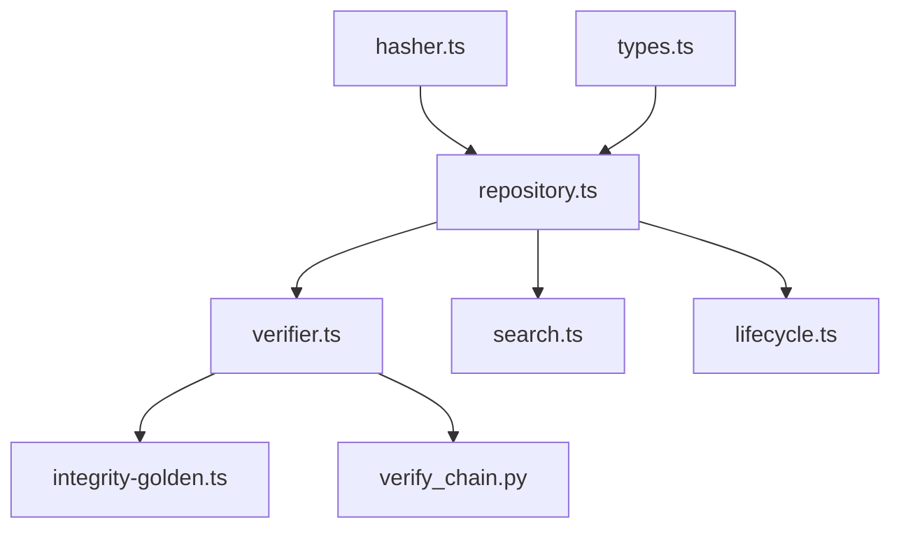

# 证据系统

<cite>
**本文引用的文件**
- [src/evidence_log/index.ts](file://src/evidence_log/index.ts)
- [src/evidence_log/types.ts](file://src/evidence_log/types.ts)
- [src/evidence_log/repository.ts](file://src/evidence_log/repository.ts)
- [src/evidence_log/verifier.ts](file://src/evidence_log/verifier.ts)
- [src/evidence_log/hasher.ts](file://src/evidence_log/hasher.ts)
- [src/evidence_log/search.ts](file://src/evidence_log/search.ts)
- [src/evidence_log/lifecycle.ts](file://src/evidence_log/lifecycle.ts)
- [src/cas/blob_store.ts](file://src/cas/blob_store.ts)
- [schema/migrations/0015_far_blob_store.sql](file://schema/migrations/0015_far_blob_store.sql)
- [schema/migrations/0021_lifecycle_events.sql](file://schema/migrations/0021_lifecycle_events.sql)
- [src/api/routes/evidence.ts](file://src/api/routes/evidence.ts)
- [frontend/src/lib/integrity-golden.ts](file://frontend/src/lib/integrity-golden.ts)
- [repro/far_chain_repro/verify_chain.py](file://repro/far_chain_repro/verify_chain.py)
</cite>

## 目录
1. [简介](#简介)
2. [项目结构](#项目结构)
3. [核心组件](#核心组件)
4. [架构总览](#架构总览)
5. [详细组件分析](#详细组件分析)
6. [依赖关系分析](#依赖关系分析)
7. [性能考虑](#性能考虑)
8. [故障排查指南](#故障排查指南)
9. [结论](#结论)
10. [附录](#附录)

## 简介
本文件系统性阐述 FAR-Lab 的“证据系统”：以不可变哈希链为核心的证据记录、存储、检索与验证机制；Merkle 树在整链完整性证明中的应用；证据生命周期管理（创建→归档）；哈希算法选择与实现细节；溯源与审计追踪；查询语言与操作接口；备份、恢复与迁移最佳实践；与外部系统的交换协议与格式标准；以及大规模数据处理与性能优化策略。

## 项目结构
证据系统围绕以下模块组织：
- 数据模型与类型定义：types.ts
- 写入与持久化：repository.ts（call_records、evidence_log）
- 内容寻址存储：cas/blob_store.ts + 0015_far_blob_store.sql
- 校验与验证：verifier.ts（链头校验、payload 内容寻址校验、导出锚比对）
- 哈希与规范化：hasher.ts（canonical JSON、SHA-256）
- 全文检索：search.ts（FTS5 索引与搜索）
- 生命周期状态机：lifecycle.ts（撤回/纠正/覆盖事件链）
- API 暴露：api/routes/evidence.ts
- 前端 Merkle 根与包含证明 golden 向量：frontend/src/lib/integrity-golden.ts
- 跨语言参考实现：repro/far_chain_repro/verify_chain.py

```mermaid
graph TB
subgraph "证据日志"
R["repository.ts"]
V["verifier.ts"]
H["hasher.ts"]
S["search.ts"]
L["lifecycle.ts"]
end
subgraph "内容寻址存储"
CAS["blob_store.ts"]
SQL15["0015_far_blob_store.sql"]
end
subgraph "API"
API["evidence.ts"]
end
subgraph "前端与跨语言"
FE["integrity-golden.ts"]
PY["verify_chain.py"]
end
R --> H
R --> V
V --> H
S --> R
L --> R
API --> R
API --> V
CAS --> H
SQL15 --> CAS
FE --> V
PY --> V
```

图表来源
- [src/evidence_log/repository.ts:94-165](file://src/evidence_log/repository.ts#L94-L165)
- [src/evidence_log/verifier.ts:17-65](file://src/evidence_log/verifier.ts#L17-L65)
- [src/evidence_log/hasher.ts:8-39](file://src/evidence_log/hasher.ts#L8-L39)
- [src/evidence_log/search.ts:43-88](file://src/evidence_log/search.ts#L43-L88)
- [src/evidence_log/lifecycle.ts:188-266](file://src/evidence_log/lifecycle.ts#L188-L266)
- [src/cas/blob_store.ts:31-44](file://src/cas/blob_store.ts#L31-L44)
- [schema/migrations/0015_far_blob_store.sql:22-43](file://schema/migrations/0015_far_blob_store.sql#L22-L43)
- [src/api/routes/evidence.ts:74-161](file://src/api/routes/evidence.ts#L74-L161)
- [frontend/src/lib/integrity-golden.ts:38-58](file://frontend/src/lib/integrity-golden.ts#L38-L58)
- [repro/far_chain_repro/verify_chain.py:117-152](file://repro/far_chain_repro/verify_chain.py#L117-L152)

章节来源
- [src/evidence_log/index.ts:1-92](file://src/evidence_log/index.ts#L1-L92)

## 核心组件
- 不可变证据链（call_records）：每条记录由规范化输入计算 current_hash，并链接到 prev_hash，形成从创世哈希开始的单链。写入使用 IMMEDIATE 事务保证并发安全。
- 证据条目（evidence_log）：关联 call_record，支持可重算标记（derivable），对 derivable=1 的行落内容哈希，用于检测字节级篡改。
- 内容寻址存储（far_blob_store）：按 sha256(canonical JSON) 去重存储任意 blob，禁止更新/删除，确保 artifact 不可静默替换。
- 验证器：链头校验、payload 内容寻址校验、导出锚比对，提供 tamper 定位。
- 生命周期事件链（lifecycle_events）：针对 claim/verdict_node/proof_envelope/evidence 的状态迁移事件链，含状态机约束与事件级哈希链。
- 全文检索（FTS5）：可选的检索辅助层，懒同步重建，不影响链验证。
- API：按 evidenceId 或 chain head hash 查询证据及子图。

章节来源
- [src/evidence_log/repository.ts:94-165](file://src/evidence_log/repository.ts#L94-L165)
- [src/evidence_log/repository.ts:193-258](file://src/evidence_log/repository.ts#L193-L258)
- [src/cas/blob_store.ts:31-44](file://src/cas/blob_store.ts#L31-L44)
- [src/evidence_log/verifier.ts:17-65](file://src/evidence_log/verifier.ts#L17-L65)
- [src/evidence_log/verifier.ts:83-123](file://src/evidence_log/verifier.ts#L83-L123)
- [src/evidence_log/verifier.ts:145-188](file://src/evidence_log/verifier.ts#L145-L188)
- [src/evidence_log/lifecycle.ts:188-266](file://src/evidence_log/lifecycle.ts#L188-L266)
- [src/evidence_log/search.ts:106-181](file://src/evidence_log/search.ts#L106-L181)
- [src/api/routes/evidence.ts:74-161](file://src/api/routes/evidence.ts#L74-L161)

## 架构总览
证据系统采用“链式不可变 + 内容寻址 + 状态机审计”的分层设计：
- 链式不可变：call_records 通过 canonicalHash(prev_hash, stage_id, cred, payload_kind, purpose_tag) 生成 current_hash，形成时间序链。
- 内容寻址：evidence_log 中 derivable=1 的行以 sha256(canonical JSON) 绑定内容；far_blob_store 以相同方式全局去重。
- 状态机审计：lifecycle_events 维护目标对象的状态迁移历史，事件级 prev_hash/current_hash 链与状态机规则共同防伪造。
- 检索与对外：FTS5 提供高效检索；API 暴露证据与链片段；前端基于 golden 向量进行浏览器端 Merkle 验证。



图表来源
- [src/evidence_log/repository.ts:94-165](file://src/evidence_log/repository.ts#L94-L165)
- [src/evidence_log/hasher.ts:8-39](file://src/evidence_log/hasher.ts#L8-L39)
- [src/evidence_log/verifier.ts:17-65](file://src/evidence_log/verifier.ts#L17-L65)

## 详细组件分析

### 不可变证据链（call_records）
- 写入流程：读取链头 → 校验传入 prev_hash 与链头一致 → 规范化输入 → 计算 current_hash → 原子插入（IMMEDIATE 事务）。
- 并发安全：BEGIN IMMEDIATE 获取 RESERVED 写锁，避免 TOCTOU 分叉。
- 校验流程：顺序遍历 call_records，校验 prev_hash 链与 current_hash 重算一致性。



图表来源
- [src/evidence_log/repository.ts:94-165](file://src/evidence_log/repository.ts#L94-L165)
- [src/evidence_log/hasher.ts:8-39](file://src/evidence_log/hasher.ts#L8-L39)

章节来源
- [src/evidence_log/repository.ts:94-165](file://src/evidence_log/repository.ts#L94-L165)
- [src/evidence_log/verifier.ts:17-65](file://src/evidence_log/verifier.ts#L17-L65)

### 证据条目与内容寻址（evidence_log + far_blob_store）
- evidence_log：
  - 关联 call_record_seq，记录证据载荷与来源锚点。
  - derivable=1 时写入 evidence_payload_hash = sha256(canonical JSON)，用于后续重算比对。
  - provenance_class 与 system_claim_hash 强制约束，防止 LLM 自填来源。
- far_blob_store：
  - 以 hash = sha256(canonical JSON) 为 PK，INSERT OR IGNORE 去重。
  - 触发器禁止 UPDATE/DELETE，保障内容不可变。



图表来源
- [src/evidence_log/types.ts:120-178](file://src/evidence_log/types.ts#L120-L178)
- [src/cas/blob_store.ts:19-58](file://src/cas/blob_store.ts#L19-L58)
- [schema/migrations/0015_far_blob_store.sql:22-43](file://schema/migrations/0015_far_blob_store.sql#L22-L43)

章节来源
- [src/evidence_log/repository.ts:193-258](file://src/evidence_log/repository.ts#L193-L258)
- [src/cas/blob_store.ts:31-44](file://src/cas/blob_store.ts#L31-L44)
- [schema/migrations/0015_far_blob_store.sql:22-43](file://schema/migrations/0015_far_blob_store.sql#L22-L43)

### Merkle 树与整链完整性
- 叶节点：call_records 的 current_hash（或经规范化的证据项哈希）。
- 内部节点：combine(left, right) = sha256(left || right)。
- 根：整链信任根，可被外部审计方独立复证。
- 包含证明：给定叶索引与 siblings，可在浏览器本地重算根并与期望根比对。



图表来源
- [frontend/src/lib/integrity-golden.ts:38-58](file://frontend/src/lib/integrity-golden.ts#L38-L58)

章节来源
- [frontend/src/lib/integrity-golden.ts:38-58](file://frontend/src/lib/integrity-golden.ts#L38-L58)

### 哈希算法与规范化
- 算法：SHA-256。
- 规范化：fast-json-stable-stringify 生成稳定 JSON 字符串；禁止 NaN/Infinity；字符串比较使用确定性码元序。
- 用途：
  - call_records.current_hash：canonicalHash(白名单字段+prev_hash)。
  - evidence_payload_hash / far_blob_store.hash：hashCanonicalJson(payload)。
  - lifecycle event current_hash：computeEventHash(事件核心字段+prev_hash)。

章节来源
- [src/evidence_log/hasher.ts:8-67](file://src/evidence_log/hasher.ts#L8-L67)
- [src/evidence_log/lifecycle.ts:133-148](file://src/evidence_log/lifecycle.ts#L133-L148)

### 生命周期管理与审计追踪
- 状态集：active → contested → corrected/retracted/superseded（终态不可逆）。
- 事件链：每个迁移事件包含 actor、reason、prev_hash/current_hash，形成目标级哈希链。
- 校验：verifyLifecycleChain 重放状态机规则，检查 prev_hash 连续性与迁移合法性。



图表来源
- [src/evidence_log/lifecycle.ts:27-47](file://src/evidence_log/lifecycle.ts#L27-L47)
- [schema/migrations/0021_lifecycle_events.sql:21-52](file://schema/migrations/0021_lifecycle_events.sql#L21-L52)

章节来源
- [src/evidence_log/lifecycle.ts:188-329](file://src/evidence_log/lifecycle.ts#L188-L329)
- [schema/migrations/0021_lifecycle_events.sql:21-52](file://schema/migrations/0021_lifecycle_events.sql#L21-L52)

### 证据查询语言与操作接口
- FTS5 查询：
  - searchEvidence(query, options) 支持 stageId/payloadKind/provenanceClass 过滤，返回 bm25 相关度排序结果。
  - 自动懒同步：当 evidence_fts 与 evidence_log 行数不一致时全量重建索引。
- API：
  - GET /evidence/:id：按 evidenceId 获取证据条目与关联裁决节点。
  - GET /evidence/chain/:headHash：按链头哈希获取链尾记录与子图。

章节来源
- [src/evidence_log/search.ts:106-181](file://src/evidence_log/search.ts#L106-L181)
- [src/api/routes/evidence.ts:74-161](file://src/api/routes/evidence.ts#L74-L161)

### 备份、恢复与迁移
- 备份：
  - 导出 call_records.redacted.jsonl（含 payload hash 列）作为“导出锚”，用于后续一致性比对。
- 恢复：
  - 将 DB 与导出锚比对，verifyCallRecordExportAnchor 检测一致伪造与锚漂移。
- 迁移：
  - 新增表/触发器（如 0015、0021）保持向前兼容；老行缺失 hash 列计为 legacy-not-covered，不误报。

章节来源
- [src/evidence_log/verifier.ts:196-279](file://src/evidence_log/verifier.ts#L196-L279)
- [schema/migrations/0015_far_blob_store.sql:22-43](file://schema/migrations/0015_far_blob_store.sql#L22-L43)
- [schema/migrations/0021_lifecycle_events.sql:21-52](file://schema/migrations/0021_lifecycle_events.sql#L21-L52)

### 与外部系统的证据交换协议与格式标准
- 跨语言验证：Python 参考实现 verify_chain_head/db/json 路径与 TS 侧行为对齐，确保跨语言一致性。
- 前端验证：浏览器端使用 Web Crypto 重算 combine/root，与 golden 向量比对，无需下载全部记录即可验证包含性。

章节来源
- [repro/far_chain_repro/verify_chain.py:117-152](file://repro/far_chain_repro/verify_chain.py#L117-L152)
- [frontend/src/lib/integrity-golden.ts:38-58](file://frontend/src/lib/integrity-golden.ts#L38-L58)

## 依赖关系分析
- 低耦合：
  - repository.ts 依赖 hasher.ts 与 types.ts，不直接感知上层业务。
  - verifier.ts 仅依赖 hasher.ts、repository.ts 的类型与常量。
  - search.ts 与 lifecycle.ts 分别独立扩展检索与审计能力。
- 外部依赖：
  - better-sqlite3 提供数据库访问与事务。
  - fast-json-stable-stringify 提供稳定序列化。
  - node:crypto 提供 SHA-256。
- 潜在循环：无显式循环依赖；模块间通过类型与常量解耦。



图表来源
- [src/evidence_log/hasher.ts:8-39](file://src/evidence_log/hasher.ts#L8-L39)
- [src/evidence_log/repository.ts:94-165](file://src/evidence_log/repository.ts#L94-L165)
- [src/evidence_log/verifier.ts:17-65](file://src/evidence_log/verifier.ts#L17-L65)
- [src/evidence_log/search.ts:106-181](file://src/evidence_log/search.ts#L106-L181)
- [src/evidence_log/lifecycle.ts:188-266](file://src/evidence_log/lifecycle.ts#L188-L266)

章节来源
- [src/evidence_log/index.ts:1-92](file://src/evidence_log/index.ts#L1-L92)

## 性能考虑
- 写入性能：
  - IMMEDIATE 事务减少并发冲突；批量写入建议合并事务以降低开销。
- 检索性能：
  - FTS5 懒同步：仅在 COUNT 不一致时重建索引；limit 上限 200 防止失控扫描。
- 验证性能：
  - verifyChainHead 顺序扫描 O(n)；对于大库可结合分页或增量校验。
  - verifyEvidencePayloadHashes/verifyCallRecordPayloadHashes 仅对 derivable/hash 列参与计算，降低开销。
- 存储规模：
  - far_blob_store 去重减少冗余；evidence_log 仅存必要载荷与锚点。
- 大规模方案：
  - 分片/分区：按 stage_id 或时间范围分表；配合索引加速查询。
  - 异步索引：FTS 重建放入后台任务，避免阻塞主流程。
  - 只读副本：验证与检索走只读副本，写入走主库。

[本节为通用指导，不直接分析具体文件]

## 故障排查指南
- 链头校验失败：
  - 检查 prev_hash 是否断裂；确认 genesis 起始值与第一条记录的 prev_hash。
  - 核查规范化输入是否一致（字段顺序、数值表示）。
- 内容寻址失配：
  - evidence_payload_hash 为空但 derivable=1 → 视为篡改。
  - call_records payload hash 为空 → 老行不计入 tampered，需补全或标注。
- 导出锚漂移：
  - 导出行多于 DB 或 DB 行多于导出 → 锚漂移；逐项比对 hash 列定位 seq。
- 生命周期非法迁移：
  - 终态不可逆；fromState/toState 不在允许表中 → 拒绝。
  - 事件哈希不匹配 → 审计链断裂。

章节来源
- [src/evidence_log/verifier.ts:17-65](file://src/evidence_log/verifier.ts#L17-L65)
- [src/evidence_log/verifier.ts:83-123](file://src/evidence_log/verifier.ts#L83-L123)
- [src/evidence_log/verifier.ts:145-188](file://src/evidence_log/verifier.ts#L145-L188)
- [src/evidence_log/verifier.ts:196-279](file://src/evidence_log/verifier.ts#L196-L279)
- [src/evidence_log/lifecycle.ts:284-329](file://src/evidence_log/lifecycle.ts#L284-L329)

## 结论
证据系统通过“链式不可变 + 内容寻址 + 状态机审计”的组合，提供了强一致的证据完整性保障与可审计的溯源能力。Merkle 根与包含证明使外部审计方能够轻量验证证据存在性。FTS5 检索与 API 暴露提升了可用性。跨语言参考实现与前端 golden 向量确保了算法一致性与可移植性。面向大规模场景的分片、异步索引与只读副本策略可进一步提升性能与可扩展性。

[本节为总结，不直接分析具体文件]

## 附录
- 关键类型与常量：
  - GENESIS_PREV_HASH：创世前哈希。
  - LIFECYCLE_STATES/TARGET_KINDS：生命周期状态与目标类型。
  - ProvenanceClass：system_derived/llm_generated/human。
- 常用函数路径：
  - 写入：appendRecord、appendEvidenceLog
  - 校验：verifyChainHead、verifyEvidencePayloadHashes、verifyCallRecordPayloadHashes、verifyCallRecordExportAnchor
  - 检索：ensureFtsIndex、reindexEvidenceFts、searchEvidence
  - 生命周期：applyLifecycleTransition、verifyLifecycleChain
  - 内容寻址：storeBlob、getBlob、blobExists

章节来源
- [src/evidence_log/types.ts:4-178](file://src/evidence_log/types.ts#L4-L178)
- [src/evidence_log/index.ts:1-92](file://src/evidence_log/index.ts#L1-L92)