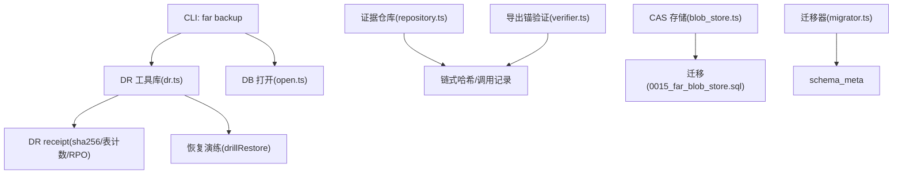
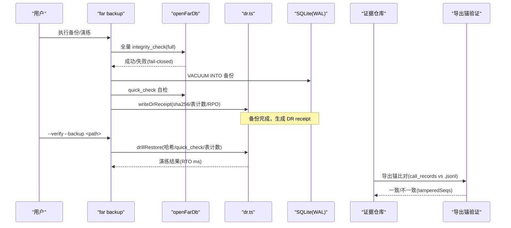
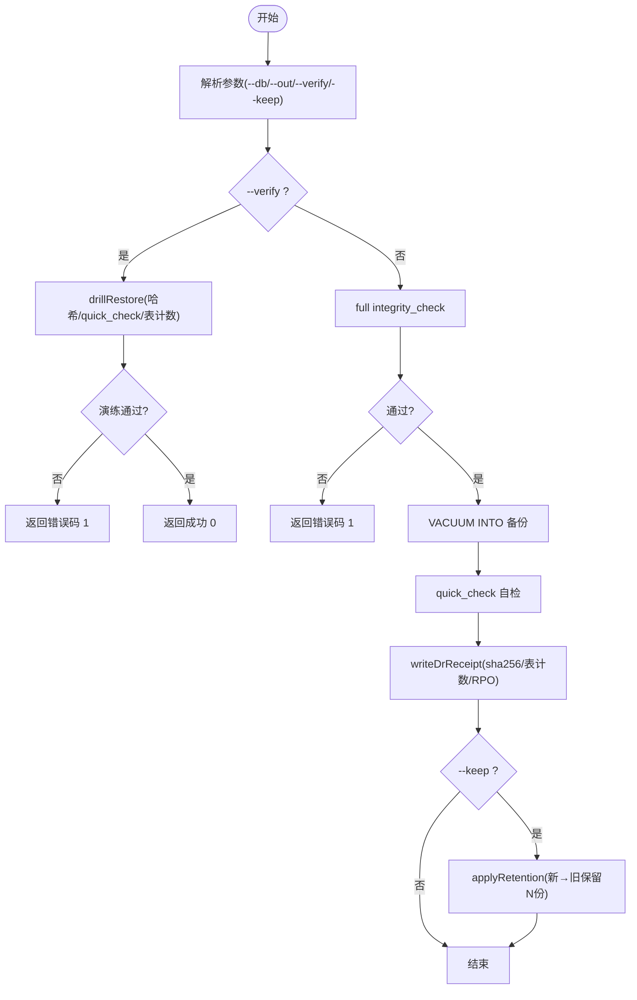
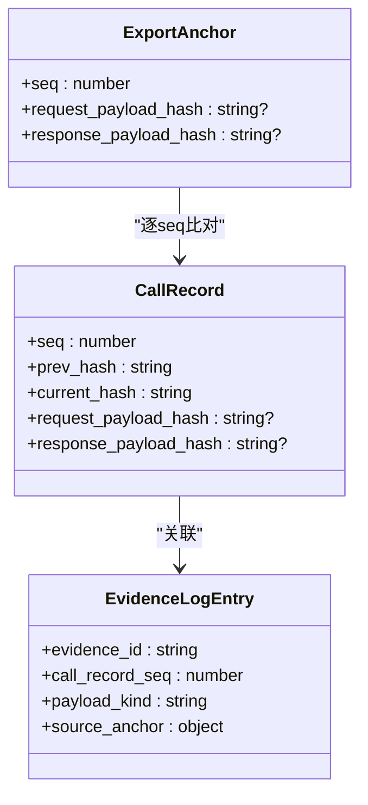
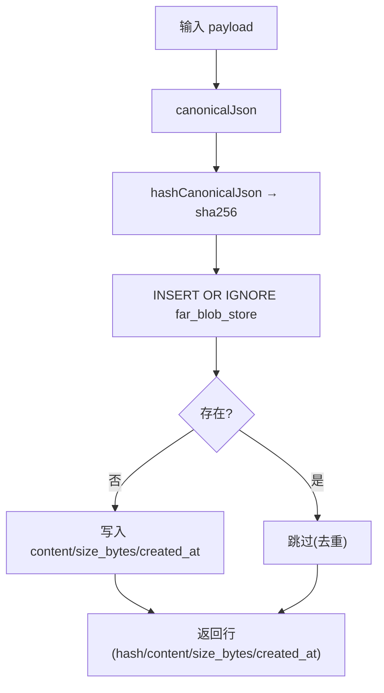
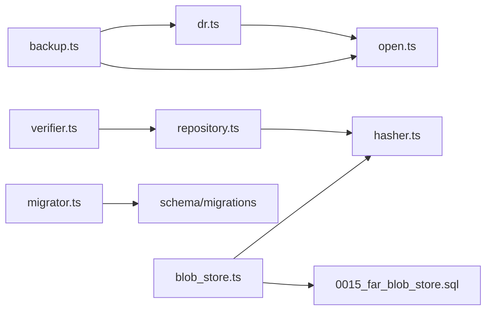

# 备份恢复

<cite>
**本文引用的文件**
- [src/db/dr.ts](file://src/db/dr.ts)
- [src/cli/commands/backup.ts](file://src/cli/commands/backup.ts)
- [src/cas/blob_store.ts](file://src/cas/blob_store.ts)
- [schema/migrations/0015_far_blob_store.sql](file://schema/migrations/0015_far_blob_store.sql)
- [src/evidence_log/repository.ts](file://src/evidence_log/repository.ts)
- [src/evidence_log/verifier.ts](file://src/evidence_log/verifier.ts)
- [src/db/migrator.ts](file://src/db/migrator.ts)
- [tests/db/dr.test.ts](file://tests/db/dr.test.ts)
- [tests/evidence_log/append_verify.test.ts](file://tests/evidence_log/append_verify.test.ts)
- [tests/far_proof/bundle_export_anchor.test.ts](file://tests/far_proof/bundle_export_anchor.test.ts)
- [src/agent_loop/fsm_runner.ts](file://src/agent_loop/fsm_runner.ts)
</cite>

## 目录
1. [简介](#简介)
2. [项目结构](#项目结构)
3. [核心组件](#核心组件)
4. [架构总览](#架构总览)
5. [详细组件分析](#详细组件分析)
6. [依赖关系分析](#依赖关系分析)
7. [性能考虑](#性能考虑)
8. [故障排查指南](#故障排查指南)
9. [结论](#结论)
10. [附录](#附录)

## 简介
本方案围绕数据持久化与灾难恢复，给出覆盖 SQLite 数据库、证据日志与元数据、对象存储中的二进制大对象（BLOB）的完整备份与恢复策略。重点包括：
- 一致性保证：基于 WAL、VACUUM INTO、quick/full integrity_check、链式哈希校验与导出锚比对。
- 增量与热备份：通过 WAL 模式与 VACUUM INTO 实现在线安全备份；结合 DR receipt 记录 RPO/RTO 实测值。
- 证据与元数据：证据链完整性、payload 哈希、导出锚点一致性验证，确保可审计与抗篡改。
- BLOB 去重与压缩：内容寻址 CAS 提供幂等写入与全局去重；建议配合外部压缩与传输加密。
- 自动化与调度：CLI 命令封装备份、演练、保留策略；可通过系统计划任务或 CI 编排执行。
- 恢复流程与验证：三关校验（哈希、完整性、表计数），跨环境迁移工具与回滚策略。
- 安全与合规：加密存储与传输、最小权限、fail-closed 原则。
- RTO/RPO 目标与演练：以 DR receipt 为台账，定期演练并持续优化。

## 项目结构
与备份恢复相关的代码集中在以下模块：
- 数据库备份与恢复：CLI 命令与 DR 工具库
- 证据日志与完整性：链式记录、导出锚比对、触发器约束
- 内容寻址存储（CAS）：BLOB 去重与不可变存储
- 迁移与安全：迁移器与 schema 版本保护

**图表来源**
- [src/cli/commands/backup.ts:60-143](file://src/cli/commands/backup.ts#L60-L143)
- [src/db/dr.ts:101-166](file://src/db/dr.ts#L101-L166)
- [src/evidence_log/repository.ts:94-165](file://src/evidence_log/repository.ts#L94-L165)
- [src/evidence_log/verifier.ts:196-228](file://src/evidence_log/verifier.ts#L196-L228)
- [src/cas/blob_store.ts:31-57](file://src/cas/blob_store.ts#L31-L57)
- [schema/migrations/0015_far_blob_store.sql:20-44](file://schema/migrations/0015_far_blob_store.sql#L20-L44)
- [src/db/migrator.ts:38-78](file://src/db/migrator.ts#L38-L78)

**章节来源**
- [src/cli/commands/backup.ts:60-143](file://src/cli/commands/backup.ts#L60-L143)
- [src/db/dr.ts:101-166](file://src/db/dr.ts#L101-L166)

## 核心组件
- 备份与恢复演练（DR）
  - 使用 VACUUM INTO 进行安全备份，备份前后分别执行 full/quick 完整性检查，失败即 fail-closed。
  - 生成 DR receipt，包含 sha256、文件大小、创建时间、源库各表计数、RPO 秒数、是否独立介质副本标记。
  - 恢复演练 drillRestore 对备份文件进行哈希核对、quick_check 与表计数对拍，输出 RTO 毫秒级耗时。
  - 保留策略 applyRetention 按 receipt.createdAt 清理旧备份（含 receipt）。
- 证据日志与元数据
  - 调用记录 appendRecord 维护链式 prev_hash/current_hash，事务 IMMEDIATE 防并发分叉。
  - 导出锚 verifyCallRecordExportAnchor 将 call_records.redacted.jsonl 的 payload hash 与 DB 落库值逐 seq 比对，检测一致伪造。
  - 触发器与约束保障证据插入合法性（如 llm_generated 来源限制）。
- 内容寻址存储（CAS）
  - storeBlob 以 canonical JSON 的 sha256 作为 hash，INSERT OR IGNORE 去重，trigger 禁止 UPDATE/DELETE 保证不可变。
  - 与 evidence_log 正交：前者按内容哈希去重，后者按链式哈希保证顺序完整性。
- 迁移与安全
  - migrator 强制连续版本号、前向不兼容检测（DB 版本高于代码时 fail-closed）。
  - 受保护动作 guard 限制敏感操作（export/migrate/delete 等）由确定性代码判定。

**章节来源**
- [src/cli/commands/backup.ts:60-143](file://src/cli/commands/backup.ts#L60-L143)
- [src/db/dr.ts:101-166](file://src/db/dr.ts#L101-L166)
- [src/evidence_log/repository.ts:94-165](file://src/evidence_log/repository.ts#L94-L165)
- [src/evidence_log/verifier.ts:196-228](file://src/evidence_log/verifier.ts#L196-L228)
- [src/cas/blob_store.ts:31-57](file://src/cas/blob_store.ts#L31-L57)
- [schema/migrations/0015_far_blob_store.sql:20-44](file://schema/migrations/0015_far_blob_store.sql#L20-L44)
- [src/db/migrator.ts:38-78](file://src/db/migrator.ts#L38-L78)

## 架构总览
下图展示从 CLI 触发备份到 DR receipt 生成与恢复演练的端到端流程，以及证据链与导出锚的一致性保障。

**图表来源**
- [src/cli/commands/backup.ts:60-143](file://src/cli/commands/backup.ts#L60-L143)
- [src/db/dr.ts:101-166](file://src/db/dr.ts#L101-L166)
- [src/evidence_log/verifier.ts:196-228](file://src/evidence_log/verifier.ts#L196-L228)

## 详细组件分析

### 组件A：SQLite 备份与恢复（CLI + DR）
- 备份流程
  - 参数解析：支持 --db、--out、--force、--verify、--backup、--keep。
  - 备份前：full integrity_check，失败直接退出（fail-closed）。
  - 备份中：VACUUM INTO 生成物理一致的备份文件。
  - 备份后：quick_check 自检，生成 DR receipt（sha256、sizeBytes、createdAt、tableCounts、rpoSeconds、offsiteCopied=false）。
  - 可选：applyRetention 按 keep 保留最近 N 份备份（含 receipt）。
- 恢复演练
  - drillRestore：读取 DR receipt，校验 sha256；quick_check 读备份库；对比 tableCounts；统计 rtoMs。
  - 无 receipt 视为未演练备份，不能作为可靠性证据。
- 测试覆盖
  - tests/db/dr.test.ts 验证 CLI 备份产出 DR receipt、sha256 一致、表计数锚点、RPO 首份为 null。

**图表来源**
- [src/cli/commands/backup.ts:27-143](file://src/cli/commands/backup.ts#L27-L143)
- [src/db/dr.ts:101-191](file://src/db/dr.ts#L101-L191)

**章节来源**
- [src/cli/commands/backup.ts:27-143](file://src/cli/commands/backup.ts#L27-L143)
- [src/db/dr.ts:101-191](file://src/db/dr.ts#L101-L191)
- [tests/db/dr.test.ts:35-59](file://tests/db/dr.test.ts#L35-L59)

### 组件B：证据日志与元数据备份策略
- 链式记录与一致性
  - appendRecord 在 IMMEDIATE 事务中获取 chainHead，计算 currentHash 并插入 call_records，防止并发分叉。
  - 触发器与约束保障证据插入合法性（例如 llm_generated 必须满足 system_claim_hash 非空且 source_anchor_req 为空）。
- 导出锚比对
  - verifyCallRecordExportAnchor 将 call_records.redacted.jsonl 的 request/response payload hash 与 DB 落库值逐 seq 比对，检测一致伪造（DEF-18）。
- 恢复与续跑
  - resumeStore 与 evidenceLogDb 血缘绑定：resume 的 DB 必须包含最后收据签收时的链头，否则拒绝续跑（空心裁决攻击防护）。

**图表来源**
- [src/evidence_log/repository.ts:94-165](file://src/evidence_log/repository.ts#L94-L165)
- [src/evidence_log/verifier.ts:196-228](file://src/evidence_log/verifier.ts#L196-L228)
- [tests/evidence_log/append_verify.test.ts:141-215](file://tests/evidence_log/append_verify.test.ts#L141-L215)

**章节来源**
- [src/evidence_log/repository.ts:94-165](file://src/evidence_log/repository.ts#L94-L165)
- [src/evidence_log/verifier.ts:196-228](file://src/evidence_log/verifier.ts#L196-L228)
- [tests/evidence_log/append_verify.test.ts:141-215](file://tests/evidence_log/append_verify.test.ts#L141-L215)
- [src/agent_loop/fsm_runner.ts:319-344](file://src/agent_loop/fsm_runner.ts#L319-L344)

### 组件C：对象存储中的 BLOB 备份（CAS 去重与不可变）
- 设计要点
  - hash = sha256(canonical JSON of payload)，同内容幂等写入（INSERT OR IGNORE）。
  - trigger 禁止 UPDATE/DELETE，保证 CAS 不可变性与完整性。
  - 与 evidence_log 正交：证据按链式 prev_hash，blob 按内容 hash 去重。
- 备份策略
  - 将 FEC Plan、kernel trace、evidence payload 写入 CAS，manifest 引用 hash；导出时一并打包。
  - 建议外部压缩（如 gzip/zstd）与传输加密（TLS/SFTP），但 CAS 本身不内置压缩。

**图表来源**
- [src/cas/blob_store.ts:31-57](file://src/cas/blob_store.ts#L31-L57)
- [schema/migrations/0015_far_blob_store.sql:20-44](file://schema/migrations/0015_far_blob_store.sql#L20-L44)

**章节来源**
- [src/cas/blob_store.ts:31-57](file://src/cas/blob_store.ts#L31-L57)
- [schema/migrations/0015_far_blob_store.sql:20-44](file://schema/migrations/0015_far_blob_store.sql#L20-L44)

### 组件D：迁移与版本安全
- 迁移器行为
  - runMigrations 强制连续版本号，若 DB schema_meta 中存在未知版本则 fail-closed。
  - 已应用迁移幂等跳过，schema_meta 可读。
- 与备份恢复的关系
  - 恢复后需运行迁移以确保 schema 一致；若版本不匹配，应拒绝启动并提示升级/降级风险。

**章节来源**
- [src/db/migrator.ts:38-78](file://src/db/migrator.ts#L38-L78)
- [tests/db/migrator_safety.test.ts:17-32](file://tests/db/migrator_safety.test.ts#L17-L32)

## 依赖关系分析
- CLI 依赖 DR 工具库与 DB 打开模块，DR 依赖 openFarDb 与文件系统。
- 证据仓库依赖 hasher 与枚举类型，导出锚验证依赖 call_records 与导出文件。
- CAS 依赖 hasher 与迁移脚本，确保 schema 与 trigger 生效。
- 迁移器依赖 schema 目录与文件系统，管理 schema_meta 状态。

**图表来源**
- [src/cli/commands/backup.ts:60-143](file://src/cli/commands/backup.ts#L60-L143)
- [src/db/dr.ts:101-166](file://src/db/dr.ts#L101-L166)
- [src/evidence_log/repository.ts:94-165](file://src/evidence_log/repository.ts#L94-L165)
- [src/evidence_log/verifier.ts:196-228](file://src/evidence_log/verifier.ts#L196-L228)
- [src/cas/blob_store.ts:31-57](file://src/cas/blob_store.ts#L31-L57)
- [schema/migrations/0015_far_blob_store.sql:20-44](file://schema/migrations/0015_far_blob_store.sql#L20-L44)
- [src/db/migrator.ts:38-78](file://src/db/migrator.ts#L38-L78)

**章节来源**
- [src/cli/commands/backup.ts:60-143](file://src/cli/commands/backup.ts#L60-L143)
- [src/db/dr.ts:101-166](file://src/db/dr.ts#L101-L166)
- [src/evidence_log/repository.ts:94-165](file://src/evidence_log/repository.ts#L94-L165)
- [src/evidence_log/verifier.ts:196-228](file://src/evidence_log/verifier.ts#L196-L228)
- [src/cas/blob_store.ts:31-57](file://src/cas/blob_store.ts#L31-L57)
- [schema/migrations/0015_far_blob_store.sql:20-44](file://schema/migrations/0015_far_blob_store.sql#L20-L44)
- [src/db/migrator.ts:38-78](file://src/db/migrator.ts#L38-L78)

## 性能考虑
- 备份性能
  - VACUUM INTO 会重写数据库文件，建议在低峰期执行；WAL 模式提升并发读性能。
  - quick_check 比 full integrity_check 更快，适合频繁自检。
- 恢复演练
  - drillRestore 的 RTO 毫秒级统计可用于评估恢复速度瓶颈（I/O、哈希计算、表计数扫描）。
- 证据链与导出锚
  - 逐 seq 比对可能在大库上产生开销，建议分批或增量比对。
- CAS 去重
  - INSERT OR IGNORE 避免重复写入，减少存储膨胀；trigger 禁止更新删除，保证一致性但增加写路径复杂度。

[本节为通用指导，无需特定文件引用]

## 故障排查指南
- 备份失败
  - full integrity_check 失败：检查数据库损坏、磁盘空间、权限；查看 CLI 输出错误码 1。
  - outPath 冲突：使用 --force 覆盖或删除已有文件。
- 恢复演练失败
  - sha256 不匹配：备份文件被篡改或 stale；重新备份。
  - quick_check 失败：备份文件损坏；检查存储介质。
  - 表计数漂移：备份与 receipt 不一致；检查是否有未记录的写入。
- 证据链异常
  - 导出锚比对失败：检测 tamperedSeqs；定位具体 seq 并核查导出文件与 DB。
  - 触发器拦截：直接 SQL INSERT 被拒；使用 API/CLI 正确路径写入。
- 迁移问题
  - 版本不连续或前向不兼容：检查 migrations 目录与 schema_meta；修复后重试。

**章节来源**
- [src/cli/commands/backup.ts:60-143](file://src/cli/commands/backup.ts#L60-L143)
- [src/db/dr.ts:101-166](file://src/db/dr.ts#L101-L166)
- [tests/db/dr.test.ts:35-59](file://tests/db/dr.test.ts#L35-L59)
- [tests/evidence_log/append_verify.test.ts:141-215](file://tests/evidence_log/append_verify.test.ts#L141-L215)
- [src/db/migrator.ts:38-78](file://src/db/migrator.ts#L38-L78)

## 结论
本方案通过 CLI 驱动的 VACUUM INTO 备份、DR receipt 台账、证据链与导出锚一致性验证、CAS 去重存储与迁移安全守卫，构建了覆盖 SQLite、证据日志与元数据、BLOB 的完整备份与恢复体系。结合定期演练与保留策略，可实现可验证的 RPO/RTO 目标与灾难恢复能力。生产部署建议补充远端副本、加密存储与传输、以及跨环境迁移工具，以满足更高可靠性与合规要求。

[本节为总结性内容，无需特定文件引用]

## 附录

### 自动化备份脚本与调度配置建议
- 本地计划任务
  - Linux cron：定时执行 far backup --db <path> --out <path> --keep N。
  - Windows Task Scheduler：同上，设置触发器与操作。
- CI/CD 集成
  - GitHub Actions：在 nightly 或每日构建中执行备份与演练，上传 artifact。
- 监控与告警
  - 解析 CLI 输出与退出码，失败时发送告警。
  - 定期校验 DR receipt 的 offsiteCopied 字段（人工确认后置真）。

[本节为通用指导，无需特定文件引用]

### 数据恢复流程与验证方法
- 恢复步骤
  - 选择最新有效 DR receipt 对应的备份文件。
  - 运行 drillRestore 验证哈希、完整性、表计数。
  - 恢复后运行迁移器确保 schema 一致。
  - 如需续跑，检查 resumeStore 与 evidenceLogDb 的血缘绑定。
- 验证方法
  - 导出锚比对：verifyCallRecordExportAnchor 检测一致伪造。
  - 表计数对拍：与 receipt.tableCounts 逐项比较。
  - 链式哈希校验：verifyChainHead 检测 current_hash 篡改。

**章节来源**
- [src/db/dr.ts:101-166](file://src/db/dr.ts#L101-L166)
- [src/db/migrator.ts:38-78](file://src/db/migrator.ts#L38-L78)
- [src/agent_loop/fsm_runner.ts:319-344](file://src/agent_loop/fsm_runner.ts#L319-L344)
- [tests/far_proof/bundle_export_anchor.test.ts:86-115](file://tests/far_proof/bundle_export_anchor.test.ts#L86-L115)

### 跨环境数据迁移工具
- 使用 far backup 导出物理备份文件，配合 DR receipt 作为迁移凭证。
- 在新环境恢复后运行迁移器，确保 schema 一致。
- 对于证据链与 CAS，建议同时迁移 call_records、evidence_log、far_blob_store 及 manifest。

[本节为通用指导，无需特定文件引用]

### 备份数据加密与传输安全
- 存储加密：对备份文件与 DR receipt 启用磁盘加密（如 LUKS、BitLocker）。
- 传输加密：使用 TLS/SFTP/SCP 传输备份至远端；避免明文网络传输。
- 访问控制：限制备份目录与文件的读写权限，仅授权用户/服务账户可访问。

[本节为通用指导，无需特定文件引用]

### RTO/RPO 目标设定与演练计划
- RPO 目标：基于 DR receipt.rpoSeconds 设定最大允许数据丢失窗口（如 15 分钟/小时）。
- RTO 目标：基于 drillRestore.rtoMs 设定恢复时间上限（如 5 分钟/小时）。
- 演练计划：
  - 每周执行一次恢复演练，记录 RTO 与问题清单。
  - 每月进行一次远端恢复演练（模拟真实灾难场景）。
  - 每季度审查 DR receipt 台账，优化备份频率与保留策略。

**章节来源**
- [src/db/dr.ts:101-166](file://src/db/dr.ts#L101-L166)
- [tests/db/dr.test.ts:35-59](file://tests/db/dr.test.ts#L35-L59)