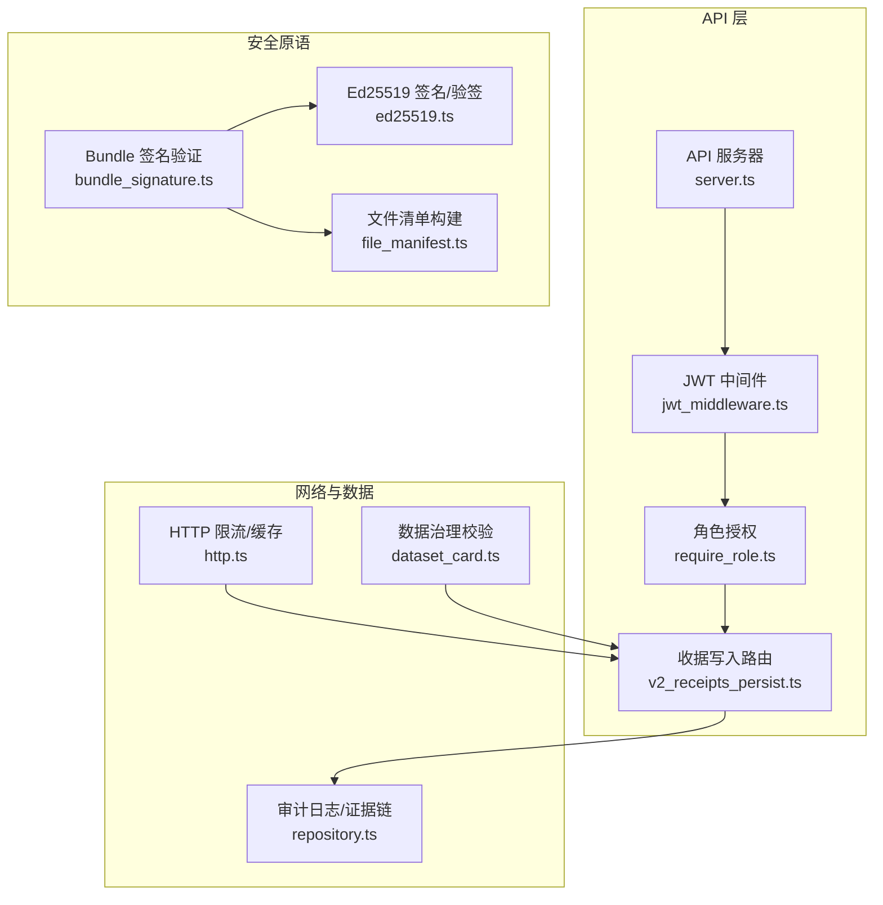
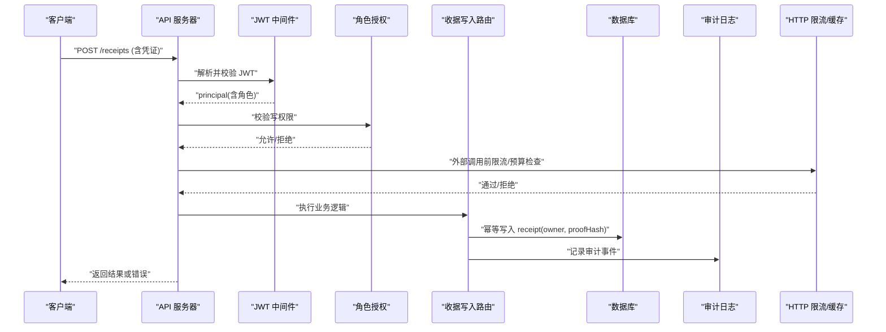
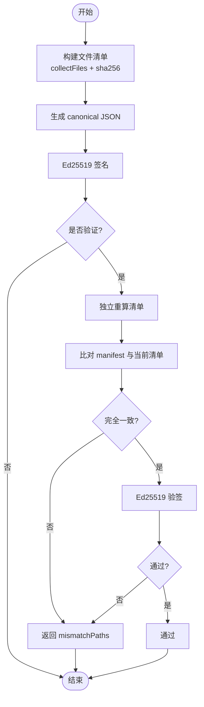
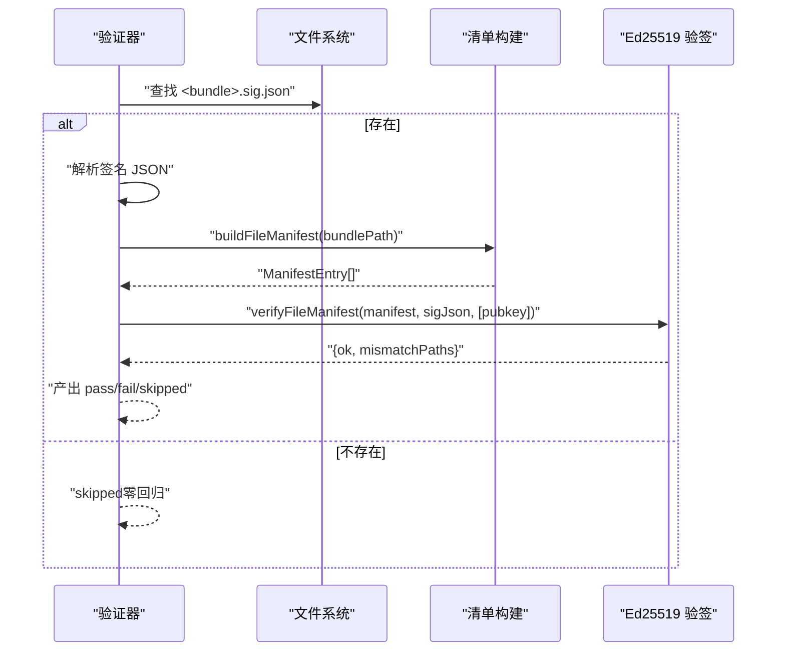
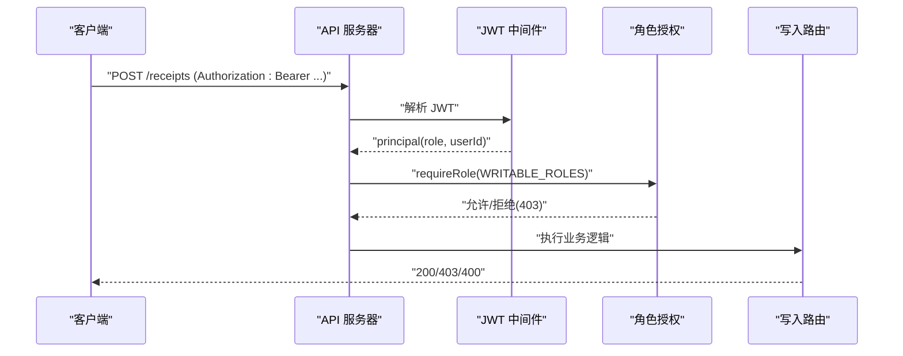
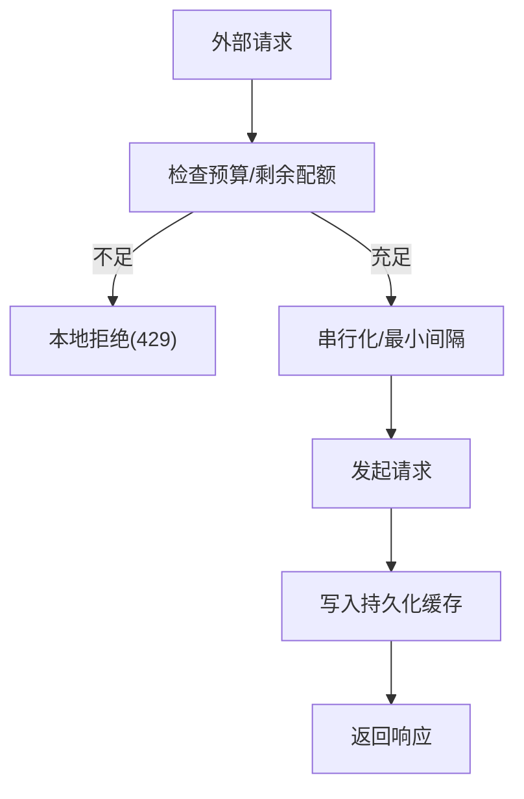
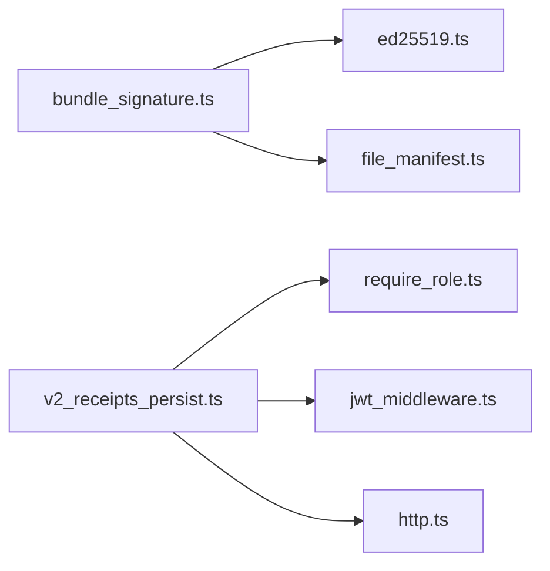

# 安全加固

<cite>
**本文引用的文件**
- [src/security/ed25519.ts](file://src/security/ed25519.ts)
- [src/security/file_manifest.ts](file://src/security/file_manifest.ts)
- [src/far_proof/bundle_signature.ts](file://src/far_proof/bundle_signature.ts)
- [src/api/auth/jwt_middleware.ts](file://src/api/auth/jwt_middleware.ts)
- [src/api/auth/require_role.ts](file://src/api/auth/require_role.ts)
- [src/api/routes/v2_receipts_persist.ts](file://src/api/routes/v2_receipts_persist.ts)
- [tests/api/server_fail_closed.test.ts](file://tests/api/server_fail_closed.test.ts)
- [scripts/secret_scan.mjs](file://scripts/secret_scan.mjs)
- [tests/scripts/core_process_gates.test.mjs](file://tests/scripts/core_process_gates.test.mjs)
- [src/retrieval/http.ts](file://src/retrieval/http.ts)
- [tests/retrieval/http_hardening.test.ts](file://tests/retrieval/http_hardening.test.ts)
- [src/cli/commands/api.ts](file://src/cli/commands/api.ts)
- [src/api/server.ts](file://src/api/server.ts)
- [src/data_governance/dataset_card.ts](file://src/data_governance/dataset_card.ts)
- [src/evidence_log/repository.ts](file://src/evidence_log/repository.ts)
- [tests/evidence_log/append_verify.test.ts](file://tests/evidence_log/append_verify.test.ts)
</cite>

## 目录
1. [简介](#简介)
2. [项目结构](#项目结构)
3. [核心组件](#核心组件)
4. [架构总览](#架构总览)
5. [详细组件分析](#详细组件分析)
6. [依赖关系分析](#依赖关系分析)
7. [性能考量](#性能考量)
8. [故障排查指南](#故障排查指南)
9. [结论](#结论)
10. [附录](#附录)

## 简介
本指南面向生产环境，提供端到端的安全加固实践：身份认证与授权（JWT、角色权限）、加密与签名（Ed25519 在证明包验证中的应用）、输入验证与输出编码、网络安全（HTTPS、CORS、限流）、敏感信息保护（API 密钥管理、配置加密）、安全扫描与漏洞检测流程、合规与许可证审计、安全事件响应与审计日志。内容基于仓库现有实现与测试用例提炼而成，确保可落地、可验证。

## 项目结构
与安全相关的关键模块分布在以下位置：
- 密码学与签名：security/ed25519.ts、security/file_manifest.ts、far_proof/bundle_signature.ts
- API 鉴权与授权：api/auth/*、api/routes/*
- 网络与请求治理：retrieval/http.ts
- 敏感信息与合规：data_governance/dataset_card.ts、scripts/secret_scan.mjs
- CLI 启动参数与服务器：cli/commands/api.ts、api/server.ts
- 审计与证据链：evidence_log/repository.ts

图表来源
- [src/api/server.ts](file://src/api/server.ts)
- [src/api/auth/jwt_middleware.ts](file://src/api/auth/jwt_middleware.ts)
- [src/api/auth/require_role.ts](file://src/api/auth/require_role.ts)
- [src/api/routes/v2_receipts_persist.ts](file://src/api/routes/v2_receipts_persist.ts)
- [src/security/ed25519.ts](file://src/security/ed25519.ts)
- [src/security/file_manifest.ts](file://src/security/file_manifest.ts)
- [src/far_proof/bundle_signature.ts](file://src/far_proof/bundle_signature.ts)
- [src/retrieval/http.ts](file://src/retrieval/http.ts)
- [src/data_governance/dataset_card.ts](file://src/data_governance/dataset_card.ts)
- [src/evidence_log/repository.ts](file://src/evidence_log/repository.ts)

章节来源
- [src/api/server.ts](file://src/api/server.ts)
- [src/api/auth/jwt_middleware.ts](file://src/api/auth/jwt_middleware.ts)
- [src/api/auth/require_role.ts](file://src/api/auth/require_role.ts)
- [src/api/routes/v2_receipts_persist.ts](file://src/api/routes/v2_receipts_persist.ts)
- [src/security/ed25519.ts](file://src/security/ed25519.ts)
- [src/security/file_manifest.ts](file://src/security/file_manifest.ts)
- [src/far_proof/bundle_signature.ts](file://src/far_proof/bundle_signature.ts)
- [src/retrieval/http.ts](file://src/retrieval/http.ts)
- [src/data_governance/dataset_card.ts](file://src/data_governance/dataset_card.ts)
- [src/evidence_log/repository.ts](file://src/evidence_log/repository.ts)

## 核心组件
- Ed25519 签名与清单构建：提供确定性清单生成、Ed25519 签名与验签，支持 bundle 侧边签名验证，拒绝符号链接，保证跨平台一致排序。
- Bundle 签名验证：定位 sidecar 签名文件，重算清单并比对哈希，结合可选外部公钥进行归属交叉校验。
- JWT 鉴权与角色授权：通过中间件解析令牌，按角色控制写/读权限；CLI 启动参数对空 secret 做严格拒绝，避免弱密钥。
- HTTP 限流与缓存：对外部请求实施速率限制、最小间隔、预算守卫与持久化缓存，防止滥用与资源耗尽。
- 数据治理与合规：数据集卡片强制隐私类别、同意依据、保留策略与泄漏风险缓解说明，避免“静默敏感数据”。
- 审计与证据链：入参强校验、不可变追加、链头校验，保障审计轨迹完整可追溯。

章节来源
- [src/security/ed25519.ts:1-154](file://src/security/ed25519.ts#L1-L154)
- [src/security/file_manifest.ts:1-59](file://src/security/file_manifest.ts#L1-L59)
- [src/far_proof/bundle_signature.ts:1-125](file://src/far_proof/bundle_signature.ts#L1-L125)
- [src/api/auth/jwt_middleware.ts](file://src/api/auth/jwt_middleware.ts)
- [src/api/auth/require_role.ts](file://src/api/auth/require_role.ts)
- [src/api/routes/v2_receipts_persist.ts:92-124](file://src/api/routes/v2_receipts_persist.ts#L92-L124)
- [tests/api/server_fail_closed.test.ts:1-109](file://tests/api/server_fail_closed.test.ts#L1-L109)
- [src/retrieval/http.ts](file://src/retrieval/http.ts)
- [tests/retrieval/http_hardening.test.ts:164-264](file://tests/retrieval/http_hardening.test.ts#L164-L264)
- [src/data_governance/dataset_card.ts:126-169](file://src/data_governance/dataset_card.ts#L126-L169)
- [src/evidence_log/repository.ts](file://src/evidence_log/repository.ts)
- [tests/evidence_log/append_verify.test.ts:106-139](file://tests/evidence_log/append_verify.test.ts#L106-L139)

## 架构总览
下图展示从请求进入 API 到落库与审计的完整安全路径，以及离线证明包的签名验证链路。

图表来源
- [src/api/server.ts](file://src/api/server.ts)
- [src/api/auth/jwt_middleware.ts](file://src/api/auth/jwt_middleware.ts)
- [src/api/auth/require_role.ts](file://src/api/auth/require_role.ts)
- [src/api/routes/v2_receipts_persist.ts:92-124](file://src/api/routes/v2_receipts_persist.ts#L92-L124)
- [src/retrieval/http.ts](file://src/retrieval/http.ts)
- [src/evidence_log/repository.ts](file://src/evidence_log/repository.ts)

## 详细组件分析

### Ed25519 数字签名与清单构建
- 确定性清单：按相对路径 code-unit 序排序，计算每个文件的 SHA-256，生成 canonical JSON。
- 签名与验签：使用 node:crypto 原生 Ed25519，签名产物包含算法、base64 签名、自含公钥、时间戳、清单与唯一 signatureId。
- 防篡改：拒绝符号链接与非常规条目；验签时双向比对当前清单与签名内清单，缺失或哈希不一致均失败。

图表来源
- [src/security/ed25519.ts:65-148](file://src/security/ed25519.ts#L65-L148)
- [src/security/file_manifest.ts:23-58](file://src/security/file_manifest.ts#L23-L58)

章节来源
- [src/security/ed25519.ts:1-154](file://src/security/ed25519.ts#L1-L154)
- [src/security/file_manifest.ts:1-59](file://src/security/file_manifest.ts#L1-L59)

### Bundle 签名验证（证明包）
- Sidecar 机制：在 bundle 目录外生成 .sig.json，避免修改被签文件。
- 验证流程：定位 sidecar → 读取签名 → 重建清单 → 比对哈希 → 验签 → 可选外部公钥归属校验。
- 威胁模型：将“一致伪造”窗口收窄至“同时持有私钥”，未签名 bundle 仍保持只检朴素篡改。

图表来源
- [src/far_proof/bundle_signature.ts:55-125](file://src/far_proof/bundle_signature.ts#L55-L125)
- [src/security/ed25519.ts:114-148](file://src/security/ed25519.ts#L114-L148)
- [src/security/file_manifest.ts:50-58](file://src/security/file_manifest.ts#L50-L58)

章节来源
- [src/far_proof/bundle_signature.ts:1-125](file://src/far_proof/bundle_signature.ts#L1-L125)

### 身份认证与授权（JWT 与角色）
- 启动参数与密钥：CLI 解析 --protected 与 FAR_JWT_SECRET；空或缺失 secret 会被拒绝为 null，避免 HS256 空 key 可伪造 admin。
- 中间件与授权：JWT 中间件解析 principal，角色授权根据 WRITABLE_ROLES 判断写权限；viewer 仅读，非 writable 角色返回 403。
- 幂等与归属：写入 receipt 时 owner 取自 principal.userId（受保护模式），匿名模式写 NULL；以 proofHash 作为内容寻址实现幂等。

图表来源
- [tests/api/server_fail_closed.test.ts:19-109](file://tests/api/server_fail_closed.test.ts#L19-L109)
- [src/api/auth/jwt_middleware.ts](file://src/api/auth/jwt_middleware.ts)
- [src/api/auth/require_role.ts](file://src/api/auth/require_role.ts)
- [src/api/routes/v2_receipts_persist.ts:92-124](file://src/api/routes/v2_receipts_persist.ts#L92-L124)
- [src/cli/commands/api.ts](file://src/cli/commands/api.ts)

章节来源
- [tests/api/server_fail_closed.test.ts:1-109](file://tests/api/server_fail_closed.test.ts#L1-L109)
- [src/api/routes/v2_receipts_persist.ts:92-124](file://src/api/routes/v2_receipts_persist.ts#L92-L124)
- [src/cli/commands/api.ts](file://src/cli/commands/api.ts)

### 输入验证与输出编码
- 审计数据强校验：对 requestPayload、responsePayload、finishReason、usageTokensTotal 等字段进行 fail-closed 校验，非法值直接抛错，避免污染证据链。
- 数据治理卡：敏感/个人数据必须声明同意依据；保留策略必须包含删除程序；泄漏风险需附带缓解说明。
- 建议：对所有外部输入执行白名单校验与类型约束；对输出进行上下文相关的编码（HTML/JS/CSS/URL），防止 XSS、注入等攻击。

章节来源
- [tests/evidence_log/append_verify.test.ts:106-139](file://tests/evidence_log/append_verify.test.ts#L106-L139)
- [src/data_governance/dataset_card.ts:126-169](file://src/data_governance/dataset_card.ts#L126-L169)

### 网络安全配置（HTTPS、CORS、频率限制）
- HTTPS：在生产部署中由反向代理或容器编排强制 HTTPS，服务端不暴露明文端口。
- CORS：仅允许已知前端域名，最小化暴露面。
- 频率限制：对外部请求实施每主机最小间隔、预算守卫与持久化缓存；当剩余配额为 0 时本地拒绝后续请求，避免超限。

图表来源
- [tests/retrieval/http_hardening.test.ts:164-264](file://tests/retrieval/http_hardening.test.ts#L164-L264)
- [src/retrieval/http.ts](file://src/retrieval/http.ts)

章节来源
- [tests/retrieval/http_hardening.test.ts:164-264](file://tests/retrieval/http_hardening.test.ts#L164-L264)
- [src/retrieval/http.ts](file://src/retrieval/http.ts)

### 敏感信息保护（API 密钥管理与配置加密）
- 密钥扫描：CI 集成 secret_scan，识别真实泄露、豁免引用/占位/文档 URL/尖括号模板，全仓扫描零命中为门禁通过。
- 环境变量：FAR_JWT_SECRET 为空或缺失时视为 offline 匿名模式；禁止空字符串作为密钥，避免 HS256 空 key 绕过。
- 配置加密：建议对配置文件与密钥使用 KMS/Secrets Manager 托管，运行时解密注入，不落盘明文。

章节来源
- [tests/scripts/core_process_gates.test.mjs:1-54](file://tests/scripts/core_process_gates.test.mjs#L1-L54)
- [scripts/secret_scan.mjs](file://scripts/secret_scan.mjs)
- [tests/api/server_fail_closed.test.ts:80-109](file://tests/api/server_fail_closed.test.ts#L80-L109)

### 安全扫描与漏洞检测流程
- 供应链与许可证：通过脚本生成 SBOM 并进行许可证审计，阻断不合规依赖。
- 代码质量与架构：运行架构一致性检查、覆盖率门控、零容忍扫描（无 any/@ts-ignore/空 catch）。
- 持续集成：所有扫描作为 PR/Merge 门禁，失败即阻断发布。

章节来源
- [tests/scripts/core_process_gates.test.mjs:1-54](file://tests/scripts/core_process_gates.test.mjs#L1-L54)

### 合规性检查与许可证审计
- 数据集卡片：强制隐私分类、同意依据、保留与删除策略、泄漏风险缓解说明，确保数据生命周期合规。
- 许可证：SBOM 与许可证审计脚本用于发现未知/受限许可证，纳入治理清单。

章节来源
- [src/data_governance/dataset_card.ts:126-169](file://src/data_governance/dataset_card.ts#L126-L169)

### 安全事件响应与审计日志
- 审计事件：关键操作（运行开始、阶段完成、写入 receipt）均记录结构化事件，包含时间戳与摘要哈希。
- 证据链：append 后支持 verifyChainHead 校验链头完整性，断链立即失败。
- 事件响应：对异常与失败分支集中告警，结合审计日志溯源；对签名失效、权限拒绝、限流拒绝等事件建立告警规则。

章节来源
- [src/evidence_log/repository.ts](file://src/evidence_log/repository.ts)
- [tests/evidence_log/append_verify.test.ts:106-139](file://tests/evidence_log/append_verify.test.ts#L106-L139)

## 依赖关系分析
- 松耦合：签名与清单构建解耦于 bundle 验证；JWT 中间件与业务路由分离；HTTP 限流与业务路由解耦。
- 关键依赖：
  - bundle_signature 依赖 ed25519 与 file_manifest 作为单一事实源。
  - v2_receipts_persist 依赖 require_role 与 jwt_middleware 进行鉴权与授权。
  - http.ts 提供对外部调用的统一限流与缓存策略。
- 潜在循环：未发现直接循环依赖；各模块职责清晰，便于替换与扩展。

图表来源
- [src/far_proof/bundle_signature.ts:27-31](file://src/far_proof/bundle_signature.ts#L27-L31)
- [src/api/routes/v2_receipts_persist.ts:92-124](file://src/api/routes/v2_receipts_persist.ts#L92-L124)
- [src/retrieval/http.ts](file://src/retrieval/http.ts)

章节来源
- [src/far_proof/bundle_signature.ts:1-125](file://src/far_proof/bundle_signature.ts#L1-L125)
- [src/api/routes/v2_receipts_persist.ts:92-124](file://src/api/routes/v2_receipts_persist.ts#L92-L124)
- [src/retrieval/http.ts](file://src/retrieval/http.ts)

## 性能考量
- 清单构建与签名：文件遍历与哈希计算为 CPU 密集，建议在离线打包阶段执行；批量处理时注意内存占用。
- 限流与缓存：对外部请求串行化与最小间隔降低并发压力；持久化缓存减少重复请求，提升吞吐。
- 鉴权开销：JWT 解析与角色校验轻量，但应避免在热路径中进行昂贵操作。

[本节为通用指导，无需特定文件来源]

## 故障排查指南
- 签名失败：检查清单是否一致（path→sha256）、sidecar 是否损坏、公钥是否匹配；查看 mismatchPaths 定位差异文件。
- 权限拒绝：确认 JWT 有效且 principal.role 具备写权限；检查 CLI 启动参数是否启用 --protected 并设置非空 FAR_JWT_SECRET。
- 限流拒绝：检查 X-RateLimit-Remaining 与预算守卫；确认请求是否超过每主机最小间隔。
- 审计链断裂：调用链头校验接口，定位断点 seq；检查 appendRecord 入参是否符合强校验规则。

章节来源
- [src/far_proof/bundle_signature.ts:68-125](file://src/far_proof/bundle_signature.ts#L68-L125)
- [tests/api/server_fail_closed.test.ts:80-109](file://tests/api/server_fail_closed.test.ts#L80-L109)
- [tests/retrieval/http_hardening.test.ts:164-264](file://tests/retrieval/http_hardening.test.ts#L164-L264)
- [tests/evidence_log/append_verify.test.ts:106-139](file://tests/evidence_log/append_verify.test.ts#L106-L139)

## 结论
本指南基于仓库现有实现，提供了生产环境安全加固的系统化方案：以 Ed25519 为核心的可验证证据链、严格的 JWT 鉴权与角色授权、健壮的输入验证与数据治理、网络层的限流与缓存、全面的敏感信息保护与扫描流程、合规与许可证审计、以及完善的事件响应与审计日志。遵循这些实践可显著降低安全风险，提升系统的可审计性与可恢复性。

## 附录
- 推荐部署要点：
  - 使用反向代理强制 HTTPS，关闭明文端口。
  - 配置最小化 CORS 白名单。
  - 将 FAR_JWT_SECRET 交由 Secrets Manager 管理，禁止硬编码。
  - 在 CI 中启用 secret_scan、SBOM 与许可证审计门禁。
  - 定期导出并验证 bundle 签名与证据链完整性。

[本节为通用指导，无需特定文件来源]