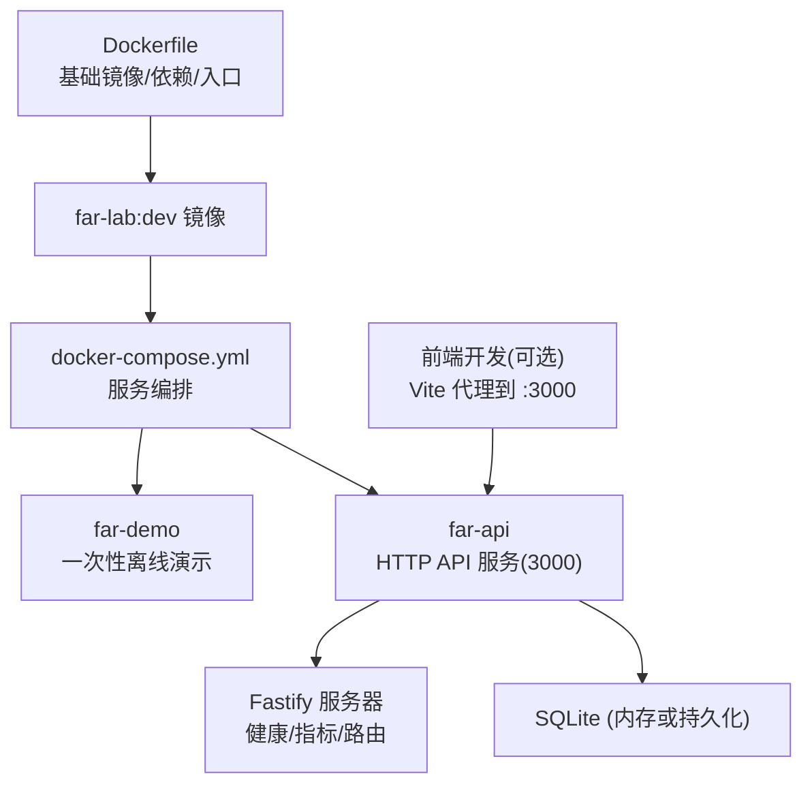
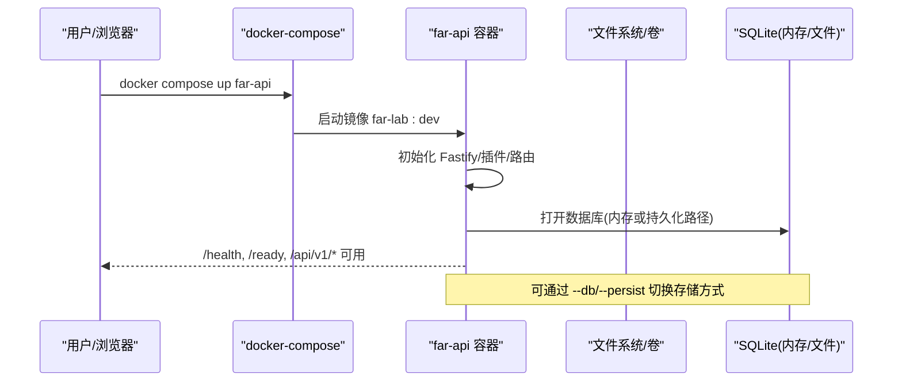
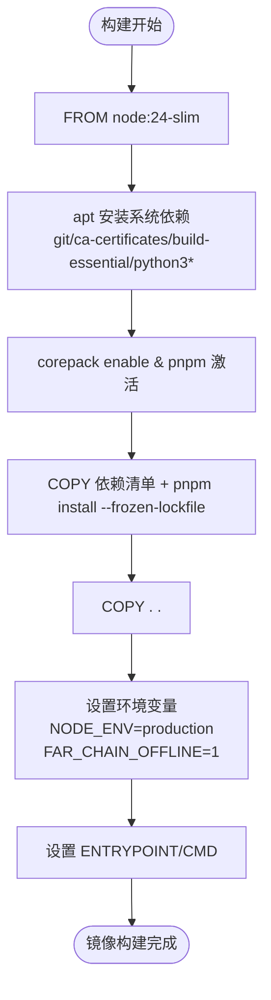
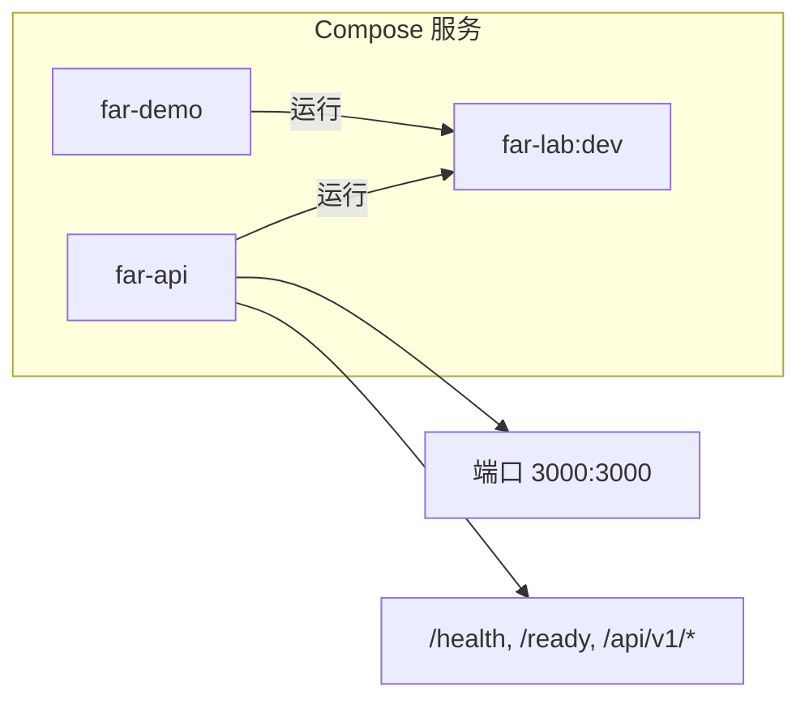
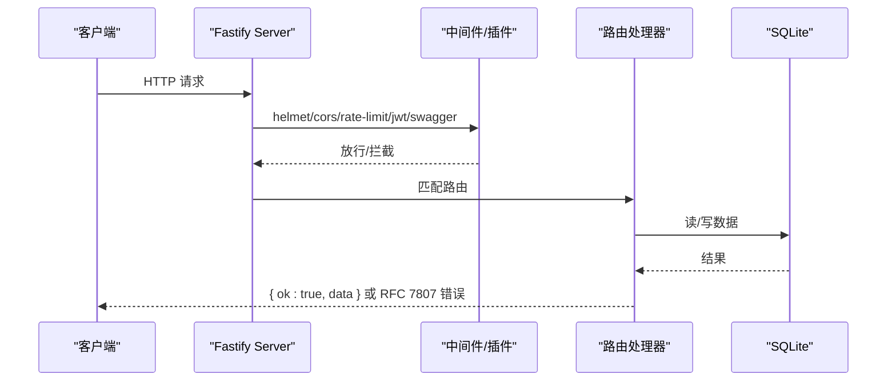
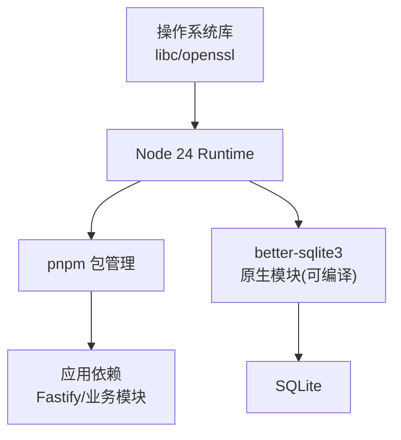

# 容器化部署

<cite>
**本文引用的文件**
- [Dockerfile](file://Dockerfile)
- [docker-compose.yml](file://docker-compose.yml)
- [src/api/server.ts](file://src/api/server.ts)
- [src/cli/commands/api.ts](file://src/cli/commands/api.ts)
- [frontend/vite.config.ts](file://frontend/vite.config.ts)
- [package.json](file://package.json)
</cite>

## 目录
1. [简介](#简介)
2. [项目结构](#项目结构)
3. [核心组件](#核心组件)
4. [架构总览](#架构总览)
5. [详细组件分析](#详细组件分析)
6. [依赖关系分析](#依赖关系分析)
7. [性能与优化](#性能与优化)
8. [故障排查指南](#故障排查指南)
9. [结论](#结论)
10. [附录：环境变量与启动参数示例](#附录环境变量与启动参数示例)

## 简介
本指南面向生产与研发环境，提供 FAR-Lab 的容器化部署方案。内容涵盖：
- Docker 镜像构建（多阶段与离线优先）
- 关键环境变量（特别是 FAR_CHAIN_OFFLINE）
- docker-compose 服务编排（API、演示任务、前端开发联动）
- 生产环境优化建议（镜像体积、安全加固、资源限制）
- 容器启动参数与环境变量配置示例
- 离线模式与在线模式的差异
- 常见故障排查与调试方法

## 项目结构
仓库包含后端 API（Node.js/Fastify）、CLI 工具、前端（React/Vite）以及测试与脚本等。容器化主要围绕根目录的 Dockerfile 与 docker-compose.yml 展开，并通过 CLI 命令暴露 demo 与 api 两种运行模式。

图表来源
- [Dockerfile:1-57](file://Dockerfile#L1-L57)
- [docker-compose.yml:1-28](file://docker-compose.yml#L1-L28)
- [src/api/server.ts:112-255](file://src/api/server.ts#L112-L255)

章节来源
- [Dockerfile:1-57](file://Dockerfile#L1-L57)
- [docker-compose.yml:1-28](file://docker-compose.yml#L1-L28)

## 核心组件
- 镜像构建（Dockerfile）
  - 基础镜像：node:24-slim（建议使用固定 digest 提升供应链安全）
  - 系统依赖：git、ca-certificates、build-essential、python3/python3-dev（用于 better-sqlite3 原生模块编译兜底）
  - 包管理：启用 corepack 并安装 pnpm@10.29.3
  - 依赖层缓存：先复制 package.json/pnpm-lock.yaml/pnpm-workspace.yaml，再执行 pnpm install --frozen-lockfile
  - 源码复制与构建产物：COPY . .
  - 环境变量：NODE_ENV=production；FAR_CHAIN_OFFLINE=1（默认离线）
  - 入口与默认命令：ENTRYPOINT node src/cli/far.ts；CMD ["demo","tess-offline"]
- 服务编排（docker-compose.yml）
  - far-demo：一次性运行离线 TESS 演示
  - far-api：长驻 API 服务，监听 0.0.0.0:3000，端口映射 3000:3000
  - 支持通过 --env-file 注入真实 provider 密钥（如 DASHSCOPE_API_KEY），但默认不读取宿主 .env
- API 服务（Fastify）
  - 插件链：helmet、cors、rate-limit、jwt（可选）、swagger
  - 路由：/health、/ready、/metrics、/api/v1/*、/api/v2/*
  - 优雅启停：SIGINT/SIGTERM 关闭 Fastify 并关闭数据库连接
- 前端（可选）
  - Vite 开发服务器默认 5173，代理 /api/v1、/health、/ready 到 localhost:3000

章节来源
- [Dockerfile:15-49](file://Dockerfile#L15-L49)
- [docker-compose.yml:12-28](file://docker-compose.yml#L12-L28)
- [src/api/server.ts:112-255](file://src/api/server.ts#L112-L255)
- [frontend/vite.config.ts:47-58](file://frontend/vite.config.ts#L47-L58)

## 架构总览
容器内运行 Node 应用，默认以离线模式启动。API 服务通过 Fastify 暴露 REST 接口，使用 SQLite（内存或持久化）。前端可在本地开发时通过 Vite 代理访问 API。

图表来源
- [docker-compose.yml:19-28](file://docker-compose.yml#L19-L28)
- [src/api/server.ts:265-290](file://src/api/server.ts#L265-L290)
- [src/cli/commands/api.ts:29-78](file://src/cli/commands/api.ts#L29-L78)

## 详细组件分析

### Dockerfile 多阶段与构建流程
- 基础镜像选择
  - 使用 node:24-slim，注释中强调应钉住 SHA256 digest 以提升供应链安全（当前受限于构建环境无法获取 digest）
- 系统依赖安装
  - 安装 git、ca-certificates、build-essential、python3、python3-dev，以便在 prebuilt binary 失败时回退到 node-gyp 编译 native 模块（better-sqlite3）
- 包管理器与依赖层
  - 启用 corepack 并激活 pnpm@10.29.3
  - 仅复制依赖清单后执行 pnpm install --frozen-lockfile，充分利用 Docker 层缓存
- 源码与运行环境
  - 复制全部源码
  - 设置 NODE_ENV=production 与 FAR_CHAIN_OFFLINE=1
- 入口与默认命令
  - ENTRYPOINT 指向 src/cli/far.ts
  - CMD 默认执行 demo tess-offline（零密钥离线演示）

图表来源
- [Dockerfile:15-49](file://Dockerfile#L15-L49)

章节来源
- [Dockerfile:15-49](file://Dockerfile#L15-L49)

### 环境变量与关键参数
- FAR_CHAIN_OFFLINE
  - 作用：控制是否启用离线模式。镜像默认设置为 1，即默认离线运行，无需任何外部 API key
  - 行为影响：LLM 相关端点在未配置 provider 时将 fail-closed（确定性端点仍可用）
- PORT
  - 作用：覆盖 API 监听端口（当存在时）
- FAR_JWT_SECRET
  - 作用：启用受保护模式（需显式 --protected 或传入非空 secret），否则为匿名模式
- DASHSCOPE_API_KEY / FAR_DASHSCOPE_API_KEY
  - 作用：在线模式下注入 LLM provider 密钥（通过 --env-file 显式注入，默认不读取宿主 .env）

章节来源
- [Dockerfile:42-49](file://Dockerfile#L42-L49)
- [src/cli/commands/api.ts:58-78](file://src/cli/commands/api.ts#L58-L78)
- [src/api/server.ts:112-120](file://src/api/server.ts#L112-L120)

### docker-compose 服务编排
- far-demo
  - 构建自当前目录，镜像名 far-lab:dev
  - 命令：demo tess-offline（一次性离线演示）
- far-api
  - 构建自当前目录，镜像名 far-lab:dev
  - 命令：api --host 0.0.0.0 --port 3000
  - 端口映射：3000:3000
  - 说明：离线 Web Cockpit 后端（匿名 demo，自动种子数据）；如需真实 provider，通过 --env-file 注入密钥

图表来源
- [docker-compose.yml:12-28](file://docker-compose.yml#L12-L28)

章节来源
- [docker-compose.yml:12-28](file://docker-compose.yml#L12-L28)

### API 服务与路由
- 插件注册顺序：helmet → cors → rate-limit → jwt（可选）→ swagger → auth middleware → error handler → routes
- 路由分组：
  - 健康与指标：/health、/ready、/metrics
  - V1 API：/api/v1/hypothesize、/evidence、/verdict、/report、/integrity、/benchmark、/court、/arena、/llm-status
  - V2 API：/api/v2 收据验证与持久化
- 请求体大小与超时：bodyLimit=10MB；requestTimeout=900s；connectionTimeout=60s
- 优雅关闭：SIGINT/SIGTERM 触发 close() 并关闭数据库

图表来源
- [src/api/server.ts:112-255](file://src/api/server.ts#L112-L255)
- [src/api/server.ts:265-290](file://src/api/server.ts#L265-L290)

章节来源
- [src/api/server.ts:112-255](file://src/api/server.ts#L112-L255)
- [src/api/server.ts:265-290](file://src/api/server.ts#L265-L290)

### 前端开发与集成
- Vite 开发服务器默认端口 5173
- 代理规则：/api/v1、/health、/ready 转发至 http://localhost:3000
- 构建目标：es2022，拆分 vendor chunk（react、d3、react-query）
- 与 API 交互：前端通过相对路径调用 /api/v1，由代理转发到远端 API 服务

章节来源
- [frontend/vite.config.ts:24-58](file://frontend/vite.config.ts#L24-L58)

## 依赖关系分析
- 运行时依赖
  - Node.js 24（slim）
  - pnpm 包管理器（corepack 激活）
  - better-sqlite3（可能需编译 native）
- 系统级依赖
  - build-essential、python3、python3-dev（native 编译兜底）
  - ca-certificates（HTTPS 证书校验）
- 应用依赖
  - Fastify 生态（helmet、cors、rate-limit、jwt、swagger）
  - 业务模块：证据日志、裁决内核、防篡改密封、报告生成等

图表来源
- [Dockerfile:26-37](file://Dockerfile#L26-L37)
- [package.json:95-120](file://package.json#L95-L120)

章节来源
- [Dockerfile:26-37](file://Dockerfile#L26-L37)
- [package.json:95-120](file://package.json#L95-L120)

## 性能与优化
- 镜像体积优化
  - 使用 slim 基础镜像减少冗余
  - 利用层缓存：先安装依赖再复制源码
  - 移除不必要的构建工具（当前保留 build-essential 以支持 native 编译兜底）
- 安全加固
  - 基础镜像建议使用固定 digest（避免浮动 tag）
  - 默认离线模式，避免泄露 provider 密钥
  - 启用 helmet、cors 白名单、rate-limit、可选 JWT 鉴权
- 资源限制
  - 容器层面通过平台能力限制 CPU/内存
  - 应用层面：请求体大小限制、请求超时、连接超时
- 数据库持久化
  - 默认内存数据库适合演示；生产建议使用 --db 指定文件或 --persist 持久化
  - 优雅关闭确保 WAL 落盘

章节来源
- [Dockerfile:15-49](file://Dockerfile#L15-L49)
- [src/api/server.ts:121-140](file://src/api/server.ts#L121-L140)
- [src/cli/commands/api.ts:46-55](file://src/cli/commands/api.ts#L46-L55)

## 故障排查指南
- 无法访问网络或证书问题
  - 检查 ca-certificates 是否正确安装
  - 确认容器网络策略与代理设置
- native 模块编译失败
  - 确认 build-essential、python3、python3-dev 已安装
  - 观察日志中是否有 node-gyp rebuild 过程
- API 不可用
  - 检查 /health、/ready 返回状态
  - 确认端口映射与防火墙
  - 查看日志中的 CORS、rate-limit、JWT 配置
- 数据库写入异常
  - 使用 --db 指定持久化路径
  - 确认进程退出时能优雅关闭（WAL checkpoint）
- 前端无法连接后端
  - 开发环境确认 Vite 代理配置
  - 生产环境检查跨域与反向代理设置

章节来源
- [Dockerfile:26-30](file://Dockerfile#L26-L30)
- [src/api/server.ts:132-146](file://src/api/server.ts#L132-L146)
- [src/api/server.ts:265-290](file://src/api/server.ts#L265-L290)

## 结论
本指南提供了 FAR-Lab 的容器化部署方案，包括镜像构建、环境变量配置、服务编排与生产优化建议。默认离线模式便于快速验证与演示；通过显式注入密钥可切换到在线模式。结合健康探针、限流与安全头，可满足基本生产需求。建议在发布前钉住基础镜像 digest，并根据实际负载调整资源限制与数据库持久化策略。

## 附录：环境变量与启动参数示例
- 环境变量
  - FAR_CHAIN_OFFLINE=1：启用离线模式（默认）
  - PORT=3000：覆盖 API 端口
  - FAR_JWT_SECRET=<非空字符串>：启用受保护模式（需配合 --protected）
  - DASHSCOPE_API_KEY / FAR_DASHSCOPE_API_KEY：在线模式 provider 密钥
- 启动参数（API）
  - --host 0.0.0.0：绑定所有网卡
  - --port 3000：监听端口
  - --db <路径>：指定 SQLite 文件路径
  - --persist：使用默认持久化路径
  - --no-seed：不自动注入演示数据
  - --protected：从环境变量读取 FAR_JWT_SECRET 启用鉴权
- 典型命令
  - 离线演示：docker run --rm far-lab:dev demo tess-offline
  - 启动 API：docker run --rm far-lab:dev api --host 0.0.0.0 --port 3000
  - 带密钥的 API：docker compose --env-file .env up far-api

章节来源
- [Dockerfile:42-49](file://Dockerfile#L42-L49)
- [docker-compose.yml:12-28](file://docker-compose.yml#L12-L28)
- [src/cli/commands/api.ts:29-78](file://src/cli/commands/api.ts#L29-L78)