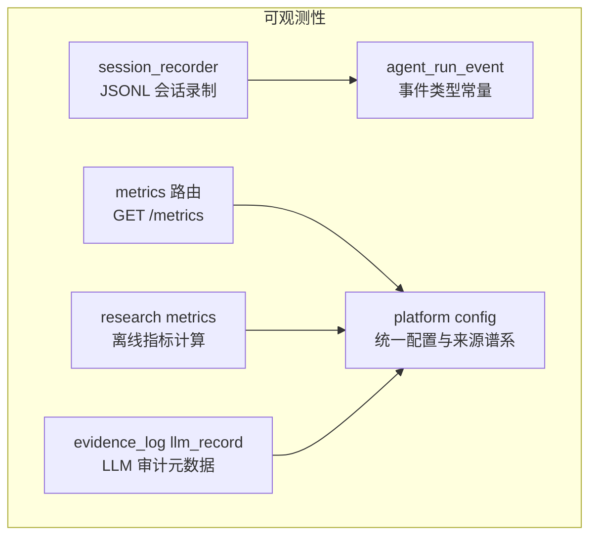
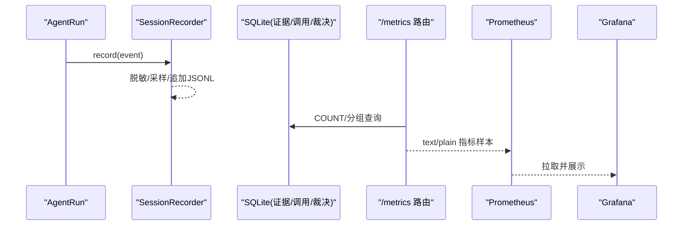
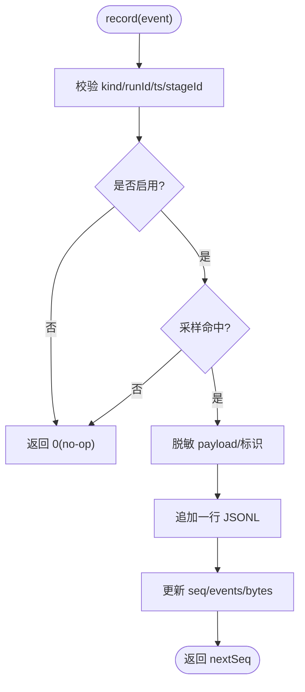
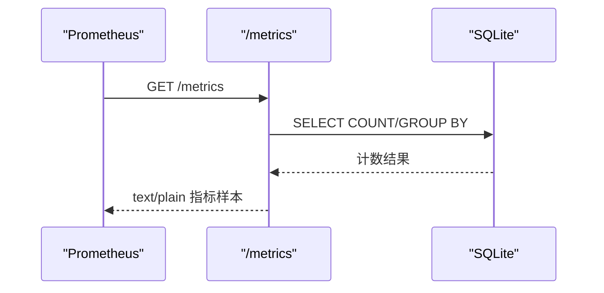
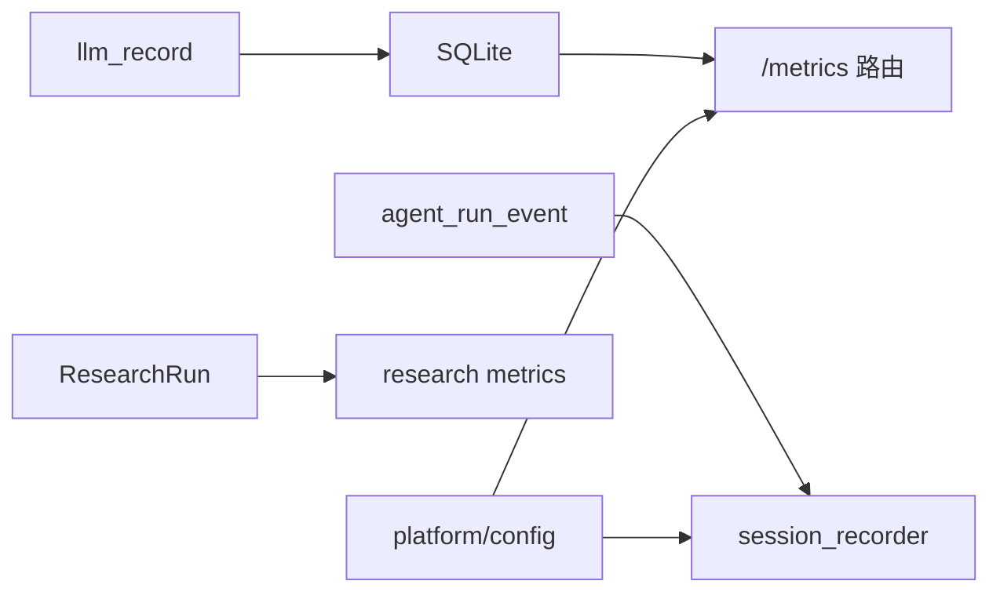

# 监控与日志

<cite>
**本文引用的文件**
- [src/trace/session_recorder.ts](file://src/trace/session_recorder.ts)
- [src/trace/agent_run_event.ts](file://src/trace/agent_run_event.ts)
- [src/api/routes/metrics.ts](file://src/api/routes/metrics.ts)
- [src/research/evaluation/metrics.ts](file://src/research/evaluation/metrics.ts)
- [src/platform/config.ts](file://src/platform/config.ts)
- [src/evidence_log/llm_record.ts](file://src/evidence_log/llm_record.ts)
- [tests/api/metrics.test.ts](file://tests/api/metrics.test.ts)
- [tests/research/metrics.test.ts](file://tests/research/metrics.test.ts)
</cite>

## 目录
1. [简介](#简介)
2. [项目结构](#项目结构)
3. [核心组件](#核心组件)
4. [架构总览](#架构总览)
5. [详细组件分析](#详细组件分析)
6. [依赖关系分析](#依赖关系分析)
7. [性能考量](#性能考量)
8. [故障排查指南](#故障排查指南)
9. [结论](#结论)
10. [附录](#附录)

## 简介
本文件面向“可观测性”（监控、日志、追踪）的落地实现，覆盖以下目标：
- 会话记录器：事件捕获、存储格式、回放与脱敏策略。
- 指标收集：进程指标、数据库业务指标、研究运行期业务指标。
- 配置与输出：统一配置来源、实验开关控制、Prometheus 文本格式。
- 集成方案：Prometheus 抓取 /metrics；Grafana 仪表板建议。
- 分布式追踪：基于 AgentRunEventKind 的事件流与链路串联。
- 告警与通知：基于指标阈值的告警规则建议与通知策略。
- 日志轮转、归档与清理：结合 JSONL 追加式写入与外部工具的建议。
- 基准测试与容量规划：以现有指标为基线进行容量评估与压测建议。

## 项目结构
可观测性相关代码主要分布在以下模块：
- trace：运行时会话录制与事件类型定义。
- api/routes/metrics：Prometheus 指标端点。
- research/evaluation/metrics：研究运行期的离线指标计算。
- platform/config：统一配置解析与来源谱系。
- evidence_log/llm_record：LLM 调用审计记录元数据。

图表来源
- [src/trace/session_recorder.ts:1-311](file://src/trace/session_recorder.ts#L1-L311)
- [src/trace/agent_run_event.ts:1-68](file://src/trace/agent_run_event.ts#L1-L68)
- [src/api/routes/metrics.ts:1-174](file://src/api/routes/metrics.ts#L1-L174)
- [src/research/evaluation/metrics.ts:1-275](file://src/research/evaluation/metrics.ts#L1-L275)
- [src/platform/config.ts:1-196](file://src/platform/config.ts#L1-L196)
- [src/evidence_log/llm_record.ts:1-48](file://src/evidence_log/llm_record.ts#L1-L48)

章节来源
- [src/trace/session_recorder.ts:1-311](file://src/trace/session_recorder.ts#L1-L311)
- [src/api/routes/metrics.ts:1-174](file://src/api/routes/metrics.ts#L1-L174)
- [src/research/evaluation/metrics.ts:1-275](file://src/research/evaluation/metrics.ts#L1-L275)
- [src/platform/config.ts:1-196](file://src/platform/config.ts#L1-L196)
- [src/evidence_log/llm_record.ts:1-48](file://src/evidence_log/llm_record.ts#L1-L48)

## 核心组件
- 会话录制器（SessionRecorder）
  - 职责：在 agent_loop 主循环中按事件类型追加写入 JSONL 行，支持采样、脱敏、回放与统计。
  - 关键特性：确定性 seq、UTC 时间戳、runId/stageId 脱敏、payload 敏感字段掩码、损坏行跳过。
  - 配置：FAR_SESSION_RECORD=off 或 opts.enabled=false 关闭；samplingRate ∈ (0,1] 开启确定性抽样。
- 事件类型（AgentRunEventKind）
  - 提供 run/stage/tool/guardrail/verdict/fork/replay/attack/session/dialogue/intent/clarification 等 22 种事件种类，用于串联全链路。
- Prometheus 指标端点（/metrics）
  - 暴露进程指标（uptime、内存）与数据库业务指标（证据日志行数、调用记录数、FTS 索引行数、裁决分布、降级计数）。
  - 返回 Prometheus 文本格式（text/plain; version=0.0.4），无鉴权，探针豁免。
- 研究运行期指标（computeRunMetrics）
  - 从 ResearchRun 冻结状态计算引用绑定率、假设数量、证伪完备性、计划完备性、阶段收据完整性、生成重试率/截断率等。
- 统一配置（platform/config）
  - 单一 typed schema，来源优先级：runtime-arg > CLI > env > file > default；敏感值 mask；实验功能默认 OFF。
- LLM 审计元数据（llm_record）
  - 记录 stageId、payloadKind、purposeTag、reproHash、gitCommitSha、finishReason 等，便于回溯与重算。

章节来源
- [src/trace/session_recorder.ts:1-311](file://src/trace/session_recorder.ts#L1-L311)
- [src/trace/agent_run_event.ts:1-68](file://src/trace/agent_run_event.ts#L1-L68)
- [src/api/routes/metrics.ts:1-174](file://src/api/routes/metrics.ts#L1-L174)
- [src/research/evaluation/metrics.ts:1-275](file://src/research/evaluation/metrics.ts#L1-L275)
- [src/platform/config.ts:1-196](file://src/platform/config.ts#L1-L196)
- [src/evidence_log/llm_record.ts:1-48](file://src/evidence_log/llm_record.ts#L1-L48)

## 架构总览
系统通过“事件 → 指标 → 可视化/告警”的可观测性链路组织：
- 事件层：session_recorder 将 agent_loop 的运行过程以 JSONL 形式持久化，支持回放与审计。
- 指标层：/metrics 暴露进程与数据库指标；research metrics 提供研究运行期质量指标。
- 可视化/告警层：Prometheus 抓取 /metrics；Grafana 构建仪表板；基于阈值与趋势设置告警规则。

图表来源
- [src/trace/session_recorder.ts:166-249](file://src/trace/session_recorder.ts#L166-L249)
- [src/api/routes/metrics.ts:55-169](file://src/api/routes/metrics.ts#L55-L169)

章节来源
- [src/trace/session_recorder.ts:166-249](file://src/trace/session_recorder.ts#L166-L249)
- [src/api/routes/metrics.ts:55-169](file://src/api/routes/metrics.ts#L55-L169)

## 详细组件分析

### 会话录制器（SessionRecorder）
- 事件捕获
  - 通过 record(event) 接收事件，校验 kind、runId、ts、stageId（阶段事件必填）。
  - 对 payload 执行深度脱敏：私钥、令牌、邮箱、手机号、PII 键名等替换为占位符。
  - runId/stageId 使用稳定哈希前缀脱敏，保留同值关联但不泄露原值。
- 存储格式
  - 每行一个紧凑 JSON：{seq, ts, kind, runId, stageId?, payload?}，append-only。
  - 序列号递增，确保确定性回放顺序。
- 查询接口
  - replaySession(path)：读取 JSONL，跳过损坏行并统计 skippedLines，返回事件数组。
  - stats()：返回 events 与 bytes 计数。
- 采样与开关
  - FAR_SESSION_RECORD=off 或 enabled=false 完全关闭。
  - samplingRate 基于 runId 的确定性哈希判定，避免孤儿生命周期事件。

图表来源
- [src/trace/session_recorder.ts:141-249](file://src/trace/session_recorder.ts#L141-L249)

章节来源
- [src/trace/session_recorder.ts:22-132](file://src/trace/session_recorder.ts#L22-L132)
- [src/trace/session_recorder.ts:141-249](file://src/trace/session_recorder.ts#L141-L249)
- [src/trace/session_recorder.ts:252-311](file://src/trace/session_recorder.ts#L252-L311)

### 事件类型与决策/失败码
- 事件种类：run_started/completed、stage_started/completed、tool_call_*、guardrail_blocked、source_card_accepted、human_checkpoint_recorded、verdict_written、fork_created、replay_*、attack_case_*、session_*、dialogue_turn_*、intent_inferred、clarification_asked。
- 决策集合：allow/ask/deny/skip/record。
- 失败码：schema_invalid、tool_misroute、unsupported_claim、source_mismatch、hidden_scope_slip、over_confirmed、nonreproducible_metric、provider_boundary_leak、guardrail_missing、security_policy_violation。

章节来源
- [src/trace/agent_run_event.ts:1-68](file://src/trace/agent_run_event.ts#L1-L68)

### Prometheus 指标端点（/metrics）
- 进程指标：far_lab_uptime_seconds、process_resident_memory_bytes、process_heap_used_bytes。
- 业务指标：
  - far_lab_evidence_log_total：证据日志表行数。
  - far_lab_call_record_total：调用记录表行数。
  - far_lab_evidence_fts_total：全文检索镜像表行数（可选）。
  - far_lab_verdict_total{verdict="..."}：五值裁决分布。
  - far_lab_degradation_total：LLM 降级次数（call_records.degraded_from 非空）。
  - far_lab_degraded_scope_verdict_total：裁决节点 DEGRADED_SCOPE 数量。
- 错误处理：指标采集失败返回 500 + 可读诊断文本，不伪造样本。

图表来源
- [src/api/routes/metrics.ts:55-169](file://src/api/routes/metrics.ts#L55-L169)

章节来源
- [src/api/routes/metrics.ts:1-174](file://src/api/routes/metrics.ts#L1-L174)
- [tests/api/metrics.test.ts](file://tests/api/metrics.test.ts)

### 研究运行期指标（computeRunMetrics）
- 指标类别：
  - 引用与证据：citationBindingRate、unboundEvidenceCount。
  - 假设与多样性：hypothesisCount、distinctHypothesisIdCount、falsificationMetricDiversity、strategyOriginDiversity。
  - 计划与执行：planCompleteness、revisionCount、observationCount。
  - 收据与门控：receiptCompleteness、humanApprovalGateCount、gateVerdictResearchable、runModeIsLive。
  - 评分维度均值：scorecardMeanGrade.*（A=4…F=0 映射）。
  - 生成质量：generationRetryRate、generationTruncationRate、generationRetryCount。
- 特点：纯函数、可重算、不含人工打分项（标注 humanRubricMetrics）。

章节来源
- [src/research/evaluation/metrics.ts:1-275](file://src/research/evaluation/metrics.ts#L1-L275)
- [tests/research/metrics.test.ts](file://tests/research/metrics.test.ts)

### 统一配置与来源谱系
- 配置层级：runtime-arg > CLI > env > file > default。
- 敏感字段：在 provenance 中以 "***" 显示。
- 实验功能：默认 OFF，仅 runtime-arg/CLI 可显式开启。
- 未知键门：默认拒绝未声明键，防止误用。
- 会话录制开关：FAR_SESSION_RECORD 受实验约束，需显式开启。

章节来源
- [src/platform/config.ts:1-196](file://src/platform/config.ts#L1-L196)

### LLM 审计元数据
- 元数据字段：stageId、payloadKind、purposeTag、reproHash、gitCommitSha、finishReason。
- 用途：与证据日志、阶段收据联动，支撑可重算与溯源。

章节来源
- [src/evidence_log/llm_record.ts:1-48](file://src/evidence_log/llm_record.ts#L1-L48)

## 依赖关系分析
- session_recorder 依赖 agent_run_event 中的事件种类常量进行校验。
- /metrics 路由依赖 SQLite 数据库进行确定性 COUNT/GROUP BY 查询。
- research metrics 依赖 ResearchRun 冻结状态，纯函数计算，不触发外部网络。
- platform/config 为所有可观测性开关提供统一入口与来源谱系。
- llm_record 与证据日志/阶段收据形成可追溯闭环。

图表来源
- [src/trace/agent_run_event.ts:1-68](file://src/trace/agent_run_event.ts#L1-L68)
- [src/trace/session_recorder.ts:166-249](file://src/trace/session_recorder.ts#L166-L249)
- [src/api/routes/metrics.ts:55-169](file://src/api/routes/metrics.ts#L55-L169)
- [src/research/evaluation/metrics.ts:124-275](file://src/research/evaluation/metrics.ts#L124-L275)
- [src/platform/config.ts:90-137](file://src/platform/config.ts#L90-L137)
- [src/evidence_log/llm_record.ts:18-48](file://src/evidence_log/llm_record.ts#L18-L48)

章节来源
- [src/trace/agent_run_event.ts:1-68](file://src/trace/agent_run_event.ts#L1-L68)
- [src/trace/session_recorder.ts:166-249](file://src/trace/session_recorder.ts#L166-L249)
- [src/api/routes/metrics.ts:55-169](file://src/api/routes/metrics.ts#L55-L169)
- [src/research/evaluation/metrics.ts:124-275](file://src/research/evaluation/metrics.ts#L124-L275)
- [src/platform/config.ts:90-137](file://src/platform/config.ts#L90-L137)
- [src/evidence_log/llm_record.ts:18-48](file://src/evidence_log/llm_record.ts#L18-L48)

## 性能考量
- 会话录制
  - 追加式 JSONL 写入，低开销；采样率可控制 I/O 压力。
  - 脱敏遍历 payload，注意大对象时的 CPU 成本；可按需裁剪 payload 大小。
- 指标端点
  - 指标为确定性 COUNT/GROUP BY 查询，无 LLM 调用；在高并发下关注 DB 锁与连接池。
  - 建议限制 /metrics 抓取频率（如 15–60s），避免频繁扫描大表。
- 研究指标
  - computeRunMetrics 为纯函数，复杂度与假设/收据规模线性相关；批量聚合时注意内存占用。
- 容量规划
  - 依据 far_lab_evidence_log_total、far_lab_call_record_total 增长速率估算磁盘与备份窗口。
  - 依据 process_heap_used_bytes、process_resident_memory_bytes 设定 OOM 阈值与扩容策略。

[本节为通用指导，无需具体文件引用]

## 故障排查指南
- 会话录制问题
  - 现象：回放事件缺失或损坏行增多。
  - 排查：检查 FAR_SESSION_RECORD 与 samplingRate；确认 runId 非空、ts 为 UTC；查看 replaySession 的 skippedLines。
- 指标端点异常
  - 现象：/metrics 返回 500 或指标缺失。
  - 排查：确认 DB 可用；检查证据日志/调用记录/裁决表是否存在；FTS 表可选，不存在时 ftsTotal 为 0。
- 研究指标不一致
  - 现象：指标与预期不符。
  - 排查：确认 ResearchRun 冻结状态完整；检查 receiptCompleteness、generationRetryRate 等辅助指标定位问题阶段。
- 配置问题
  - 现象：实验功能未按预期开启或报错。
  - 排查：检查 CONFIG_LAYERS 优先级；确认 experimental 键仅由 runtime-arg/CLI 开启；查看 violations。

章节来源
- [src/trace/session_recorder.ts:141-249](file://src/trace/session_recorder.ts#L141-L249)
- [src/api/routes/metrics.ts:120-169](file://src/api/routes/metrics.ts#L120-L169)
- [src/research/evaluation/metrics.ts:124-275](file://src/research/evaluation/metrics.ts#L124-L275)
- [src/platform/config.ts:90-137](file://src/platform/config.ts#L90-L137)

## 结论
本系统以“事件驱动 + 指标直出”的方式实现了端到端的可观测性：
- 会话录制提供高保真、可回放的运行轨迹，配合脱敏保障安全。
- /metrics 暴露进程与数据库指标，满足 Prometheus 抓取与 Grafana 可视化。
- research metrics 提供研究运行期质量度量，支撑科学严谨性与可重算。
- 统一配置确保开关可控、来源可溯、敏感信息不外泄。
后续可扩展分布式追踪（OpenTelemetry）、结构化日志（JSON 行）与告警自动化。

[本节为总结，无需具体文件引用]

## 附录

### Prometheus 集成方案
- 抓取配置
  - scrape_configs 指向服务 /metrics，间隔 15–60s。
  - 标签：job=far-lab，instance=主机名/IP。
- 指标说明
  - 进程：far_lab_uptime_seconds、process_resident_memory_bytes、process_heap_used_bytes。
  - 业务：far_lab_evidence_log_total、far_lab_call_record_total、far_lab_evidence_fts_total、far_lab_verdict_total{verdict}、far_lab_degradation_total、far_lab_degraded_scope_verdict_total。

章节来源
- [src/api/routes/metrics.ts:1-174](file://src/api/routes/metrics.ts#L1-L174)

### Grafana 仪表板建议
- 面板
  - 进程健康：uptime、内存使用。
  - 业务量级：证据日志/调用记录/FTS 行数趋势。
  - 裁决分布：五值裁决占比。
  - 降级监控：degradation_total、degraded_scope_verdict_total。
- 告警
  - 指标突增：evidence_log_total/call_record_total 短时激增。
  - 裁决异常：REFUTED/DEGRADED_SCOPE 比例上升。
  - 资源压力：heap_used_bytes 接近容器限制。

[本节为概念性配置建议，无需具体文件引用]

### 分布式追踪与链路跟踪
- 事件串联
  - 使用 runId 作为跨阶段/跨组件的链路标识。
  - 通过 stageId 区分阶段边界，tool_call_* 标记外部调用。
- 扩展建议
  - 在事件 payload 中注入 trace_id/span_id（若引入 OpenTelemetry）。
  - 将 session JSONL 与分布式追踪平台对接，实现“事件 + 链路”双视图。

章节来源
- [src/trace/agent_run_event.ts:1-68](file://src/trace/agent_run_event.ts#L1-L68)
- [src/trace/session_recorder.ts:22-36](file://src/trace/session_recorder.ts#L22-L36)

### 告警规则与通知策略
- 规则示例
  - far_lab_degradation_total 增长率超过阈值 → 通知运维。
  - far_lab_verdict_total{verdict="REFUTED"} 占比升高 → 通知质量团队。
  - process_heap_used_bytes 持续高位 → 触发扩容或限流。
- 通知渠道
  - 企业微信/钉钉/邮件/Slack；分级通知（警告/严重）。

[本节为通用策略，无需具体文件引用]

### 日志轮转、归档与清理
- 轮转
  - 基于文件大小或时间（如每日）轮转 JSONL 文件，保留最近 N 天。
- 归档
  - 压缩归档到对象存储（如 S3/OSS），保留长期审计。
- 清理
  - 删除过期归档；定期校验 integrity（哈希链）。
- 工具建议
  - logrotate、自研脚本或云原生日志采集器（Fluent Bit/Vector）。

[本节为通用实践，无需具体文件引用]

### 性能基准测试与容量规划
- 基准
  - 以 /metrics 响应时间与 DB 查询耗时为核心指标。
  - 以 session_recorder 写入吞吐与 CPU 占用为基准。
- 容量
  - 根据 far_lab_evidence_log_total 增长速率规划磁盘与备份窗口。
  - 根据 process_heap_used_bytes 峰值规划内存与副本数。

[本节为通用指导，无需具体文件引用]