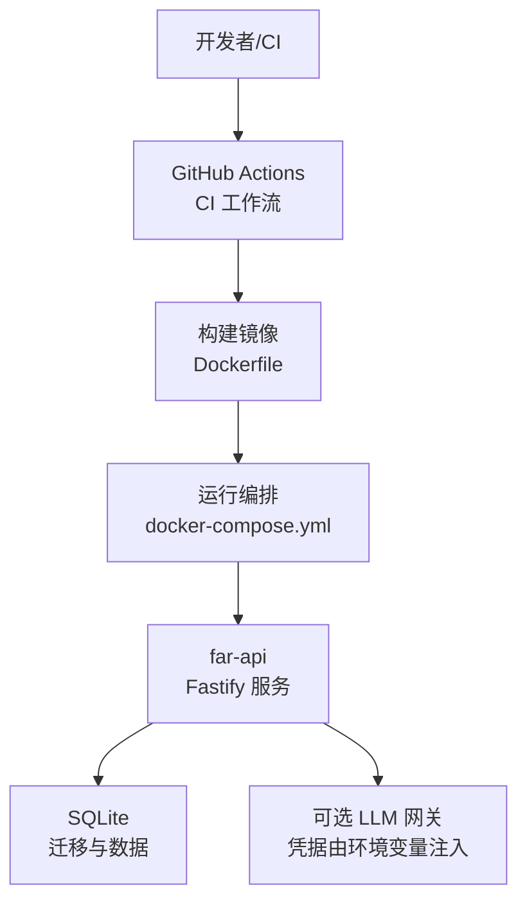
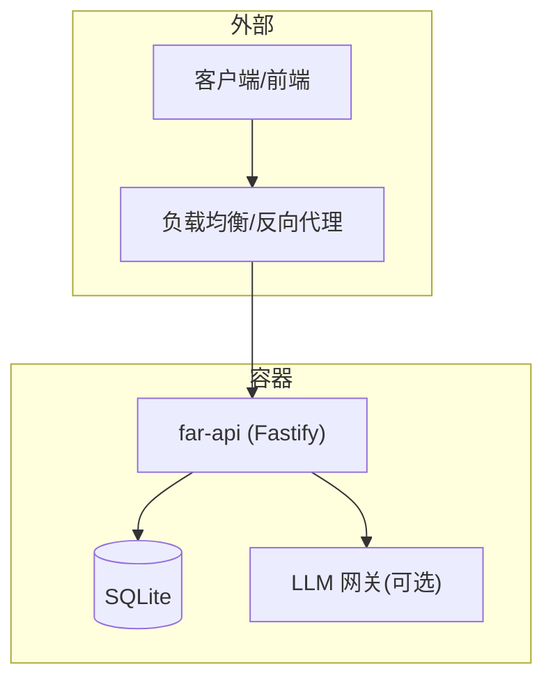
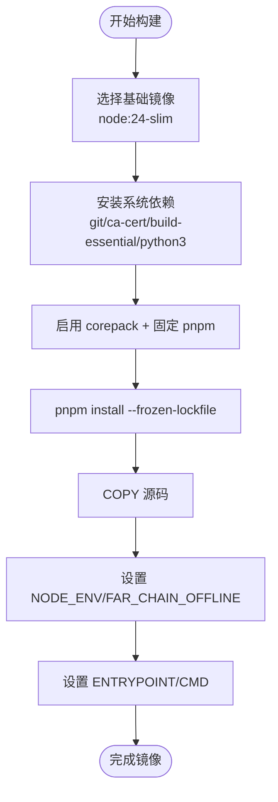
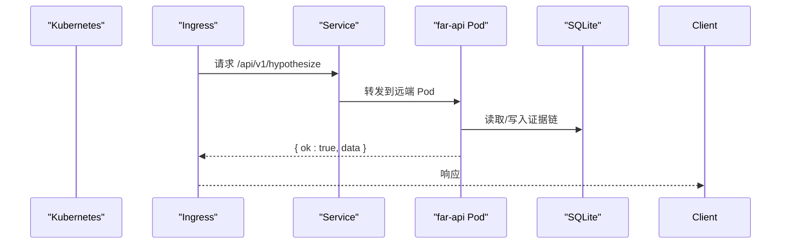
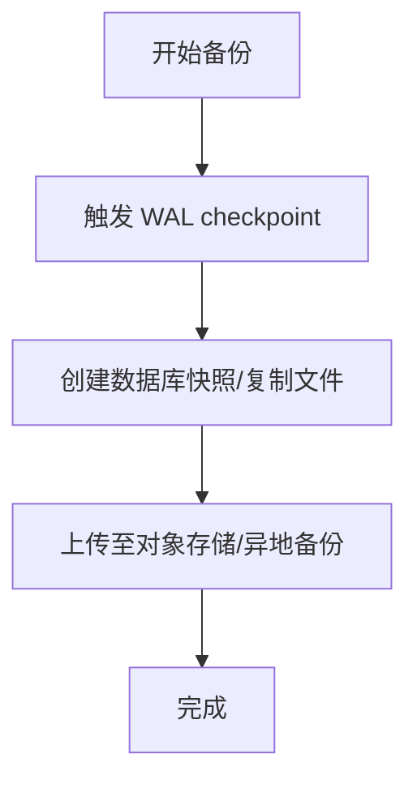
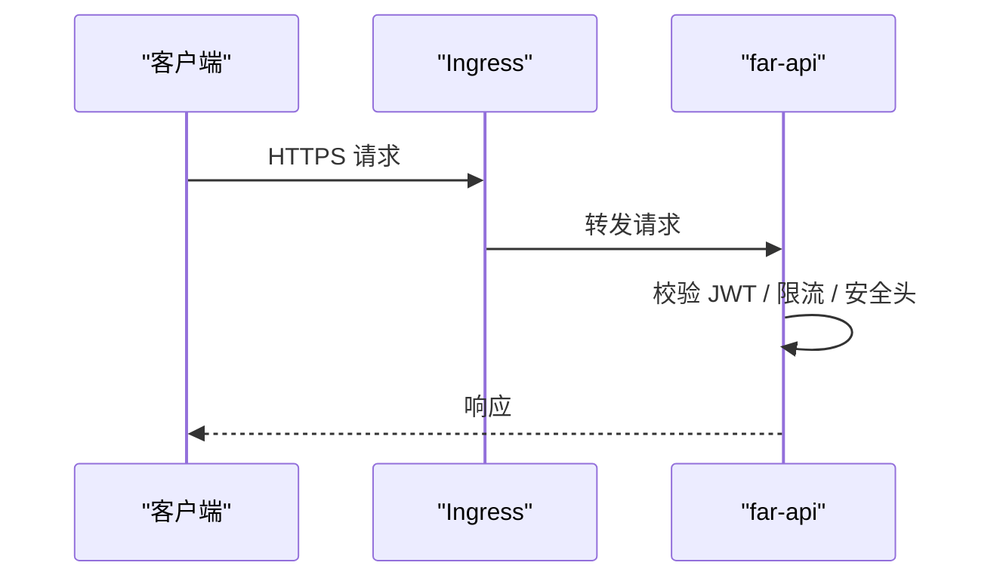
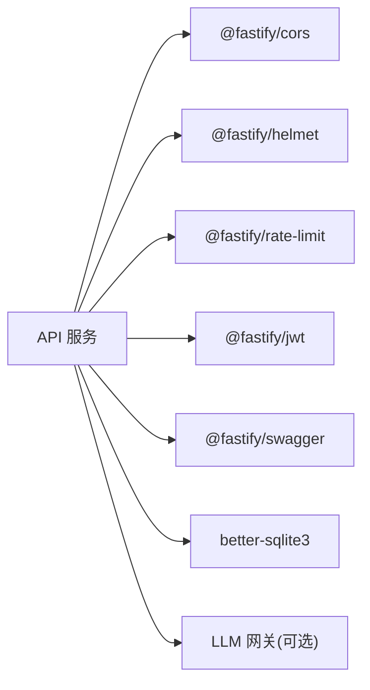

# 部署运维

<cite>
**本文引用的文件**
- [Dockerfile](file://Dockerfile)
- [docker-compose.yml](file://docker-compose.yml)
- [package.json](file://package.json)
- [Makefile](file://Makefile)
- [.github/workflows/ci.yml](file://.github/workflows/ci.yml)
- [src/api/server.ts](file://src/api/server.ts)
- [src/db/index.ts](file://src/db/index.ts)
- [schema/migrations/0001_initial.sql](file://schema/migrations/0001_initial.sql)
- [schema/migrations/README.md](file://schema/migrations/README.md)
- [src/science_harness/sandbox_runner.ts](file://src/science_harness/sandbox_runner.ts)
</cite>

## 目录
1. [简介](#简介)
2. [项目结构](#项目结构)
3. [核心组件](#核心组件)
4. [架构总览](#架构总览)
5. [详细组件分析](#详细组件分析)
6. [依赖分析](#依赖分析)
7. [性能考虑](#性能考虑)
8. [故障排查指南](#故障排查指南)
9. [结论](#结论)
10. [附录](#附录)

## 简介
本指南面向生产环境的部署与运维，覆盖容器化镜像构建、编排与服务发现、环境变量与配置中心集成、日志监控与指标采集、负载均衡与高可用、数据库备份恢复、安全加固与访问控制、故障排查与性能调优、容量规划与资源估算、升级策略与版本管理。内容基于仓库中的 Dockerfile、docker-compose、CI 工作流、API 服务实现与数据库迁移等实际代码进行说明，确保可落地执行。

## 项目结构
- 容器化与编排
  - Dockerfile：定义 Node 基础镜像、依赖安装、源码拷贝、环境变量与默认命令；内置离线优先策略，不预置任何 provider key。
  - docker-compose.yml：提供 far-demo（一次性离线演示）与 far-api（长驻 API 服务，默认端口 3000）两个服务；真实 LLM provider 需通过显式 --env-file 注入密钥。
- 应用入口与脚本
  - package.json：声明 CLI 入口、脚本命令（build/test/api/dev 等）、依赖与引擎要求。
  - Makefile：封装 bootstrap、verify、demo 等常用目标，便于本地与 CI 统一执行。
- 持续集成与质量门禁
  - .github/workflows/ci.yml：12+ 步串行闸门，包含类型检查、lint、测试分片、跨语言一致性、OpenAPI 契约校验、供应链加固、覆盖率、模糊测试、离线发布形态 smoke 等。
- API 服务
  - src/api/server.ts：Fastify 实例构建、插件注册（helmet/cors/rate-limit/jwt/swagger）、路由注册、健康与指标端点、优雅启停。
- 数据层
  - schema/migrations/*：SQLite 迁移脚本集合；src/db/index.ts 暴露迁移运行接口。

**图表来源**
- [Dockerfile:1-57](file://Dockerfile#L1-L57)
- [docker-compose.yml:1-28](file://docker-compose.yml#L1-L28)
- [.github/workflows/ci.yml:1-651](file://.github/workflows/ci.yml#L1-L651)
- [src/api/server.ts:1-291](file://src/api/server.ts#L1-L291)

**章节来源**
- [Dockerfile:1-57](file://Dockerfile#L1-L57)
- [docker-compose.yml:1-28](file://docker-compose.yml#L1-L28)
- [package.json:1-121](file://package.json#L1-L121)
- [Makefile:1-47](file://Makefile#L1-L47)
- [.github/workflows/ci.yml:1-651](file://.github/workflows/ci.yml#L1-L651)

## 核心组件
- 容器镜像与运行基线
  - 基础镜像：Node 24 slim；安装 git、ca-certificates、build-essential、python3 以支持 better-sqlite3 原生模块编译兜底。
  - 包管理器：启用 corepack 并固定 pnpm 版本；依赖层与源码分层构建，利于缓存。
  - 环境变量：NODE_ENV=production；FAR_CHAIN_OFFLINE=1 默认离线优先；严禁在镜像中内置 provider key。
  - 入口与默认命令：CLI 入口为 src/cli/far.ts；默认运行 offline demo。
- Compose 编排
  - far-demo：一次性离线演示任务。
  - far-api：长驻 API 服务，监听 0.0.0.0:3000；可通过 --env-file 注入真实 provider 密钥。
- CI 质量门
  - 类型检查、ESLint、Python 语法检查、TS/Py 测试分片执行、跨语言哈希一致性、OpenAPI 契约稳定、供应链加固、覆盖率、模糊测试、离线发布形态 smoke。
- API 服务
  - Fastify 插件链：helmet → cors → rate-limit → jwt（可选）→ swagger → 鉴权中间件 → 错误处理器 → 路由。
  - 健康与指标：/health、/ready、/metrics（Prometheus 文本格式）。
  - 优雅启停：SIGINT/SIGTERM 关闭服务并 checkpoint WAL。

**章节来源**
- [Dockerfile:15-49](file://Dockerfile#L15-L49)
- [docker-compose.yml:12-28](file://docker-compose.yml#L12-L28)
- [.github/workflows/ci.yml:117-331](file://.github/workflows/ci.yml#L117-L331)
- [src/api/server.ts:102-173](file://src/api/server.ts#L102-L173)
- [src/api/server.ts:265-291](file://src/api/server.ts#L265-L291)

## 架构总览
下图展示生产环境典型部署拓扑：外部流量经反向代理/负载均衡进入 far-api，服务内部使用 SQLite 作为持久化存储，并通过环境变量接入 LLM 网关（可选）。CI 负责构建镜像与质量门禁，Compose 用于本地与轻量编排。

**图表来源**
- [docker-compose.yml:19-28](file://docker-compose.yml#L19-L28)
- [src/api/server.ts:121-173](file://src/api/server.ts#L121-L173)

## 详细组件分析

### 容器化部署与镜像构建
- 构建步骤
  - 安装系统依赖（git、ca-certificates、build-essential、python3），确保 native 模块可回退编译。
  - 启用 corepack 并固定 pnpm 版本，冻结依赖安装。
  - 复制依赖清单与源码，设置生产环境变量与离线模式。
  - 指定 CLI 入口与默认命令。
- 安全与可追溯性
  - 基础镜像建议使用 digest 钉住（当前注释说明了获取与更新方式）。
  - 镜像内不内置任何 provider key，避免凭据泄露面。
- 扩展建议
  - 多阶段构建：将构建期依赖与运行期镜像分离，进一步缩小镜像体积。
  - 非 root 用户运行：提升运行时安全性。
  - 只读根文件系统：减少攻击面。

**图表来源**
- [Dockerfile:15-49](file://Dockerfile#L15-L49)

**章节来源**
- [Dockerfile:1-57](file://Dockerfile#L1-L57)

### Kubernetes 编排与服务发现
- 部署对象
  - Deployment：far-api 副本数按负载设定；使用镜像标签或 digest 锁定版本。
  - Service：ClusterIP 暴露 /api/v1 与 /metrics；Ingress 暴露对外域名与 TLS 终止。
  - ConfigMap/Secret：存放非敏感配置与敏感凭据（如 JWT secret、LLM provider key）。
  - HorizontalPodAutoscaler：基于 CPU/内存或自定义指标（/metrics）自动扩缩容。
- 服务发现与健康检查
  - livenessProbe：GET /health。
  - readinessProbe：GET /ready。
  - startupProbe：给慢启动场景缓冲时间。
- 网络与安全
  - NetworkPolicy：仅允许 Ingress Controller 与必要 Pod 访问 far-api。
  - PodSecurity：限制特权容器、只读根文件系统、最小权限。

**图表来源**
- [src/api/server.ts:171-173](file://src/api/server.ts#L171-L173)

**章节来源**
- [docker-compose.yml:19-28](file://docker-compose.yml#L19-L28)
- [src/api/server.ts:121-173](file://src/api/server.ts#L121-L173)

### 环境变量管理与配置中心集成
- 环境变量策略
  - 默认离线优先：FAR_CHAIN_OFFLINE=1。
  - 生产密钥通过 Secret/ConfigMap 注入，严禁硬编码或镜像内置。
  - LLM provider 密钥通过 --env-file 或 K8s Secret 注入，compose 明确拒绝默认读取宿主 .env。
- 配置中心集成建议
  - 使用 K8s Secret/ConfigMap 或外部配置中心（如 Vault、Consul、Nacos）动态下发配置。
  - 对敏感字段加密存储，运行时解密后注入进程环境变量。
  - 变更审计与灰度：结合滚动更新与蓝绿/金丝雀发布。

**章节来源**
- [docker-compose.yml:1-10](file://docker-compose.yml#L1-L10)
- [Dockerfile:42-49](file://Dockerfile#L42-L49)

### 日志收集、监控告警与性能指标采集
- 日志
  - Fastify 默认开启 logger；输出结构化 JSON 日志至 stdout/stderr，由容器运行时收集。
  - 建议接入集中式日志系统（如 Loki/ELK），按服务名与实例 ID 标注。
- 指标
  - /metrics 暴露 Prometheus 文本格式指标；配合 Prometheus 抓取与 Grafana 可视化。
  - 关键指标：请求速率、错误率、延迟分布、WAL 状态、数据库连接池（如有）。
- 告警
  - 基于指标阈值与错误率设置告警规则（如 5xx 比例、P95 延迟、WAL 堆积）。
  - 结合事件总线（SSE）与审计日志，实现关键操作追踪。

**章节来源**
- [src/api/server.ts:121-173](file://src/api/server.ts#L121-L173)

### 负载均衡与高可用配置
- 负载均衡
  - Ingress 层：多后端 Pod 自动轮询；支持会话亲和（如需）。
  - 限流：rate-limit 插件默认 100 req/min，可按业务调整。
- 高可用
  - 多副本部署 + 健康探针；失败自动重启与替换。
  - 数据库：SQLite 适合单机或小规模；生产建议迁移至主从/集群型数据库并引入 WAL 与定期快照。
  - 优雅启停：SIGINT/SIGTERM 触发 close() 并 checkpoint WAL，保证数据一致性。

**章节来源**
- [src/api/server.ts:137-140](file://src/api/server.ts#L137-L140)
- [src/api/server.ts:279-287](file://src/api/server.ts#L279-L287)

### 数据库备份与恢复流程
- 备份
  - 定期快照：基于文件系统快照或 cp 到对象存储；确保 WAL 已 checkpoint。
  - 增量：结合 WAL 文件与时间点归档。
- 恢复
  - 冷恢复：停止服务 → 替换数据库文件 → 启动服务。
  - 热恢复：在线切换（需双写或同步机制，生产建议停机窗口）。
- 迁移
  - 使用迁移工具顺序执行 SQL 脚本；幂等 up 与 gap 检测已在 CI 验证。

**图表来源**
- [src/api/server.ts:279-287](file://src/api/server.ts#L279-L287)
- [schema/migrations/README.md](file://schema/migrations/README.md)

**章节来源**
- [src/db/index.ts:1-12](file://src/db/index.ts#L1-L12)
- [schema/migrations/0001_initial.sql](file://schema/migrations/0001_initial.sql)
- [schema/migrations/README.md](file://schema/migrations/README.md)

### 安全加固与访问控制配置
- 传输安全
  - HTTPS 终止于 Ingress；启用 HSTS、TLS 1.2+。
- 应用安全
  - helmet 启用安全头；cors 白名单限制；rate-limit 防刷。
  - JWT 鉴权：生产必须启用并严格校验；offline 模式默认匿名。
- 运行时安全
  - 非 root 用户运行；只读根文件系统；最小权限网络策略。
  - Python 子进程环境白名单与密钥剥离，防止敏感信息泄露。

**图表来源**
- [src/api/server.ts:132-146](file://src/api/server.ts#L132-L146)
- [src/science_harness/sandbox_runner.ts:197-274](file://src/science_harness/sandbox_runner.ts#L197-L274)

**章节来源**
- [src/api/server.ts:132-146](file://src/api/server.ts#L132-L146)
- [src/science_harness/sandbox_runner.ts:197-274](file://src/science_harness/sandbox_runner.ts#L197-L274)

### 故障排查与性能调优指南
- 常见问题
  - 依赖安装失败：检查网络与镜像 digest；必要时启用 node-gyp 重建。
  - 端口冲突：修改 compose 映射端口或 K8s Service 端口。
  - 鉴权失败：确认 JWT secret 注入与客户端 token 正确。
  - LLM 不可用：检查 provider key 与环境变量；服务 fail-closed 但确定性端点仍可用。
- 性能调优
  - 调整 requestTimeout/connectionTimeout；优化 rate-limit 阈值。
  - 指标观测：关注 /metrics 的延迟与错误率；结合 Prometheus 告警。
  - 数据库：WAL 模式与定期 checkpoint；避免长时间事务。
- 诊断命令
  - 本地：docker run --rm far-lab:dev doctor；查看环境自诊结果。
  - 服务：curl http://localhost:3000/health 与 /ready。

**章节来源**
- [Dockerfile:6-9](file://Dockerfile#L6-L9)
- [src/api/server.ts:121-130](file://src/api/server.ts#L121-L130)
- [src/api/server.ts:265-291](file://src/api/server.ts#L265-L291)

### 容量规划与资源估算方法
- 计算维度
  - QPS 与峰值：基于历史流量与活动时段估算。
  - 资源需求：CPU/内存根据压测结果确定；结合 P95/P99 延迟目标。
  - 存储：证据链增长速率与保留策略决定磁盘容量。
- 扩缩容策略
  - HPA：基于 CPU/内存或自定义指标（/metrics）自动扩缩容。
  - 预留容量：应对突发流量与故障转移。
- 成本优化
  - 按需扩缩容；冷热数据分层存储；缓存热点查询。

**章节来源**
- [src/api/server.ts:121-130](file://src/api/server.ts#L121-L130)

### 升级策略与版本管理流程
- 版本管理
  - 镜像标签：语义化版本 + 构建哈希；生产使用 digest 锁定。
  - 依赖锁定：pnpm lockfile 与 pyproject 依赖锁定。
- 升级策略
  - 滚动更新：逐步替换 Pod，保持服务可用。
  - 蓝绿/金丝雀：先小流量验证，再全量发布。
  - 回滚：快速回退到上一稳定版本镜像。
- 发布前检查
  - CI 全量门禁通过后发布；离线发布形态 smoke 必须通过。

**章节来源**
- [.github/workflows/ci.yml:516-553](file://.github/workflows/ci.yml#L516-L553)
- [Dockerfile:15-24](file://Dockerfile#L15-L24)

## 依赖分析
- 直接依赖
  - Fastify 生态：@fastify/cors、@fastify/helmet、@fastify/jwt、@fastify/rate-limit、@fastify/swagger。
  - 数据存储：better-sqlite3。
  - 其他：openai（适配器）、zod（校验）、typescript。
- 间接依赖
  - Node 运行时与系统库（build-essential、python3）用于原生模块编译。
- 耦合关系
  - API 服务强依赖 Fastify 插件链；数据库通过迁移脚本管理；LLM 网关通过环境变量注入，解耦具体 provider。

**图表来源**
- [package.json:84-98](file://package.json#L84-L98)
- [src/api/server.ts:16-21](file://src/api/server.ts#L16-L21)

**章节来源**
- [package.json:84-98](file://package.json#L84-L98)
- [src/api/server.ts:16-21](file://src/api/server.ts#L16-L21)

## 性能考虑
- 请求超时与连接回收：合理设置 requestTimeout 与 connectionTimeout，避免长连接占用。
- 限流与降级：rate-limit 保护后端；LLM 不可用时走确定性端点。
- 数据库：WAL 模式与定期 checkpoint；避免大事务与锁竞争。
- 指标驱动：基于 /metrics 观察瓶颈并调优。

**章节来源**
- [src/api/server.ts:121-130](file://src/api/server.ts#L121-L130)
- [src/api/server.ts:137-140](file://src/api/server.ts#L137-L140)

## 故障排查指南
- 启动失败
  - 检查端口占用与权限；查看容器日志与 /health 端点。
- 鉴权问题
  - 确认 JWT secret 注入；客户端 token 有效且未过期。
- LLM 调用失败
  - 检查 provider key 与环境变量；服务 fail-closed 不影响确定性端点。
- 数据库异常
  - 检查 WAL 状态与迁移是否成功；必要时执行恢复流程。

**章节来源**
- [src/api/server.ts:265-291](file://src/api/server.ts#L265-L291)
- [Dockerfile:6-9](file://Dockerfile#L6-L9)

## 结论
本指南基于仓库实际实现，提供了从容器化构建、编排部署、配置管理、监控告警、安全加固到数据库备份恢复与升级策略的完整生产运维方案。通过 CI 质量门禁与指标驱动调优，确保系统在稳定性、安全性与可维护性方面达到生产级要求。

## 附录
- 常用命令
  - 本地开发：make bootstrap、make verify、make demo。
  - 容器运行：docker build -t far-lab:dev .；docker compose up far-api。
  - 健康检查：curl http://localhost:3000/health；curl http://localhost:3000/ready。
- 参考文件
  - 构建与编排：Dockerfile、docker-compose.yml。
  - 服务实现：src/api/server.ts。
  - 数据库迁移：schema/migrations/*。
  - CI 工作流：.github/workflows/ci.yml。

**章节来源**
- [Makefile:14-27](file://Makefile#L14-L27)
- [docker-compose.yml:12-28](file://docker-compose.yml#L12-L28)
- [src/api/server.ts:171-173](file://src/api/server.ts#L171-L173)
- [schema/migrations/README.md](file://schema/migrations/README.md)