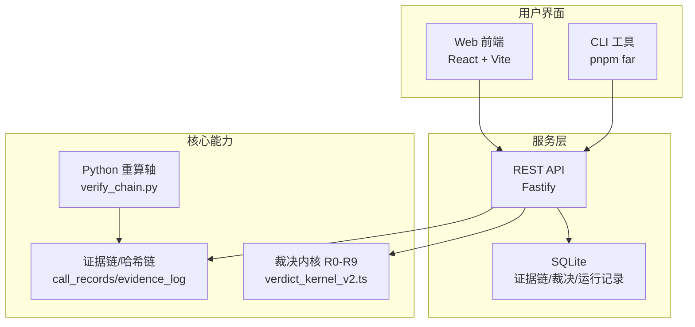
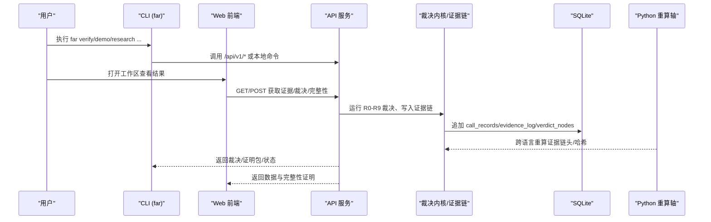
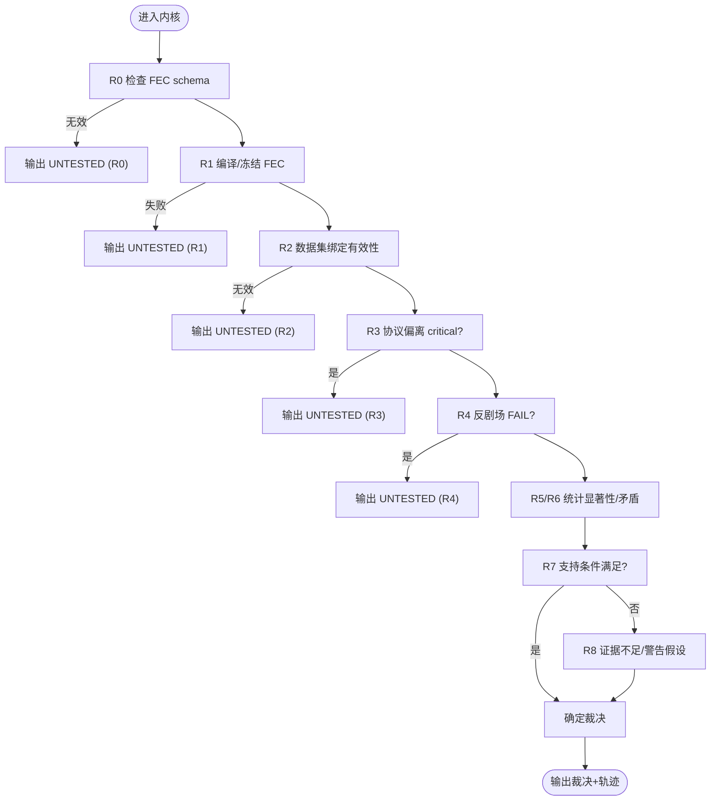
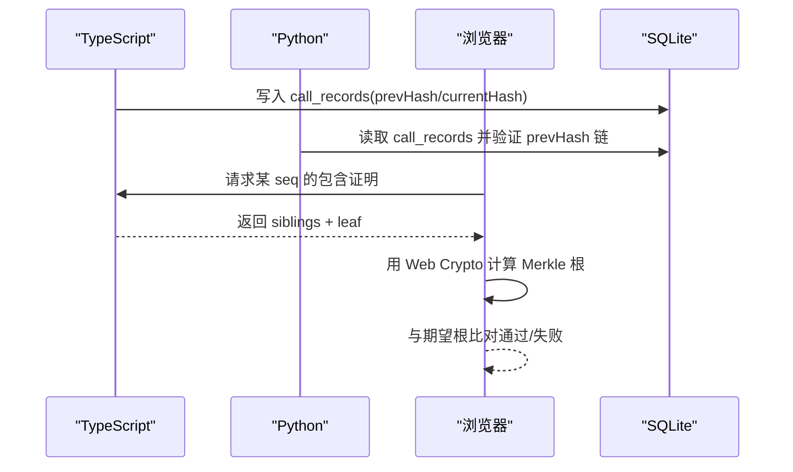
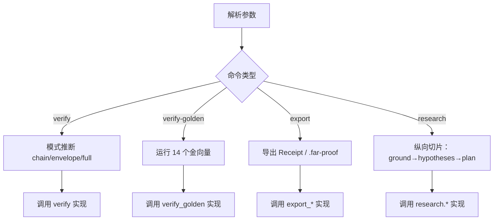
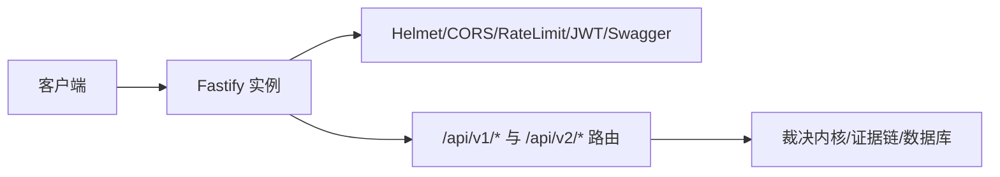
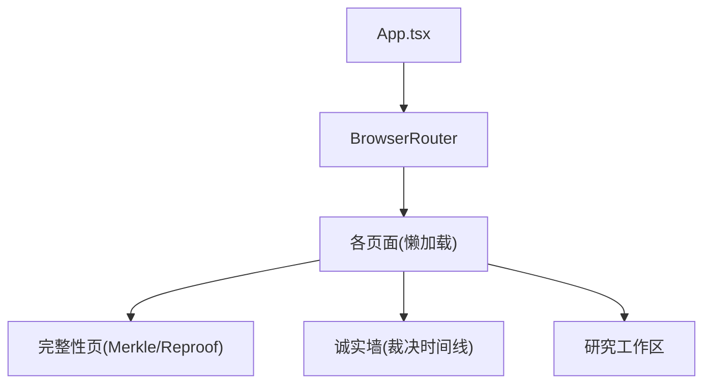
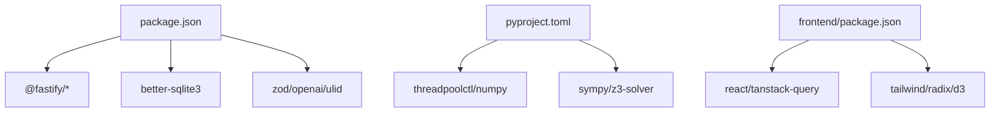

# 项目概览

<cite>
**本文引用的文件**
- [README.md](file://README.md)
- [package.json](file://package.json)
- [pyproject.toml](file://pyproject.toml)
- [src/cli/far.ts](file://src/cli/far.ts)
- [src/api/server.ts](file://src/api/server.ts)
- [frontend/src/App.tsx](file://frontend/src/App.tsx)
- [frontend/package.json](file://frontend/package.json)
- [src/falsifiability/verdict_kernel_v2.ts](file://src/falsifiability/verdict_kernel_v2.ts)
- [repro/far_chain_repro/verify_chain.py](file://repro/far_chain_repro/verify_chain.py)
- [schema/migrations/0001_initial.sql](file://schema/migrations/0001_initial.sql)
- [frontend/src/lib/integrity-golden.ts](file://frontend/src/lib/integrity-golden.ts)
</cite>

## 目录
1. [简介](#简介)
2. [项目结构](#项目结构)
3. [核心组件](#核心组件)
4. [架构总览](#架构总览)
5. [详细组件分析](#详细组件分析)
6. [依赖关系分析](#依赖关系分析)
7. [性能考量](#性能考量)
8. [故障排查指南](#故障排查指南)
9. [结论](#结论)
10. [附录：入门路径与使用场景](#附录：入门路径与使用场景)

## 简介
FAR-Lab 是一个面向 AI for Science（AI4S）的“科学声明验证层”。它把“可证伪、防篡改、独立重算”作为工程化目标，通过确定性裁决内核（R0–R9）对研究断言进行五值裁决（CONFIRMED / REFUTED / INCONCLUSIVE / DEGRADED_SCOPE / UNTESTED），并以内容寻址的证据链与密封证明包（ProofEnvelope / .far-proof）支撑第三方独立复算与审计。

核心价值主张
- 可证伪：每个被接受的断言必须携带可执行的证伪契约（度量 + 阈值 + 比较器），否则在门控处拒绝。
- 防篡改：追加式哈希链 + Merkle 根，跨语言（TypeScript / Python / 浏览器）字节级一致；任何篡改均可被发现。
- 独立重算：导出 .far-proof 后，任何人可在本地重算证据链、裁决轨迹与关键哈希，失败时给出结构化差异。

独特定位
- 不是“全自动科学家”，而是“LLM 提出假设，确定性内核做裁决”的可审计系统。
- 与实验追踪、溯源标准互补：FAR-Lab 提供断言级别的证伪裁决与反剧场检测，并兼容导出 RO-Crate/W3C PROV-O。

**章节来源**
- [README.md:1-130](file://README.md#L1-L130)

## 项目结构
仓库采用多语言、分层组织：
- CLI 工具（Node/TypeScript）：统一入口 far，覆盖 demo、research、verify、export、fec、campaign 等命令族。
- REST API 服务（Fastify）：健康检查、研究纵向切片、证据/裁决/报告、完整性校验、基准、法庭/竞技场等端点。
- Web 前端（React/Vite/Tailwind）：可视化工作区、完整性信任根、诚实墙、事件流、V2 收据等页面。
- 数据库与迁移（SQLite + SQL migrations）：call_records、evidence_log、verdict_nodes、repro_runs 等表，强制追加只写与约束。
- 可重复性轴（Python）：跨语言哈希链验证、数学后端（SymPy/Z3）、真实论文重算脚本。
- 金向量与测试：golden_vectors、全量回归测试、跨语言一致性用例。

**图表来源**
- [src/api/server.ts:112-255](file://src/api/server.ts#L112-L255)
- [src/cli/far.ts:33-380](file://src/cli/far.ts#L33-L380)
- [schema/migrations/0001_initial.sql:10-245](file://schema/migrations/0001_initial.sql#L10-L245)
- [repro/far_chain_repro/verify_chain.py:117-159](file://repro/far_chain_repro/verify_chain.py#L117-L159)

**章节来源**
- [package.json:28-79](file://package.json#L28-L79)
- [frontend/package.json:1-57](file://frontend/package.json#L1-L57)
- [README.md:37-113](file://README.md#L37-L113)

## 核心组件
- 确定性裁决内核（R0–R9）：纯函数、固定优先级、首条决定性规则胜出；输出五值裁决与完整规则轨迹，支持证据充分性与矛盾证据集合判定。
- 证据链与完整性：call_records 与 evidence_log 构成追加式哈希链；Merkle 根作为整链指纹；浏览器/Node/Python 三方哈希一致。
- 可重复性轴（Python）：独立重算证据链头、canonical_hash、prevHash 链，跨语言比对。
- 数据持久化与约束：SQLite 迁移定义不可变字段、终端裁决保护、DEGRADED_SCOPE/UNTESTED 必填原因、CONFIRMED 需存在证据负载。
- 可验证制品：ProofEnvelope/.far-proof 打包断言图、脱敏链与 proofHash，供第三方独立验证。

**章节来源**
- [src/falsifiability/verdict_kernel_v2.ts:212-286](file://src/falsifiability/verdict_kernel_v2.ts#L212-L286)
- [repro/far_chain_repro/verify_chain.py:117-159](file://repro/far_chain_repro/verify_chain.py#L117-L159)
- [schema/migrations/0001_initial.sql:97-245](file://schema/migrations/0001_initial.sql#L97-L245)
- [frontend/src/lib/integrity-golden.ts:1-20](file://frontend/src/lib/integrity-golden.ts#L1-L20)

## 架构总览
系统由三层协作组成：
- 交互层：CLI（far）与 Web 前端（React）提供研究与验证入口。
- 服务层：Fastify API 聚合路由、鉴权、限流、OpenAPI 文档、事件流（可选 SSE）。
- 核心层：裁决内核、证据链、数学/统计后端、反剧场检测、FEC 编排、可重复性重算。

**图表来源**
- [src/cli/far.ts:33-380](file://src/cli/far.ts#L33-L380)
- [src/api/server.ts:112-255](file://src/api/server.ts#L112-L255)
- [schema/migrations/0001_initial.sql:10-245](file://schema/migrations/0001_initial.sql#L10-L245)
- [repro/far_chain_repro/verify_chain.py:117-159](file://repro/far_chain_repro/verify_chain.py#L117-L159)

## 详细组件分析

### 确定性裁决内核（R0–R9）
- 输入：FEC 契约、数据集绑定、统计结果、协议偏离、反剧场发现、证据充分性、矛盾证据、完整性标志等。
- 决策：严格遵循 R0–R9 优先级（DEGRADED_SCOPE > REFUTED > INCONCLUSIVE > CONFIRMED > UNTESTED），首条决定性规则胜出；浮点容差统一为 1e-7。
- 输出：五值裁决、原因码、规则轨迹、范围/统计/证据充分性报告、是否有界支持、证据质量层级与决策轨迹（透明层）。

**图表来源**
- [src/falsifiability/verdict_kernel_v2.ts:337-363](file://src/falsifiability/verdict_kernel_v2.ts#L337-L363)

**章节来源**
- [src/falsifiability/verdict_kernel_v2.ts:212-286](file://src/falsifiability/verdict_kernel_v2.ts#L212-L286)

### 证据链与完整性（哈希链 + Merkle）
- 追加式哈希链：每条 call_record 包含 prevHash/currentHash，从创世哈希开始链接；Python 与 TypeScript 实现等价验证。
- Merkle 根：将整条证据链折叠为单一 64-hex 根，便于外部审计快速验证链完整性。
- 跨语言一致性：前端内置 golden vectors，浏览器 Web Crypto 独立重算并与 Node/Python 锚点对比。

**图表来源**
- [repro/far_chain_repro/verify_chain.py:117-159](file://repro/far_chain_repro/verify_chain.py#L117-L159)
- [frontend/src/lib/integrity-golden.ts:1-20](file://frontend/src/lib/integrity-golden.ts#L1-L20)

**章节来源**
- [schema/migrations/0001_initial.sql:10-95](file://schema/migrations/0001_initial.sql#L10-L95)

### CLI 工具（far）
- 命令注册表驱动：所有子命令 lazy import，减少冷启动开销。
- 常用命令：demo、verify、verify-golden、export far-proof、research、fec、campaign、schedule、backup 等。
- 退出码语义：0=全部通过；1=部分重算（环境受限）；7=检测到篡改。

**图表来源**
- [src/cli/far.ts:33-380](file://src/cli/far.ts#L33-L380)
- [src/cli/far.ts:485-519](file://src/cli/far.ts#L485-L519)
- [src/cli/far.ts:555-592](file://src/cli/far.ts#L555-L592)

**章节来源**
- [src/cli/far.ts:33-380](file://src/cli/far.ts#L33-L380)

### REST API 服务（Fastify）
- 插件栈：helmet、cors、rate-limit、jwt（可选）、swagger。
- 路由分组：/health、/metrics、/api/v1/*（hypothesize/evidence/verdict/report/integrity/benchmark/court/arena/research/lifecycle/planning/events）、/api/v2/*（v2 receipts）。
- 成功信封：preSerialization 钩子统一包装 { ok: true, data }，错误走 RFC 7807。

**图表来源**
- [src/api/server.ts:112-255](file://src/api/server.ts#L112-L255)

**章节来源**
- [src/api/server.ts:1-291](file://src/api/server.ts#L1-L291)

### Web 前端应用（React/Vite）
- 路由与代码分割：研究工作台默认入口，其他页面按需加载（d3 等大库隔离）。
- 功能页：Overview、Integrity（Merkle 根与实时复证）、HonestyWall（五值裁决时间线）、Court/Arena、Planning、Events、AuditTrace、V2Receipt 等。
- 国际化与主题：I18nProvider、ThemeProvider 包裹全局。

**图表来源**
- [frontend/src/App.tsx:1-110](file://frontend/src/App.tsx#L1-L110)

**章节来源**
- [frontend/src/App.tsx:1-110](file://frontend/src/App.tsx#L1-L110)

## 依赖关系分析
- 运行时依赖（Node）：Fastify 生态（cors/helmet/jwt/rate-limit/swagger）、better-sqlite3、zod、openai、ulid、fast-json-stable-stringify。
- 运行时依赖（Python）：threadpoolctl、numpy、sympy、z3-solver；可选 science 依赖（lightkurve、astroquery）。
- 前端依赖：React、TanStack Query、Tailwind、Radix UI、d3、Zod。

**图表来源**
- [package.json:84-98](file://package.json#L84-L98)
- [pyproject.toml:10-23](file://pyproject.toml#L10-L23)
- [frontend/package.json:17-55](file://frontend/package.json#L17-L55)

**章节来源**
- [package.json:84-98](file://package.json#L84-L98)
- [pyproject.toml:10-23](file://pyproject.toml#L10-L23)
- [frontend/package.json:17-55](file://frontend/package.json#L17-L55)

## 性能考量
- 单节点 SQLite：适合 O(10²) 行/秒追加与 O(10⁴) 行/秒索引查询；高并发多写建议迁移至 PostgreSQL。
- 请求超时与空闲回收：API 设置请求超时与连接超时，防止慢调用挂起。
- 前端分包：大依赖（如 d3）按路由拆分，降低首屏体积。
- 确定性 BLAS 线程：Python 轴通过 threadpoolctl 限制 nthread=1，确保数值可重复。

[本节为通用指导，不直接分析具体文件]

## 故障排查指南
- 篡改检测：修改 .far-proof 中的证据文件会导致 exit 7；verify 会报告 tamperStatus=tampered。
- 部分重算：当本机缺少 Python/WebCrypto 等轴时，可能返回 WARN（非失败），提示更多独立重算轴未运行。
- 数据库约束：直接 INSERT 违反触发器（如 llm_generated 缺 system_claim_hash）会被拒绝；终端裁决不可回滚。
- LLM 依赖：未配置 key 时，LLM 相关端点 fail-closed（503 + 指引），确定性端点仍可用。

**章节来源**
- [README.md:98-110](file://README.md#L98-L110)
- [schema/migrations/0001_initial.sql:128-185](file://schema/migrations/0001_initial.sql#L128-L185)
- [tests/schema/evidence_provenance_trigger.test.ts:60-118](file://tests/schema/evidence_provenance_trigger.test.ts#L60-L118)

## 结论
FAR-Lab 以“可证伪、防篡改、独立重算”为核心，构建了从假设生成到断言裁决再到可审计制品的全链路闭环。其差异化优势在于：
- 断言级证伪门控与五值裁决内核，避免“自说自话”的自动化科研叙事。
- 跨语言一致的哈希链与 Merkle 根，使第三方能在不同环境中独立复算与审计。
- 反剧场检测套件与证据链约束，有效识别 p-hacking、选择偏差与“表演式通过”。

对于研究者与平台方，FAR-Lab 提供了方法论层面的可信基座：让“谁提出了什么、依据什么、如何被推翻”变得可追踪、可复现、可证伪。

[本节为总结性内容，不直接分析具体文件]

## 附录：入门路径与使用场景
- 零门槛离线演示：运行远端一键 demo，体验 14 个金向量与端到端 TESS 断言，无需 API key。
- 快速上手 CLI：
  - 安装与自检：pnpm install → pnpm far doctor
  - 离线演示：pnpm far demo
  - 金向量验证：pnpm far verify-golden --all
  - 导出证明包：pnpm far export far-proof --demo-chain --force
  - 验证篡改：复制 .far-proof 并修改证据后运行 pnpm far verify <bundle>
- 在线研究流程：
  - 文献 grounding → 候选假设生成 → 批判与评分 → 研究计划 → 数据分析 → 评估与导出
  - 通过 Web 工作区或 REST API（/api/v1/research）异步运行与 SSE 事件流观察
- 适用场景：
  - 需要可审计、可复算的科学断言（天体物理、生物医学、材料科学等）
  - 团队内建立“证据-裁决-修订”的标准化流程
  - 第三方审计与监管合规要求的高可信研究产出

**章节来源**
- [README.md:37-113](file://README.md#L37-L113)
- [README.md:145-206](file://README.md#L145-L206)
- [src/cli/far.ts:77-95](file://src/cli/far.ts#L77-L95)
- [src/api/server.ts:196-244](file://src/api/server.ts#L196-L244)