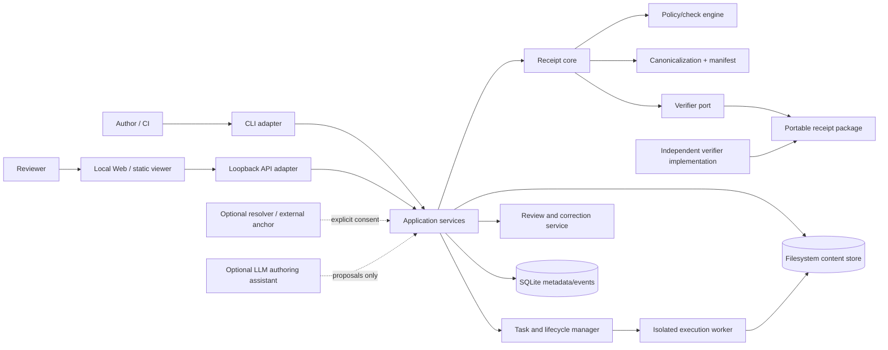

# FAR-Lab target architecture and agent-runtime boundary

| Field | Value |
|---|---|
| Status | `TARGET_CONTRACT; NOT_IMPLEMENTED` |
| Owner | Architecture owner; trust-kernel, platform and security co-owners required |
| Evidence level | A current constraints; D target design |
| Last verified | 2026-08-05 |
| Authority | System/component boundaries, runtime states and dependency direction; data protocol details live in `07_DATA_EVIDENCE_SCIENCE.md` |

## 1. Architecture decision

Build a **local-first modular monolith with a small isolated execution worker**, not microservices and not an agent platform. The portable receipt specification and independent verifier are the product trust root. Web, CLI and API are replaceable adapters. LLM/agent assistance is optional upstream authoring help and is outside the receipt’s trusted decision path.

This choice preserves current TypeScript/SQLite strengths, avoids introducing queues/databases/services before demand, makes offline verification possible, and gives one team a governable ownership boundary. Institutional multi-user deployment is an evolutionary profile, not a hidden assumption in the local design.

## 2. Context and component view



Trust direction is inward toward immutable receipt inputs and published policy. Neither UI state, LLM text, projected telemetry nor author-controlled package hashes are independent authority.

## 3. Architectural layers and dependency rules

| Layer/component | Responsibility | May depend on | Must not do |
|---|---|---|---|
| Surface adapters | CLI/Web/API parsing, presentation, transport, auth context | Application contracts, generated types | Decide policy, canonicalize privately, query DB directly |
| Application services | Use-case orchestration, transaction boundary, idempotency, authorization | Domain core and ports | Embed UI/provider details; use global “latest” state |
| Receipt domain core | Claims, materials, policies, checks, verification, lifecycle invariants | Pure value types and deterministic algorithms | Network, filesystem, clock, random IDs without injected ports |
| Policy/check engine | Compile versioned policy and emit typed check outcomes | Receipt/evidence types | Emit misconduct/truth decisions; trust caller summaries |
| Canonicalization/manifest | Canonical bytes, component digests, profiles, compatibility | Published algorithms | Silently accept unknown/downgraded profile |
| Task/lifecycle | Durable tasks, attempts, cancellation, retry, supersession, review events | Domain state machines, repositories | Simulate progress; overwrite immutable history |
| Ports | Metadata, content store, clock/ID, resolver, anchor, signer, execution | Stable domain contracts | Leak vendor DTOs into core |
| Adapters | SQLite/CAS, process runner, provider/resolver, optional anchor | Ports and external libraries | Elevate adapter availability into scientific validity |
| Independent verifier | Verify package using published specification/test vectors | Package bytes; optional explicit anchors | Require author DB, hidden service or producer codebase |
| Observability | Metrics/traces/logs and redacted diagnostics | Events/references | Become evidence ledger or store raw sensitive content by default |

Enforcement target: import/dependency tests, application-service contract tests and “no adapter/private provider type in domain” static gates. One domain core powers all surfaces.

## 4. Deployment profiles

### 4.1 Profile L — local single user (initial)

- CLI plus optional loopback API/Web; bind only loopback.
- One local workspace, SQLite metadata/event DB and filesystem content-addressed store.
- No identity guarantee, tenancy, shared authorization or background daemon by default.
- Execution accepts only trusted user code until the isolated-worker gate passes.
- Network off by default; each resolver/anchor call receives explicit host/data consent.
- Backup/export is user-initiated and verified; no cloud dependency.

### 4.2 Profile O — offline verifier (initial)

- Standalone verifier and static accessible viewer.
- Read-only package access; no arbitrary code execution, DNS or outbound traffic by default.
- Optional external anchor supplied as a file/explicit argument; verification report records absence.
- Can be distributed and versioned independently of authoring application.

### 4.3 Profile I — institution private (blocked)

May exist only after authorization, tenant isolation, privacy, queue/recovery, SLO, backup/restore, incident and support gates. It remains a modular monolith plus workers until measured load or independent failure domains justify service extraction. Organization, membership, legal-hold and object-storage capabilities are additive—not simulated in Profile L.

### 4.4 Profile H — multi-tenant hosted (not approved)

No implementation or promise. A future ADR must demonstrate user demand, legal/controller roles, regional/data isolation, per-tenant encryption, cost model, abuse controls and exit. Failure to pass retains Profiles L/O.

## 5. Trust zones and boundary controls

| Zone | Trust assumption | Allowed flow | Required control | Fail-safe behavior |
|---|---|---|---|---|
| Z0 untrusted package/material | Attacker-controlled bytes, paths, metadata and active content | Into preflight/quarantine only | Size/shape/path/archive/parser limits; safe renderer; hash before parse where possible | Reject or verify safe subset with explicit gap |
| Z1 local application | User-controlled host; trusted for operation, not independent authenticity | Metadata/CAS/task operations | Loopback, file permissions, input validation, append events | Read-only safe mode on corruption |
| Z2 receipt core | Trusted implementation under versioned release | Pure data/value calls | Deterministic test vectors, code review, no hidden I/O | Refuse unknown algorithm/policy |
| Z3 execution worker | Executes bounded scientific/tool code | Explicit inputs → hashed outputs | Separate process/container/OS sandbox, read-only base, no network, resource limits, secret-free env | Kill group, quarantine partial, no “network blocked” claim without measured enforcement |
| Z4 external resolver/provider | Mutable, rate-limited, possibly data-retaining third party | Minimum explicit request | Host allowlist, consent, timeout, version/content capture, license/terms | Offline/unknown; never hidden fallback |
| Z5 anchor/signer | External trust service/key authority | Manifest digest/signature/timestamp only | Key identity, algorithm, rotation, revocation, replay and transparency policy | Downgrade is visible; core integrity remains separate |
| Z6 institution clients | Distinct users/tenants/devices | Protected API/events | Authn, object authz, tenant keys, rate/audit | Default deny and non-disclosing errors |

Current Python “sandbox” belongs to Z1, not Z3: source explicitly states no OS network isolation and only validates resource requests. It cannot be named a security sandbox until enforcement tests pass (`repro/science_harness/sandbox_runner.py:18-21,91-113`; `src/science_harness/sandbox_runner.ts:52-72`).

## 6. Domain/application services

| Service | Commands | Queries | Transaction/invariant owner |
|---|---|---|---|
| Project service | Create/archive/export local project | Project and receipt index | Project scope and storage namespace |
| Draft service | Create/import/update/preflight draft | Draft versions/disclosure | Optimistic concurrency; no seal on invalid preflight |
| Receipt compiler | Compile immutable receipt | Compilation status/result | All components/manifest/policy commit atomically or no receipt |
| Verification service | Verify structure/digests/anchor/policy/recompute | Verification result | Trust dimensions remain separate and immutable |
| Policy service | Register/withdraw/select immutable version | Capability/applicability/explain | Exact version/digest; no latest substitution |
| Task service | Create/cancel/pause/resume/retry attempts | State/events/log references | Legal state transitions, idempotency and checkpoint binding |
| Review service | Add evidence request/statement/response/challenge | Review timeline | Human statement never mutates machine output |
| Lifecycle service | Supersede/withdraw/archive/correct | Current/history | Append event and explicit successor; no silent overwrite |
| Export service | Build/verify/finalize package/viewer | Export inventory | Disclosure profile and mandatory manifest; atomic finalization |
| Diagnostic service | Produce redacted support bundle | Capability/health | Allowlisted fields; no raw content/secrets |

Each command receives explicit project/receipt/task identifiers, expected resource version, actor context, idempotency key and policy/clock dependencies. There is no generic repository access in surfaces.

## 7. Durable state machines

### 7.1 Draft, receipt standing, preservation and distribution

```text
Draft lifecycle: EDITABLE | DISCARDED (terminal)
PreflightResult(draftVersion + canonical ContractBindingSet digest): PREFLIGHT_BLOCKED | PREFLIGHT_READY
Receipt existence: successful atomic compilation → SEALED
Receipt standing: ACTIVE → SUPERSEDED → WITHDRAWN; ACTIVE → WITHDRAWN
Preservation status: AVAILABLE ↔ ARCHIVED; AVAILABLE | ARCHIVED → PAYLOAD_REMOVED
```

Preflight status is not draft lifecycle: editing increments `draftVersion` and makes an older result non-current without deleting it. Compilation/finalization is a task stage; failure is a task/attempt outcome and creates no receipt. `EXPORTED`, `SHARED` and `PUBLISHED` are distribution events, while `CONTESTED` is derived from review state. They are not receipt standing. `ARCHIVED` is preservation status, not standing; a receipt may be withdrawn/superseded and archived simultaneously. A sealed receipt is immutable, while authorized `PAYLOAD_REMOVED` preserves only the permitted tombstone/root/events and an explicit gap. “Current” is a relation from one explicit lineage, never timestamp recency. The full canonical model and legacy aliases are in `19_REFERENCE_VERTICAL_SLICE_AND_CONFORMANCE.md`.

### 7.2 Task/attempt lifecycle

Doc 19 §3.2 is authoritative for exact legal edges. This table is a per-state durability/control projection, not a second transition graph:

| State | Durable on entry | Cancel | Resume/retry | Terminal result |
|---|---|---|---|---|
| QUEUED | Task ID, inputs/policy hashes, owner, budget | Immediate | N/A | No |
| PREPARING | Attempt, resolved capability, `executionContainmentPolicy` and `deploymentProfile` | At safe boundary | Retry attempt | No |
| RUNNING | Stage/check and checkpoint references | Cooperative → CANCEL_REQUESTED | Resume only matching bindings | No |
| PAUSED | Complete checkpoint and reason | Yes | Explicit authorized resume | No |
| CANCEL_REQUESTED | Request actor/time and last safe point | Idempotent | No new work | No |
| SUCCEEDED | Immutable result and output hashes | No | New verification task only | Yes |
| SUCCEEDED_WITH_GAPS | Result plus typed gaps | No | New task with supplied evidence | Yes |
| FAILED_RETRYABLE | Error, preserved outputs and backoff | No | New attempt under same logical task | Yes for attempt |
| FAILED_TERMINAL | Error/diagnostic and preserved/quarantined outputs | No | New task after input/policy change | Yes |
| CANCELED | Cleanup/checkpoint/partial manifest | No | New attempt/task only if policy and user allow; never reopen | Yes |
| EXPIRED | Phase-specific deadline reason and preserved/checkpoint disposition | No | New task/attempt only under policy | Yes |

### 7.3 Review/challenge lifecycle

Doc 19 §3.4 owns the exact review-case edges and outcome constraints. In summary, the states are `DRAFT`, `SUBMITTED`, `RESPONSE_NEEDED`, `RESPONDED`, `RESOLVED`, and `WITHDRAWN`; a resolved case has exactly one of `UPHELD`, `AMENDED`, `REJECTED_WITH_REASON`, or `UNRESOLVED`. Institutional adverse decisions are external records and require a later governance contract and deployment gate.

## 8. Event model: evidence, audit and telemetry are different

Common event envelope:

| Field | Contract |
|---|---|
| `eventId`, `schemaVersion`, `eventType` | Globally unique ID; immutable type/version |
| `streamId`, `sequence`, `previousEventHash` | Per-stream order and optional integrity link |
| `occurredAt`, `recordedAt` | UTC; clock source and skew handling documented |
| `actor` | Human/service/agent/tool identity class and scoped ID |
| `subject` | Project/receipt/task/review ID and version |
| `correlationId`, `causationId`, `idempotencyKeyHash` | Causal/retry linkage without secret key disclosure |
| `policyVersion`, `releaseVersion`, `environmentRef` | Applicable immutable versions |
| `payload`, `payloadDigest`, `classification` | Schema-validated, minimized data/reference |
| `redactions`, `retentionClass` | What was withheld and lifecycle rule |

Event categories:

- **Evidence events** bind an assertion/observation/derivation to source bytes, method and output; they can enter a receipt.
- **Audit events** prove accountability for access, policy, permission, lifecycle and publication; they are never sampled.
- **Task events** drive user-visible progress and recovery; at-least-once delivery is tolerated.
- **Telemetry** measures health/performance and may be sampled; it references IDs pseudonymously and cannot serve as audit or evidence.

Corrections append new events. Telemetry outage does not stop local verification; audit/evidence persistence failure blocks consequential state changes.

## 9. Optional agent boundary

### 9.1 Product decision

The current six-stage LLM loop is not the product core. For Gate 0–1, agent assistance may propose claim wording, candidate source references, draft FEC fields or explanations in a clearly separate `PROPOSED_BY_MODEL` layer. The user must inspect/accept inputs, and deterministic receipt compilation validates actual material bindings. Agent output never becomes observed evidence, policy, review, signature or decision merely through persistence.

If this assistance does not improve observed first-receipt completion without increasing unsafe acceptance, remove it. Core CLI/verifier remains functional with no model/provider.

### 9.2 Agent layers if retained

| Layer | Target role | Current gap / safe default |
|---|---|---|
| Model adapter | Capability/version/retention-aware provider mapping | Offline fixture or explicit provider; no silent model fallback |
| Agent loop | Drafting task state and termination | Current six calls/receipt path is not sufficient completion evidence |
| Policy engine | Data/network/tool/budget/approval decisions | Current initiator guard is not authorization; default deny writes/network |
| Tool runtime | Versioned schema, typed failures, cancel, output reference | No generic shell; only allowlisted receipt-domain tools |
| Workspace runtime | Read-only source + isolated task scratch | Current source runner not OS-isolated; trusted local only |
| Context engine | Source-located bounded context | No entire DB/repository/prompts; untrusted material marked |
| Session store | Events, checkpoints, branches and recovery | Separate from scientific evidence and receipt authority |
| Memory | None persistent initially | Project facts live in explicit versioned project data, not model memory |
| Orchestrator/subagents | Not in initial product | Single assistant; multiagent needs measured task value and isolation |
| Human control | Propose/review/approve/execute/verify/accept | Publication/network/code execution always explicit |
| Evaluation/observability | Task, safety, cost and trust-calibration metrics | Same-model self-score not a gate |

### 9.3 Agent state machine

```text
CREATED → INITIALIZING → READY → PLANNING
PLANNING → WAITING_FOR_MODEL → PROPOSAL_READY
PROPOSAL_READY → WAITING_FOR_USER → READY | COMPLETED | CANCELED
WAITING_FOR_MODEL → WAITING_FOR_TOOL_APPROVAL → RUNNING_TOOL → VERIFYING → READY
any active → PAUSED → READY
any cancellable → CANCEL_REQUESTED → CANCELED
any active → COMPACTING → READY
any active → FAILED | EXPIRED
```

Completion requires application-level acceptance (for example, a valid draft proposal delivered), not the model saying “done.” Receipt compilation/sealing and any later distribution are separate human-started actions.

### 9.4 Agent turn/event contract

Record session/branch/turn/task; objective and acceptance; input-context references and classifications; prompt/policy/model/provider/parameter versions; structured proposal; tool candidates and permission decisions; arguments digest/result reference/status; token/cache/latency/cost; state transition; stop/retry reason; redactions. Never persist private chain-of-thought; retain a concise user-auditable rationale and evidence references.

### 9.5 Permission matrix

| Action | Default | Scope/approval | Agent outcome on denial |
|---|---|---|---|
| Read user-selected local receipt/draft fields | Ask once/scoped | Exact project/object and classification | Work with provided excerpt or stop |
| Read arbitrary filesystem/repository | Deny | Separate explicit path grant | Explain missing context |
| Resolve public identifier/network fetch | Ask per host/purpose | Host, fields sent, retention and timeout | Mark unresolved/offline |
| Write draft proposal | Ask/scoped | One draft namespace; append revision | Return patch/proposal for manual entry |
| Compile/verify receipt | Suggest; human starts | Deterministic task, visible inputs/budget | Leave proposal uncompiled |
| Execute code/tool | Deny initially | Approved Z3 isolated worker/profile | Provide non-executed plan |
| Share/upload/export outside local path | Deny | Exact destination and disclosure preview | Create local export only |
| Supersede/withdraw/delete/publish policy | Deny | Authorized human; future two-person for policy/high-risk | No alternative automation |
| Install skill/plugin/MCP/dependency | Deny | Outside initial product | Explain unsupported extension |
| Record human decision or scientific truth | Forbidden | None | State boundary and request accountable reviewer |

Denials override allows. Approval never comes from untrusted document content or the model.

### 9.6 Tool contract and initial catalog

Every tool declares name/version, input/output schemas, side-effect class, permissions, data classification, network, timeout/cancel, idempotency/retry, output cap, errors, audit, compatibility and owner. Initial assistant-visible tools are:

An assistant tool name is an internal capability identifier, not doc 19's canonical `operationId`. It cannot create a shadow surface: a tool wrapper that invokes a product operation emits both its tool ID and the canonical `operationId`/`invocationId`, and it receives no permission beyond that operation. Proposal-only and resolver tools below have no implied product-operation mapping.

| Tool | Effect | Permission | Network | Output |
|---|---|---|---|---|
| `receipt.draft.inspect@1` | Read-only | Selected draft | None | Structured gaps/references |
| `receipt.policy.explain@1` | Read-only | Selected immutable policy | None | Applicable rules/limits |
| `receipt.material.summarize_metadata@1` | Read-only metadata only | Selected material/version | None | No raw content unless separately granted |
| `receipt.draft.propose_patch@1` | Draft revision proposal | User review before apply | None | Patch-like structured proposal, not write |
| `resolver.identifier.lookup@1` | External read | Per-host approval | Declared host | Source response captured/versioned as assertion |

Generic shell, arbitrary Python, filesystem write, database mutation and package install are absent. Tool errors remain typed; truncation is explicit and full output is a protected artifact reference.

### 9.7 Context budget and compaction

For any model context window, reserve at least 15% for response/tool result and 5% safety margin. Allocate the usable remainder approximately: immutable safety/project rules 15%, current task/acceptance 10%, selected receipt/policy structure 20%, source excerpts 25%, recent events/tool results 15%, tool schemas 10%, explicit memory/unknowns 5%. If pressure rises, preserve constraints, accepted facts, current versions, errors and acceptance; discard redundant prose before source anchors.

Each context item records source, version, scope, classification, trust type, retrieved time and reason. Untrusted package/web content never enters the system/developer instruction channel. Event-aware compaction preserves objective, permissions, decisions, identifiers, failed attempts, unresolved gaps and next safe action; it references original events, declares summary version/model and passes a recovery quiz before replacing history.

### 9.8 Session and memory

Session data is separate from receipt evidence and has explicit retention/export/delete. Checkpoints bind task/turn/context/prompt/tool/release versions and working proposal hash. Fork preserves parent; merge accepts verified structured changes, not concatenated prose.

No vector store or implicit long-term memory is authorized. Stable project facts are user-visible versioned fields with source/confidence/expiry. User preferences are local, inspectable and deletable. Model inferences are temporary hypotheses and cannot be promoted automatically.

### 9.9 Multiagent and extension decision

Multiagent, MCP, skills, plugins and hooks are `NOT_APPLICABLE` to the initial product. They add no necessary step to the minimum receipt handoff and expand delegation, supply-chain and permission risk. If later measured tasks justify subagents, each receives a bounded objective, immutable facts, read/write ownership, tool permissions, evidence schema, budget, stop condition and no indiscriminate session history; a human/primary service verifies outputs before merge. Parallel writes use isolated workspaces and never share a receipt transaction.

## 10. Provider, policy and evaluator governance

- Provider capability is detected and pinned by provider/model snapshot; private fields stop at adapter. Data retention/region/cost are policy inputs.
- Fallback is explicit, recorded and invalidates outputs whose semantics/capabilities differ. No fixture fallback on a real request.
- Prompt registry records ID/version/purpose/model/input-output/safety/test/owner/rollback. Prompt changes cannot change receipt policy semantics.
- Machine-readable data/network/tool/budget policy resolves conflicts deterministically with deny precedence.
- Evaluation combines schema/deterministic checks, independent model only where justified, human review and real task outcomes. Human/external graders are not “implemented” while they merely return placeholder scores.
- Budgets exist per request/turn/session/task/user or local profile for tokens, wall time, tools, network, external cost and worker resources. Hard limit stops safely; soft limit warns with a lower-risk alternative.

## 11. Failure, recovery and rollback

| Failure | Containment | Recovery | Evidence/audit | Rollback |
|---|---|---|---|---|
| Metadata DB corrupt/unavailable | Stop writes; content store remains immutable | Integrity check, verified backup restore into new path | Diagnostic and restore report | Previous verified DB; read-only package verification |
| CAS write/disk full | No receipt commit | Clean only owned temp; free space; retry from hashes | Failed task and orphan scan | None needed; prior receipt unaffected |
| Worker crash/timeout | Kill group; quarantine partial outputs | Resume matching checkpoint or new attempt | Resource/process/cleanup events | Disable worker; structure-only verification |
| Resolver/provider outage | Isolate connector; no global failure | Offline/cached explicit input | Dependency version/status | Disable connector |
| Anchor/signer unavailable/revoked | Do not downgrade silently | Core integrity report + unknown anchor/authenticity | Revocation/anchor version | Verify prior anchored packages with historical trust data |
| Unsupported receipt/policy | No partial semantic guess | Compatible standalone verifier or migrate copy | Compatibility report | Pin previous verifier |
| Agent/model/tool failure | Receipt core unaffected | Manual draft or alternate explicit provider | Session/tool failure | Disable agent assistance |
| Permission revoked mid-task | Stop new access/work; preserve authorized checkpoint | Reauthorize or cancel/export permitted subset | Revocation and denied actions | Local single-user profile only |
| Telemetry unavailable | Buffer bounded or drop noncritical metrics | Reconnect; audit/evidence unaffected | Drop counters | Disable exporter |
| Audit/evidence persistence unavailable | Block consequential transition | Repair/restore then explicit retry | Failure itself in local diagnostic | Read-only safe mode |

## 12. Evolution triggers, not speculative architecture

Extract a service only if independent scaling, security isolation, release cadence or fault containment is measured and cannot be satisfied in the modular monolith. Add object storage when package volume exceeds local CAS operations; add a queue when durable local task serialization cannot meet observed load; add search when exact indexed metadata fails real discovery tasks; add Postgres/tenant storage only with an institutional pilot. Vector/graph databases, event-sourcing frameworks and custom orchestration DSLs have no current justification.

## 13. Architecture acceptance

| Gate | Scenarios | Pass | Monitor | Safe fallback |
|---|---|---|---|---|
| Dependency boundaries | Surface attempts domain rule; adapter type imported into domain | Static/architecture tests fail invalid dependency | Boundary violations | CLI/static verifier only |
| Determinism | Same canonical inputs/policy/verifier across supported OS/language | Identical specified digests/results; nondeterministic fields excluded or declared | Cross-implementation drift | One verified platform, narrower claim |
| Isolation | Malicious path/archive/script/network/resource cases | No host/secret/egress escape under named `executionContainmentPolicy` and `deploymentProfile` | Denials, limits, kill/cleanup | Trusted inputs + structure-only checks |
| Task recovery | Crash each state, cancel races, duplicate commands/events | Legal state, no duplicate receipt, bounded cleanup | Stuck/duplicate/orphan metrics | Serialize and manual resume |
| Data/run scope | Concurrent projects/receipts and adversarial IDs | No cross-read/write/cache/event leak | Isolation canaries | One local project/run at a time |
| Independent verify | Separate implementation, no producer DB/network | Required profile verified with negative/downgrade vectors | Compatibility/mismatch | Withdraw independent claim |
| Agent removal | No model/provider configured | All receipt core tasks still succeed | Agent usage/value | Remove agent surface |
| Provider fallback | Failure/rate limit/capability mismatch | No silent semantic switch; affected result invalidated | Fallback counts/diffs | Offline/manual input |
| Audit/telemetry split | Sampling/export outage and sensitive inputs | Audit complete; telemetry minimal/redacted | Lost events/redaction failures | Disable telemetry |
| Upgrade/rollback | DB/schema/policy/verifier update interrupted | Verified forward/rollback path and old-reader behavior | Migration/compat errors | Restore copy/pin previous release |

## 14. What this architecture cannot prove

Even fully implemented, it cannot prove that original data are honest/complete, a signer’s real-world identity is correct without external identity governance, code has no defect, a scientific method is valid outside its validation scope, an institution made a fair/legal decision, or a remote archive will persist. It makes assumptions inspectable and checks reproducible; it does not eliminate accountable judgment.
