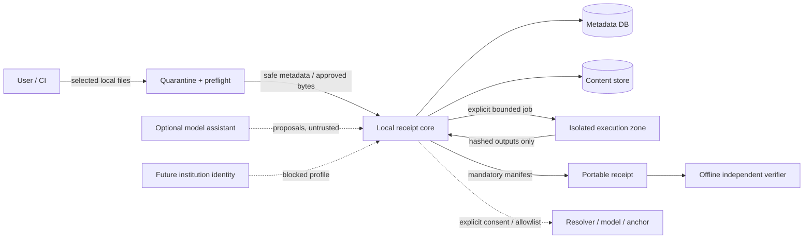

# FAR-Lab security, privacy, legal and ethics threat model

| Field | Value |
|---|---|
| Status | `TARGET_CONTROL_SPEC; CURRENT HIGH RISKS OPEN` |
| Owner | Security owner + privacy/legal owner + scientific-governance owner (unassigned) |
| Evidence level | A for current defects; D for target controls; legal conclusions `REVIEW_REQUIRED` |
| Last verified | 2026-08-05 |
| Authority | Threat, permission, privacy and harm controls; platform recovery lives in `09_PLATFORM_SRE_COST.md` |

## 1. Security objective and scope

Protect research materials, receipt integrity, reviewer/affected-party safety and the user’s host while preserving a verifiable, privacy-minimized local workflow. Security success is not “no known CVEs”; it is that untrusted bytes, model text, users, dependencies and providers cannot silently cross a trust boundary, expand authority or manufacture a stronger trust result.

Initial security scope is Profile L/O: single-user local authoring and offline read-only verification of non-sensitive computational materials. Clinical/person-level data, whistleblower/investigation cases, untrusted code execution, shared institutional access and multi-tenant hosting are denied until their explicit gates pass.

## 2. Assets, actors and trust boundaries

### 2.1 Assets

| ID | Asset | Confidentiality | Integrity/availability concern |
|---|---|---|---|
| AS-01 | Unpublished claims, data, code and outputs | High/variable | Disclosure, selective alteration, loss |
| AS-02 | Receipt manifest, components and lifecycle | Usually shareable by profile | Forgery, downgrade, omission, stale current-state |
| AS-03 | Policy/check definitions and approvals | Internal/public | Threshold/rule tampering, unauthorized publication |
| AS-04 | Review statements, challenges and affected-party identity | Confidential | Retaliation, reputation, silent revision |
| AS-05 | Credentials, signing keys, tokens and trust store | Secret | Impersonation, package/release compromise |
| AS-06 | Metadata/event DB, content store, backups | Same as contained data | Corruption, cross-scope association, irrecoverability |
| AS-07 | Verifier/compiler binaries, dependencies and release evidence | Public but security-critical | Supply-chain substitution or rollback attack |
| AS-08 | Agent prompts, context, sessions and tool permissions | Internal/confidential | Injection, leakage, memory poisoning |
| AS-09 | Diagnostics, logs, metrics and audit | Internal/confidential | Sensitive leakage, audit deletion, misleading absence |
| AS-10 | User host and external networks/services | External authority | Code execution, egress, resource exhaustion |
| AS-11 | Scientific/reputational legitimacy | Public trust | False truth/misconduct conclusion or biased process |

### 2.2 Actors

Benign author; reviewer; affected author/subject; local operator; future policy/scientific owner; future records/privacy owner; malicious package producer; external attacker; compromised dependency/action/base image; compromised resolver/model/MCP-like service; insider/support operator; stolen account/key holder; local malware or another OS user; and a well-meaning user who over-interprets a result.

### 2.3 Boundaries and data flow

Boundary rules:

- file/package content is data, never instruction;
- model/tool/external-service output is untrusted assertion until validated;
- local OS control is not independent authenticity;
- execution worker is not isolated merely because it is a subprocess/container;
- external anchor/signer adds a named trust dependency, not truth;
- future authentication is not authorization or tenant isolation by itself.

## 3. Current critical evidence

1. Scheduler claims no shell concatenation yet uses `shell:true` on a stored command string (`src/cli/commands/schedule.ts:154-173`). Exclude it from any distribution/use.
2. Science runner executes supplied Python and explicitly does not enforce egress; resource values are validated but CPU/memory are not imposed (`repro/science_harness/sandbox_runner.py:18-21,91-113,187-219`; `src/science_harness/sandbox_runner.ts:52-72`). Treat as trusted-code-only.
3. JWT principal is attached but unused by routes; schema has no owner/tenant boundary, and browser has no authentication flow. Protected multi-user claims are blocked.
4. `runId` is a logical label and global/latest queries can cross-associate concurrent runs (`API-0001`). Shared/concurrent mode is blocked.
5. V1 full verification accepts absence of the optional integrity manifest; keyless consistent rehash is out of scope. High-assurance proof wording is blocked.
6. Raw request/response text is stored in plaintext append-only columns without classification/retention. Sensitive input is denied.
7. Docker `COPY . .` plus a `.dockerignore` that omits `.env` can include local ignored secrets in image context; `.env` content was not opened (`Dockerfile:23-35`; `.dockerignore:1-25`). Image build/release is blocked.
8. Installer tracks the mutable default branch and falls back from frozen install (`scripts/install.sh:57-73`); release provenance is not version-bound.
9. Security response email and owners are placeholders; no real response SLA may be promised (`MAINTAINERS.md:3-15`; `SECURITY.md:10-19`).

## 4. Threat register

STRIDE/LINDDUN labels are prompts for coverage, not proof of control. Likelihood/impact use 1–5 for initial local scope; institutional scope can be higher.

| ID | Threat / category | Entry and asset | L/I | Prevent | Detect/respond | Residual / gate |
|---|---|---|---|---|---|---|
| TH-001 | Path traversal, symlink, archive bomb, parser exploit, active content (T/D/EoP) | Imported package/files → AS-01/06/10 | 4/5 | Quarantine; normalized safe paths; byte/entry/depth/ratio caps; no symlink/device; type sniff; isolated parsers; script/macro/external loads off | Preflight findings, parser crash/resource alerts, quarantine evidence; delete owned temp | Parser 0-days remain; BLOCK until adversarial corpus and isolation pass |
| TH-002 | Manifest removal/downgrade/component swap/consistent rehash (T/R) | Package → AS-02/11 | 5/5 | Mandatory versioned manifest; no auto-legacy; independent anchor/signature profiles; reference verifier | Negative/downgrade vectors; anchor mismatch; revoke profile | Author-controlled self-consistency remains forgeable; claim boundary mandatory |
| TH-003 | Untrusted code escapes “sandbox” or exfiltrates (EoP/I/D) | Scientific script → AS-01/05/10 | 4/5 | No untrusted execution initially; Z3 OS isolation, read-only inputs/root, no network, secret-free env, seccomp/cgroup/job-object equivalent | Egress/resource/escape canaries, process tree/cleanup, incident kill switch | Kernel/container escape remains; BLOCK for untrusted code |
| TH-004 | Shell/command injection (EoP/T) | Schedule/tool args → AS-05/10 | 4/5 | Remove scheduler/generic shell; typed executable + argv allowlist only in reviewed worker | Command policy denials and injection suite | Local user can intentionally run shell outside product; feature remains excluded |
| TH-005 | Direct/indirect prompt injection triggers tool/data leak (EoP/I) | Docs/web/package → AS-01/05/08 | 4/5 | Separate instructions/data; independent permission engine; minimal tools; no secrets/model; egress ask; no persistent memory | Red-team corpus, blocked-source events, unusual tool requests | Model may follow malicious text; denial must remain deterministic |
| TH-006 | BOLA/IDOR/role escalation/cross-tenant access (S/I/EoP) | Future API/Web → AS-01/04/06 | 4/5 | Institutional mode deny; object+tenant authorization, scoped tokens, deny precedence, separation of duty | Full matrix/isolation canaries, access/denial audit, anomaly detection | Admin/insider risk; BLOCK Profile I/H |
| TH-007 | Cross-run data association and cache/event leak (I/T) | Concurrent local/API tasks → AS-02/06 | 4/5 | Explicit project/receipt/task keys; no latest queries; scoped transactions/caches/events; serialize local publish | Concurrency/isolation/property tests; lineage consistency monitor | BLOCK shared mode until zero-leak evidence |
| TH-008 | Session/token theft, CSRF, permissive CORS/clickjacking (S/EoP/I) | Browser/API → AS-04/05 | 3/5 | Loopback local; future secure HttpOnly session/BFF, CSRF, exact origin, CSP/frame ancestors, reauth/revoke | Auth failure/session anomaly, security headers tests | Browser extensions/local malware out of scope; no hosted UI claim |
| TH-009 | SSRF/DNS rebinding/metadata access/data exfiltration (I/EoP) | Resolver/model URLs → AS-01/05/10 | 4/5 | Network deny; fixed connectors; scheme/host/port/IP validation after resolution; block private/metadata; proxy caps; explicit disclosure | Egress DNS/proxy logs without content; canaries; revoke connector | Third party sees allowed request; disclose processor/terms |
| TH-010 | Plaintext prompt/material/log/backup disclosure (I/LINDDUN disclosure/linkability) | DB/CAS/log/support → AS-01/04/08/09 | 4/5 | Minimize; deny sensitive; filesystem/key strategy; raw-content log deny; encrypted backup; access control | DLP/redaction tests, file-permission/config diagnostics | Local administrator/OS compromise; document shared responsibility |
| TH-011 | Container build includes `.env`/secrets (I) | Build context → AS-05/07 | 4/5 | Explicit context allowlist/secret exclusion; secret scanning; hermetic remote clean source build | Image-layer scan and canary secret; provenance inspection | Untracked files still risk local builds; BLOCK current Docker distribution |
| TH-012 | Dependency/action/image/install-script compromise (T/EoP) | Build/install/update → AS-05/07/10 | 4/5 | Exact pin/digest, minimal deps, lock, reviewed install, no mutable fallback, two-person release, SBOM/provenance/signature | Vulnerability/provenance/behavior checks; revoke artifact/key | Upstream maintainer compromise; reproducibility + response required |
| TH-013 | Release artifact or installer points to wrong version (S/T/R) | Distribution → AS-02/07/11 | 4/5 | Tag/package/component match; installer consumes signed version-bound asset; no branch clone; verified lock | Clean-install hash/version attestation; transparency/release ledger | Registry/Git host compromise; independent signatures/anchors |
| TH-014 | Audit deletion/clock spoof/selective disclosure (R/T) | Local/admin/event → AS-02/04/09 | 3/5 | Append/hash events, external anchor for high assurance, monotonic sequence, declared clock source, disclosure manifest | Gap/sequence/anchor checks; audit access review | Privileged consistent rewrite without anchor remains possible |
| TH-015 | Signing-key theft, misuse, expiry or revoked key accepted (S/R) | Signature profile → AS-02/05/07 | 3/5 | Offline/root hierarchy, scoped signing policy, hardware/KMS where institutional, rotation/revocation/time validation, two-person release | Key-use/transparency alerts; revoke and mark affected receipts | Signature proves key use, not honest content |
| TH-016 | Long task/archive/retry DoS and cost explosion (D) | File/API/agent → AS-06/10 | 4/4 | Admission caps, queue/backpressure, per-task budgets, recursion/size/time limits, idempotency, cancellation | Queue/resource/cost alerts; kill/quarantine | Local disk exhaustion remains; read-only safe mode |
| TH-017 | Diagnostics/crash/telemetry leaks sensitive content (I/linkability) | Errors/support → AS-01/04/08/09 | 3/5 | Allowlisted structured fields, pseudonymous IDs, opt-in bundle, preview/redact, no third-party analytics default | Canary secrets, redaction unit/fuzz tests, retention deletion | User may paste raw data to support; training/process needed |
| TH-018 | Incorrect accusation/adverse automation/procedural harm (harm/non-compliance) | Result/UI/institution → AS-04/11 | 4/5 | Conformance language; no misconduct/truth output; human review; basis/appeal/correction; no automated sanction | Comprehension, complaint/correction disparity, audit review; stop pilot | Humans can misuse export; strong license/warning/governance still needed |
| TH-019 | Deletion claim contradicted by backup/export/anchor (unawareness/non-compliance) | Lifecycle → AS-01/04/06 | 4/4 | Inventory copies/processors; deletion limits; backup propagation; legal-hold authority; receipt copies explicitly uncontrollable | Retention/orphan/restore tests; notify processors | Public recipients/immutable anchor cannot be erased; disclose before export |
| TH-020 | Insider selects/omits evidence or abuses support/admin (R/I) | Author/operator → AS-01/02/04/11 | 4/5 | Disclosure completeness rules, separation of duty, minimal support, dual review, COI, independent anchors | Access/export/policy change audit; random review; affected-party challenge | Cannot prove omitted evidence absent; core limitation |
| TH-021 | Unicode/bidi/homoglyph obscures identity/path/policy (S/T) | Metadata/UI/archive → AS-02/05 | 3/4 | Normalize per field; display codepoints/ASCII digest/escaped path for high-risk IDs; reject ambiguous control chars | Confusable/bidi test corpus | International text must not be over-rejected; review usability |
| TH-022 | Model/provider silently changes or retains/cross-borders data (I/T) | Optional assistant → AS-01/08/11 | 3/5 | Provider/version/region/retention capability policy; explicit consent; no sensitive data; no silent fallback | Provider drift/capability probe; disable switch; mark sessions | Provider disclosures may be incomplete; agent removable |

## 5. File, execution and network security design

### 5.1 Import pipeline

`receive into owned quarantine → record original name/size/media claim and exact digest → enforce aggregate/entry/depth/ratio/path limits → detect actual type → inspect/convert with network-disabled resource-constrained parser → store raw and safe derivative separately → show disclosure and findings → permit explicit inclusion`.

The safe viewer never executes macros/scripts, loads remote resources or trusts supplied HTML/MIME/filename. PDF/office/image metadata can contain personal paths/identifiers and is shown/redacted by policy. Quarantine cleanup is scoped to owned task directories and audited.

### 5.2 Execution profile Z3

Required before any untrusted code: fresh ephemeral identity/namespace; no host credentials; read-only minimal root and input mounts; dedicated writable output with quota; default-deny egress enforced below process level; CPU/memory/PID/file/disk/wall limits imposed; syscall/process restrictions; no Docker socket/host mounts; verified runtime image digest; stdout/stderr/outputs capped; process-tree termination; post-run output scan; and escape/egress/resource test evidence on every claimed OS. If any control is unavailable, capability discovery reports `trusted_code_only`.

### 5.3 Network policy

Core/offline verifier performs no network. Connectors are named code paths, not arbitrary URLs. A request declaration includes host/ports, purpose, fields/content sent, expected response/type/size, timeout, cache/license/retention and fallback. Resolve and revalidate IPs, block local/private/link-local/metadata addresses, constrain redirects and TLS, cap response/decompression, and log only safe metadata. Provider API keys are injected only into that connector process and never receipt/model context.

## 6. Identity and authorization

### 6.1 Profile L/O

No server identity claim. Loopback and OS account/file permissions are the user boundary. Static/offline verifier is read-only. Reviewer names in packages are assertions unless covered by a signature/identity policy. Do not expose local anonymous API beyond loopback.

### 6.2 Profile I gate

Use institution-managed OIDC/OAuth2/SAML as reviewed, MFA/passkeys/high-risk reauthentication, short sessions/refresh rotation/revocation/device management and workload identities. Authorization combines role and attributes/resource relationships, evaluated centrally with deny precedence.

| Action | Author | Reviewer | Policy owner | Records/privacy | Operator | Auditor |
|---|---:|---:|---:|---:|---:|---:|
| View authorized receipt/material | own/granted | assigned/granted | metadata/validation sets | case/rights scope | diagnostics only | audit scope |
| Create draft/receipt | own project | No | No | No | No | No |
| Verify/check | own/granted | assigned | validation only | No | operational retry only | Read result |
| Add review/evidence request | Respond/author note | Yes | No | procedural oversight | No | Read |
| Resolve challenge/adverse decision | No unilateral | No unilateral | Scientific policy only | Procedural role | No | Observe |
| Publish/withdraw policy | No | Independent review | Requires second approver | Privacy veto where relevant | Deploy approved only | Observe |
| Export restricted data | Scoped + approval | Scoped + approval | No | Approve/deny | Operate without content | Audit |
| Delete/hold | Request only | No | No | Authorize under policy | Execute approved job | Audit |
| Manage identity/role | No | No | No | No | Scoped admin + separation | Audit |
| View raw audit/security logs | Own events only | Own events | Policy events | Rights/hold events | Security operations | Scoped immutable view |

Every cell becomes an object/field/action test, including role combinations, revocation mid-task, former member, emergency access and cross-tenant identifiers. “Admin” is not a universal bypass; impersonation/break-glass is time-limited, reasoned, notified and audited.

## 7. Prompt/model safety

Instruction order is fixed: product/system policy → authenticated user instruction → explicitly approved project policy; ordinary repository/package/web/tool/model content is untrusted data. Content carries provenance/classification into context. Tools are dynamically minimized; permission is decided outside the model; arguments/results validate; sensitive output is referenced, not pasted; model gets no secrets; network/write/run/publication require user-visible scope.

Injection detection can warn or route to quarantine but is not a security boundary. Malicious strings, encoded/translated instructions, fake tool results, poisoned citations, context-overflow and persistent-memory attempts are in the regression set. There is no persistent model memory or extension runtime in the initial product. Agent removal must leave receipt creation/verification functional.

## 8. Cryptography and key governance

- Record versioned algorithm suite/profile; support append-only renewal, planned algorithm migration and multi-digest transition without reinterpreting old bytes.
- Local integrity requires no secret key. Optional authenticity signs the canonical manifest digest with a separately managed identity/authorization policy.
- Release and receipt-signing keys are distinct and scoped. Institutional keys use protected storage, least use, rotation, revocation and recovery ceremony; key IDs alone are not identity proof.
- Verify signature time against an explicit time context and trusted timestamp where needed; report certificate/key validity and revocation separately at sealing, renewal and current policy, including stale/missing evidence.
- Backups and confidential stores require encryption appropriate to profile; key loss/recovery and cryptographic-erasure limits are documented/tested.
- Secret injection uses file descriptor/short-lived credential/secret store as appropriate, never command line, image, repository, log or receipt.

External review by a cryptography/security specialist is a release gate for signed/anchored profiles. No custom cryptographic primitive.

The normative subject/domain-separation, disclosure commitment, trusted-time, renewal, archival and conformance requirements are in `17_FORMAL_PROTOCOL_REPRODUCIBILITY_AND_LONGEVITY.md`; this threat model cannot weaken them.

## 9. Audit design

Audit authentication/session, permission evaluation/denial, sensitive view/download/export, high-risk action/approval, agent/tool/network use, policy/model/config/release change, receipt/lifecycle/review/rights/incident operation and admin/support access. Record minimal actor/subject/action/result/reason/policy/version/time/correlation/classification—not raw material by default.

Audit is access-controlled, integrity-checked, queryable/exportable and retained by purpose. It is not sampled. External anchoring is required before claiming privileged-actor tamper evidence. Corrections append. Local audit limitations are visible. Security logs, scientific evidence, task events and product analytics remain separate.

## 10. Privacy inventory and purpose limitation

| Data | Source / purpose | Minimum content | Default retention/profile | Third party | Rights/controls |
|---|---|---|---|---|---|
| Project/claim metadata | Author; receipt preparation | Exact scoped claim and local IDs | Local until user deletes/archives | None | View/correct/export/delete subject to copies |
| Research artifacts | User-selected; checks/reproduction | Only required versions or digest/reference | Local; package per disclosure | None unless explicit resolver/share | Preview, remove before publish, license/consent |
| Model prompt/response | Optional assistant; drafting | Minimized excerpts, proposal, versions | Ephemeral/local session; not receipt evidence by default | Named provider only with consent | Disable provider, inspect/delete session |
| Receipt/check result | Compiler/verifier; handoff | Inputs/references, results, limitations, versions | Immutable while retained/shared | Recipient/anchor by explicit action | Correct via successor; withdraw notice cannot erase copies |
| Review/challenge identity | Reviewer/affected party; due process | Identity class/pseudonym as purpose permits, COI, statement | Purpose-limited; institutional policy required | Authorized participants | Access/correct/respond/export; safety controls |
| Task/log/diagnostic | System; recovery/security | IDs, states, safe error/resource metadata | Shortest operational window | None; support opt-in preview | Redact/export/delete per purpose |
| Audit/security event | System; accountability | Minimal identifiers/action/result | Defined security/legal window | Security processor only if approved | Restricted access; rights/exceptions reviewed |
| Telemetry/analytics | Optional product improvement | Aggregate/pseudonymous event, never raw content | Off by default; bounded opt-in | No third-party initially | Opt in/out/delete |
| Credentials/keys | User/institution; connector/signing | Reference or short-lived secret only | Secret store lifetime | Intended service/KMS | Rotate/revoke; never export in receipt |
| Backups | Local/institution; recovery | Same classification as source | Shortest tested RPO/history | Approved storage only | Encryption/access/delete propagation |

No “anonymous” claim without re-identification analysis; hashes and rare metadata can be personal. Debug mode does not waive minimization. Support bundles show exact fields before export.

## 11. Consent, rights and legal-review gates

The uploader must have authority for each artifact, co-author/third-party material and remote processing. The system records declaration and policy but cannot validate legal authority. Jurisdiction, controller/processor roles, lawful basis, research ethics/IRB, minors/special-category data, cross-border transfer, copyright/database/model licenses, whistleblower exceptions, employment/investigation process and retention must be reviewed by qualified counsel/ethics owners before relevant use. Status: `LEGAL_REVIEW_REQUIRED`, not legal advice.

Profile I must support verified access, correction, export, restriction, objection/withdrawal, deletion request, processor notification and legal-hold exception, with identity verification, deadlines, audit and backup propagation. Public/recipient copies and cryptographic anchors may be technically/legally non-erasable; users learn this before sharing. Initial Profile L rejects cases needing these institutional processes.

## 12. Ethics and procedural safeguards

| Harm | Affected party | Mechanism | Visibility/reversibility | Safeguard and stop threshold |
|---|---|---|---|---|
| False accusation | Author/researcher | Signal/check language treated as misconduct | Often visible late; career harm hard to reverse | No accusation output/automation; affected-party view/response; any product-caused irreversible action stops pilot |
| Reviewer automation bias | Author/reviewer | Deterministic/crypto presentation overtrusted | Hard to notice | Six assurance dimensions, limitations and comprehension gate; severe misunderstanding blocks release |
| Selective enforcement/bias | Language/domain/institution groups | Coverage/error/abstention disparities | Observable only with stratification | Stratified metrics, no unsupported group; material unexplained disparity withdraws policy |
| Whistleblower exposure | Reporter | Metadata/log/export/reviewer identity leak | Potentially irreversible | Out of initial scope; protected process/privacy review required |
| Participant privacy | Research subjects | Raw data/prompts/hash linkage | Difficult to reverse after export | Reject person-level data initially; DPIA/ethics approval and minimization later |
| IP/license breach | Authors/data owners | Package embeds/reuses material | Copies persist | License catalog/disclosure preview; block incompatible redistribution |
| Procedural inequality | Affected author | Cannot inspect/appeal; COI reviewer | Decision may persist | Basis, response, independent review, correction/history; no high-risk use without it |
| False security | Recipient | Hash interpreted as authenticity/truth | Widespread dissemination | Bound claim language; downgrade-resistant profiles; independent verifier |

Normal AI assistance is not misconduct. Scientific disagreement, error, policy nonconformance and fraud are distinct. High-risk external decisions require accountable humans, independent/double review, COI disclosure and appeal; FAR-Lab does not make them.

## 13. Security/privacy acceptance gates

| Gate | Evidence required | Block/response | Owner |
|---|---|---|---|
| Safe package handling | Malicious corpus: paths/symlinks/archives/MIME/active content/parser fuzz/resource limits | Any host write/exec/network/escape or uncontrolled crash blocks import | Security + parser owners |
| Offline verifier | Network-disabled tests, safe rendering, downgrade/rehash/swap vectors, independent implementation | Any silent downgrade or author-state dependency withdraws independent claim | Protocol/security |
| Execution Z3 | OS-specific escape/egress/secret/resource/process cleanup tests and image provenance | Otherwise `trusted_code_only`; no sandbox claim | Platform/security |
| Secrets | Full build/release/image/runtime/log canaries and scoped scanner; `.env` excluded by construction | Any secret in artifact/log triggers incident/rotation and release block | Security/release |
| Local exposure | Loopback enforcement, malicious origin/CSRF/CORS/browser cache tests | Disable Web/API; CLI/static viewer fallback | API/Web security |
| Institutional authz | Object/field/action/tenant matrix, revocation, role combination, emergency access | Profile I/H disabled on any cross-scope access | Identity/security |
| Privacy | Data map, DPIA where applicable, processor/retention/rights/delete/backup tests | Reject sensitive categories/profile | Privacy/legal |
| Prompt/agent | Direct/indirect injection, tool poisoning, context leak, denial recovery, no-model operation | Disable agent/tools; core receipt remains | Agent/security |
| Signing/anchor | Key ceremony, policy, revocation/time/algorithm/downgrade, external audit | Offer core integrity only | Cryptography/security |
| Procedural safety | Affected-party comprehension, response/appeal/correction, COI and zero automated adverse action | No high-stakes pilot | Product/legal/ethics |
| Incident readiness | Named working contact, tabletop for leak/forgery/bad policy/key/dependency, notification and correction | No public SLA/stable release | Governance/security |

## 14. Monitoring, response and residual risk

Monitor denied/high-risk permissions, import quarantines, integrity/anchor/signature/compat failures, egress attempts, worker limit/cleanup, auth/access anomalies, export/download, policy/model/release changes, secret/redaction canaries, correction/challenge and group disparities. Metrics use bounded labels and no raw content.

Incident classes include data exposure, malicious package/worker escape, release/dependency compromise, forged/downgraded receipt, signing-key event, bad scientific policy/model output, cross-scope access and harmful external use. Named command, security, privacy/legal, scientific and communication roles must contain, preserve evidence, revoke/disable, recover, notify, mark affected receipts/policies, support correction/withdrawal, publish postmortem and verify actions.

Residual risks that cannot be engineered away: local administrator/malware control; author omission or collusion; validity of real-world identity and source data; zero-day parser/runtime vulnerabilities; recipient misuse/copying; external legal/process quality; upstream provider statements; and scientific uncertainty. These limits are public product content, not a hidden legal footer.
